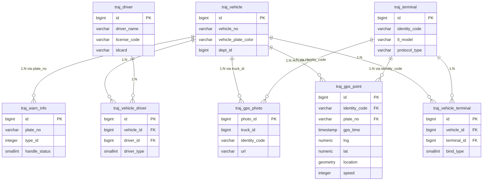

# DDL-TRAJ-001 TRAJ Schema 数据库设计

> 版本：v1.0 ｜ 日期：2026-09-30
> 数据库：PostgreSQL 16 + PostGIS 3.4
> Schema：traj
> 关联文档：MOD-TRAJ-001, API-TRAJ-001, API-TRAJ-002, SYS-005

---

## 1. 概述

### 1.1 Schema 用途

`traj` schema 存储北斗导航系统接入的轨迹数据及配套业务实体，支撑模拟数据生成、轨迹回放、轨迹查询、轨迹总览大屏四大用例。该 schema 是 TRAJ 模块唯一的持久化层，所有轨迹点采用 PostGIS `geometry(Point, 4326)` 存储以支持空间索引与空间查询。

**设计原则**：
- 忠实迁移 `langdi.sql`（MySQL 5.7）原有业务表结构至 PostgreSQL 16，保留字段语义与注释
- 新建 `traj_gps_point` 表存储轨迹点，使用 PostGIS 几何类型并建立空间索引
- 所有表采用 `snake_case` 命名，遵循 PostgreSQL 规范
- 公共审计字段（`creator`/`create_date`/`updater`/`update_date`/`valid_mark`）统一规范
- 软删除使用 `valid_mark` 标志位（1=有效，0=无效），不使用物理删除

### 1.2 表清单

| 表名 | 中文名 | 用途 | 行量级 |
|---|---|---|---|
| traj_gps_point | 轨迹点表 | 存储车辆/人员 GPS 轨迹点，含 PostGIS 几何字段 | 百万级（5车×8小时×1Hz≈14.4万/日） |
| traj_vehicle | 车辆基础信息表 | 车辆台账（车牌、VIN、所属组织等） | 千级 |
| traj_terminal | 终端信息表 | 北斗终端设备台账（设备号、协议、SIM等） | 千级 |
| traj_driver | 驾驶员信息表 | 驾驶员档案（姓名、身份证、资格证等） | 千级 |
| traj_vehicle_driver | 车辆-司机关联表 | 车辆与驾驶员多对多绑定关系 | 千级 |
| traj_vehicle_terminal | 车辆-终端关联表 | 车辆与终端多对多绑定关系 | 千级 |
| traj_warn_info | 报警信息表 | 终端上报的报警事件 | 万级/日 |
| traj_gps_photo | 车辆拍照信息表 | 终端抓拍图片元数据 | 万级 |

---

## 2. 公共字段规范

以下字段出现在所有业务表中（`traj_gps_point` 除外，其有独立的时间字段规范），定义统一含义：

| 字段名 | 类型 | 可空 | 默认 | 含义 |
|---|---|---|---|---|
| id | bigserial | 否 | — | 主键，自增 |
| valid_mark | smallint | 否 | 1 | 有效标志：1=有效，0=无效（软删除） |
| creator | varchar(40) | 否 | — | 创建人（用户名或系统标识） |
| create_date | timestamp | 否 | CURRENT_TIMESTAMP | 创建时间 |
| updater | varchar(40) | 是 | NULL | 最后修改人 |
| update_date | timestamp | 是 | NULL | 最后修改时间 |

**命名规范**：
- 表名：`traj_` 前缀 + 业务实体名（snake_case）
- 字段名：snake_case，布尔标志位用 `smallint`（0/1）而非 `boolean`，兼容历史数据
- 索引名：`idx_表名_字段名` 或 `uk_表名_字段名`（唯一索引）
- 外键：不建立物理外键约束，通过应用层校验关联完整性（遵循系统统一规范）

---

## 3. 表设计详情

### 3.1 traj_gps_point

- **中文名**：轨迹点表
- **用途**：存储车辆/人员的 GPS 轨迹点，是轨迹回放、查询、大屏可视化的核心数据源
- **行量级**：百万级（5辆车×8小时×1Hz≈14.4万/日，演示场景；生产可达千万级/日）
- **增长率**：每日 14.4 万行（演示场景）

#### 字段定义

| 列名 | 类型 | 可空 | 默认 | 注释（业务含义） |
|---|---|---|---|---|
| id | bigserial | 否 | — | 主键 |
| identity_code | varchar(100) | 否 | — | 设备身份标识（终端识别码） |
| plate_no | varchar(50) | 是 | NULL | 车牌号（冗余字段，便于直接查询） |
| gps_time | timestamp | 否 | — | GPS 定位时间（终端上报时间） |
| lng | numeric(10,6) | 否 | — | 经度（WGS84 坐标系） |
| lat | numeric(10,6) | 否 | — | 纬度（WGS84 坐标系） |
| speed | integer | 是 | NULL | 速度（km/h） |
| direction | integer | 是 | NULL | 方向角（0-359，正北为 0，顺时针） |
| altitude | integer | 是 | NULL | 海拔（米） |
| location | geometry(Point,4326) | 否 | — | PostGIS 几何点（lng/lat 组合，用于空间查询） |
| alarm_flag | smallint | 否 | 0 | 报警标志：0=正常，1=报警 |
| mileage | numeric(12,2) | 是 | NULL | 累计里程（km） |
| receive_time | timestamp | 否 | CURRENT_TIMESTAMP | 服务器接收时间 |
| create_date | timestamp | 否 | CURRENT_TIMESTAMP | 记录创建时间 |

#### 索引

| 索引名 | 类型 | 字段 | 命中场景 |
|---|---|---|---|
| pk_traj_gps_point | 主键 | id | 单点详情 |
| idx_traj_gps_point_identity_time | 复合B树 | identity_code, gps_time DESC | 按设备+时间范围查询轨迹（最高频） |
| idx_traj_gps_point_plate_time | 复合B树 | plate_no, gps_time DESC | 按车牌+时间范围查询 |
| idx_traj_gps_point_time | B树 | gps_time DESC | 大屏实时最新位置、时间范围统计 |
| idx_traj_gps_point_location | GIST空间 | location | 空间范围查询（地图视野内车辆） |

#### DDL

```sql
-- 启用 PostGIS 扩展（数据库级执行一次）
CREATE EXTENSION IF NOT EXISTS postgis;

CREATE TABLE IF NOT EXISTS traj_gps_point (
    id           bigserial       PRIMARY KEY,
    identity_code varchar(100)   NOT NULL,
    plate_no     varchar(50),
    gps_time     timestamp       NOT NULL,
    lng          numeric(10,6)   NOT NULL,
    lat          numeric(10,6)   NOT NULL,
    speed        integer,
    direction    integer,
    altitude     integer,
    location     geometry(Point, 4326) NOT NULL,
    alarm_flag   smallint        NOT NULL DEFAULT 0,
    mileage      numeric(12,2),
    receive_time timestamp       NOT NULL DEFAULT CURRENT_TIMESTAMP,
    create_date  timestamp       NOT NULL DEFAULT CURRENT_TIMESTAMP
);

COMMENT ON TABLE  traj_gps_point IS '轨迹点表';
COMMENT ON COLUMN traj_gps_point.identity_code IS '设备身份标识（终端识别码）';
COMMENT ON COLUMN traj_gps_point.plate_no      IS '车牌号（冗余字段，便于直接查询）';
COMMENT ON COLUMN traj_gps_point.gps_time      IS 'GPS 定位时间';
COMMENT ON COLUMN traj_gps_point.lng           IS '经度 WGS84';
COMMENT ON COLUMN traj_gps_point.lat           IS '纬度 WGS84';
COMMENT ON COLUMN traj_gps_point.speed         IS '速度 km/h';
COMMENT ON COLUMN traj_gps_point.direction     IS '方向角 0-359 正北为0';
COMMENT ON COLUMN traj_gps_point.altitude      IS '海拔 米';
COMMENT ON COLUMN traj_gps_point.location      IS 'PostGIS 几何点 SRID=4326';
COMMENT ON COLUMN traj_gps_point.alarm_flag    IS '报警标志 0=正常 1=报警';
COMMENT ON COLUMN traj_gps_point.mileage       IS '累计里程 km';
COMMENT ON COLUMN traj_gps_point.receive_time  IS '服务器接收时间';

CREATE INDEX idx_traj_gps_point_identity_time
    ON traj_gps_point (identity_code, gps_time DESC);
CREATE INDEX idx_traj_gps_point_plate_time
    ON traj_gps_point (plate_no, gps_time DESC);
CREATE INDEX idx_traj_gps_point_time
    ON traj_gps_point (gps_time DESC);
CREATE INDEX idx_traj_gps_point_location
    ON traj_gps_point USING GIST (location);
```

#### 软删与唯一约束

本表不使用软删除（轨迹点为时序数据，只追加不修改）。唯一性由 `identity_code + gps_time` 业务保证，但不建立唯一索引（允许同一时刻多源数据）。

#### 关联关系

| 关联表 | 关联字段 | 关系类型 | 说明 |
|---|---|---|---|
| traj_terminal | identity_code → identity_code | 多对一 | 多个轨迹点归属一个终端 |
| traj_vehicle | plate_no → vehicle_no | 多对一 | 多个轨迹点归属一辆车 |

#### 读写规则

- **写入方**：TRAJ 模块的 `TrajIngestService`（模拟器推送/批量导入）、`TrajSimulatorService`（模拟器实时生成）
- **读取方**：`TrajQueryService`（查询）、`TrajReplayService`（回放）、`TrajDashboardService`（大屏聚合）、`TrajMetricsService`（指标计算）
- **并发控制**：纯追加写入，无更新冲突；查询走时间范围+空间索引
- **归档策略**：演示场景不归档；生产建议按月分区（`PARTITION BY RANGE (gps_time)`），保留 6 个月热数据

---

### 3.2 traj_vehicle

- **中文名**：车辆基础信息表
- **用途**：车辆台账，记录车牌、VIN、所属组织、运营状态等基础信息
- **行量级**：千级
- **增长率**：低频更新，日均新增 <10

#### 字段定义

| 列名 | 类型 | 可空 | 默认 | 注释（业务含义） |
|---|---|---|---|---|
| id | bigserial | 否 | — | 车辆ID |
| dept_id | bigint | 是 | NULL | 所属组织ID |
| vehicle_no | varchar(40) | 否 | — | 车牌号 |
| vehicle_plate_color | varchar(10) | 否 | — | 车牌颜色 |
| vin | varchar(40) | 是 | NULL | 车架号 |
| vehicle_type | varchar(40) | 是 | NULL | 车辆类型 |
| operation_type | smallint | 是 | 1 | 运营状态：0=非运营，1=运营 |
| vehicle_industry | varchar(40) | 是 | NULL | 运输行业类别 |
| road_license_no | varchar(64) | 是 | NULL | 道路运输证号 |
| province_code | varchar(16) | 是 | NULL | 省区域编码 |
| city_code | varchar(16) | 是 | NULL | 市区域编码 |
| county_code | varchar(16) | 是 | NULL | 县区域编码 |
| vehicle_color | varchar(10) | 是 | NULL | 车身颜色 |
| vehicle_brand | varchar(20) | 是 | NULL | 车辆品牌 |
| owner_name | varchar(20) | 是 | NULL | 业户姓名 |
| owner_phone | varchar(30) | 是 | NULL | 业户电话 |
| remark | varchar(100) | 是 | NULL | 备注 |
| valid_mark | smallint | 否 | 1 | 有效标志 |
| creator | varchar(40) | 否 | — | 创建人 |
| create_date | timestamp | 否 | CURRENT_TIMESTAMP | 创建时间 |
| updater | varchar(40) | 是 | NULL | 修改人 |
| update_date | timestamp | 是 | NULL | 修改时间 |

> 说明：原 `tb_vehicle` 表含 40+ 字段（含年审、保险、报废等业务字段），本表精简保留演示所需核心字段。完整字段可在后续迭代中通过 `ALTER TABLE ADD COLUMN` 扩展。

#### 索引

| 索引名 | 类型 | 字段 | 命中场景 |
|---|---|---|---|
| pk_traj_vehicle | 主键 | id | 单车详情 |
| idx_traj_vehicle_dept | B树 | dept_id | 按组织查询车辆 |
| uk_traj_vehicle_no_color | 唯一 | vehicle_no, vehicle_plate_color | 车牌+颜色唯一 |

#### DDL

```sql
CREATE TABLE IF NOT EXISTS traj_vehicle (
    id                   bigserial     PRIMARY KEY,
    dept_id              bigint,
    vehicle_no           varchar(40)   NOT NULL,
    vehicle_plate_color  varchar(10)   NOT NULL,
    vin                  varchar(40),
    vehicle_type         varchar(40),
    operation_type       smallint      DEFAULT 1,
    vehicle_industry     varchar(40),
    road_license_no      varchar(64),
    province_code        varchar(16),
    city_code            varchar(16),
    county_code          varchar(16),
    vehicle_color        varchar(10),
    vehicle_brand        varchar(20),
    owner_name           varchar(20),
    owner_phone          varchar(30),
    remark               varchar(100),
    valid_mark           smallint      NOT NULL DEFAULT 1,
    creator              varchar(40)   NOT NULL,
    create_date          timestamp     NOT NULL DEFAULT CURRENT_TIMESTAMP,
    updater              varchar(40),
    update_date          timestamp
);

COMMENT ON TABLE traj_vehicle IS '车辆基础信息表';

CREATE INDEX idx_traj_vehicle_dept ON traj_vehicle (dept_id);
CREATE UNIQUE INDEX uk_traj_vehicle_no_color
    ON traj_vehicle (vehicle_no, vehicle_plate_color) WHERE valid_mark = 1;
```

#### 软删与唯一约束

`valid_mark=1` 时车牌+颜色唯一；软删除后允许重新注册相同车牌。使用部分唯一索引 `WHERE valid_mark = 1` 实现。

#### 关联关系

| 关联表 | 关联字段 | 关系类型 | 说明 |
|---|---|---|---|
| traj_vehicle_terminal | id ← vehicle_id | 一对多 | 一辆车可绑定多个终端 |
| traj_vehicle_driver | id ← vehicle_id | 一对多 | 一辆车可绑定多个驾驶员 |
| traj_gps_point | vehicle_no ← plate_no | 一对多 | 一辆车产生多条轨迹点 |

#### 读写规则

- **写入方**：IAM 模块的管理员操作、TRAJ 模块的种子数据初始化
- **读取方**：TRAJ 模块查询/回放/大屏展示
- **并发控制**：乐观锁（`update_date` 比对）
- **归档策略**：不归档，软删除保留

---

### 3.3 traj_terminal

- **中文名**：终端信息表
- **用途**：北斗终端设备台账，记录设备号、协议、SIM卡等
- **行量级**：千级
- **增长率**：低频更新

#### 字段定义

| 列名 | 类型 | 可空 | 默认 | 注释（业务含义） |
|---|---|---|---|---|
| id | bigserial | 否 | — | 终端ID |
| identity_code | varchar(100) | 否 | — | 设备身份标识（终端识别码，全局唯一） |
| tl_mac | varchar(16) | 是 | NULL | 终端MAC地址 |
| oem_code | varchar(40) | 是 | NULL | 终端厂商编码 |
| tl_model | varchar(64) | 是 | NULL | 终端型号 |
| sim_account | varchar(32) | 是 | NULL | SIM卡号 |
| protocol_type | varchar(8) | 是 | NULL | 终端协议类型 |
| equipment_type | varchar(8) | 是 | NULL | 设备类型：2=2G部标，4=1078视频 |
| video_channel | smallint | 是 | NULL | 视频通道数（0=无视频） |
| status | smallint | 否 | 1 | 状态：1=有效，0=失效 |
| remark | varchar(100) | 是 | NULL | 备注 |
| valid_mark | smallint | 否 | 1 | 有效标志 |
| creator | varchar(40) | 否 | — | 创建人 |
| create_date | timestamp | 否 | CURRENT_TIMESTAMP | 创建时间 |
| updater | varchar(40) | 是 | NULL | 修改人 |
| update_date | timestamp | 是 | NULL | 修改时间 |

#### DDL

```sql
CREATE TABLE IF NOT EXISTS traj_terminal (
    id             bigserial     PRIMARY KEY,
    identity_code  varchar(100)  NOT NULL,
    tl_mac         varchar(16),
    oem_code       varchar(40),
    tl_model       varchar(64),
    sim_account    varchar(32),
    protocol_type  varchar(8),
    equipment_type varchar(8),
    video_channel  smallint,
    status         smallint      NOT NULL DEFAULT 1,
    remark         varchar(100),
    valid_mark     smallint      NOT NULL DEFAULT 1,
    creator        varchar(40)   NOT NULL,
    create_date    timestamp     NOT NULL DEFAULT CURRENT_TIMESTAMP,
    updater        varchar(40),
    update_date    timestamp
);

COMMENT ON TABLE traj_terminal IS '终端信息表';
COMMENT ON COLUMN traj_terminal.identity_code IS '设备身份标识 全局唯一';

CREATE UNIQUE INDEX uk_traj_terminal_identity
    ON traj_terminal (identity_code) WHERE valid_mark = 1;
```

#### 关联关系

| 关联表 | 关联字段 | 关系类型 | 说明 |
|---|---|---|---|
| traj_vehicle_terminal | id ← terminal_id | 一对多 | 一个终端可绑定多辆车（历史） |
| traj_gps_point | identity_code ← identity_code | 一对多 | 一个终端产生多条轨迹点 |

---

### 3.4 traj_driver

- **中文名**：驾驶员信息表
- **用途**：驾驶员档案，记录姓名、身份证、从业资格证等
- **行量级**：千级
- **增长率**：低频更新

#### 字段定义

| 列名 | 类型 | 可空 | 默认 | 注释（业务含义） |
|---|---|---|---|---|
| id | bigserial | 否 | — | 驾驶员ID |
| driver_name | varchar(40) | 否 | — | 驾驶员姓名 |
| sex | smallint | 否 | 1 | 性别：1=男，2=女 |
| idcard | varchar(30) | 是 | NULL | 身份证号（脱敏存储） |
| contact_phone | varchar(30) | 是 | NULL | 联系电话（脱敏存储） |
| license_code | varchar(40) | 否 | — | 从业资格证号 |
| licence_category | varchar(32) | 是 | NULL | 从业资格证类别 |
| driver_img | varchar(128) | 是 | NULL | 驾驶员照片URL |
| status | smallint | 否 | 1 | 状态：1=有效，0=失效 |
| remark | varchar(100) | 是 | NULL | 备注 |
| valid_mark | smallint | 否 | 1 | 有效标志 |
| creator | varchar(40) | 否 | — | 创建人 |
| create_date | timestamp | 否 | CURRENT_TIMESTAMP | 创建时间 |
| updater | varchar(40) | 是 | NULL | 修改人 |
| update_date | timestamp | 是 | NULL | 修改时间 |

#### DDL

```sql
CREATE TABLE IF NOT EXISTS traj_driver (
    id                  bigserial    PRIMARY KEY,
    driver_name         varchar(40)  NOT NULL,
    sex                 smallint     NOT NULL DEFAULT 1,
    idcard              varchar(30),
    contact_phone       varchar(30),
    license_code        varchar(40)  NOT NULL,
    licence_category    varchar(32),
    driver_img          varchar(128),
    status              smallint     NOT NULL DEFAULT 1,
    remark              varchar(100),
    valid_mark          smallint     NOT NULL DEFAULT 1,
    creator             varchar(40)  NOT NULL,
    create_date         timestamp    NOT NULL DEFAULT CURRENT_TIMESTAMP,
    updater             varchar(40),
    update_date         timestamp
);

COMMENT ON TABLE traj_driver IS '驾驶员信息表';
COMMENT ON COLUMN traj_driver.idcard IS '身份证号 脱敏存储';
COMMENT ON COLUMN traj_driver.contact_phone IS '联系电话 脱敏存储';

CREATE UNIQUE INDEX uk_traj_driver_license
    ON traj_driver (license_code) WHERE valid_mark = 1;
```

#### 安全说明

`idcard` 和 `contact_phone` 字段在写入前由 PROC 模块的脱敏引擎处理，存储脱敏后的值（如 `110101********1234`）。详见 MOD-PROC-001 §脱敏引擎。

---

### 3.5 traj_vehicle_driver

- **中文名**：车辆-司机关联表
- **用途**：记录车辆与驾驶员的绑定关系（多对多），含主驾/副驾区分
- **行量级**：千级
- **增长率**：低频更新

#### 字段定义

| 列名 | 类型 | 可空 | 默认 | 注释（业务含义） |
|---|---|---|---|---|
| id | bigserial | 否 | — | 主键ID |
| vehicle_id | bigint | 否 | — | 车辆ID |
| driver_id | bigint | 否 | — | 驾驶员ID |
| driver_type | smallint | 是 | 1 | 司机类型：1=主驾，2=副驾 |
| bind_time | timestamp | 是 | NULL | 绑定时间 |
| unbind_time | timestamp | 是 | NULL | 解绑时间 |
| status | smallint | 否 | 1 | 状态：1=绑定生效，0=已解绑 |
| remark | varchar(100) | 是 | NULL | 备注 |
| valid_mark | smallint | 否 | 1 | 有效标志 |
| creator | varchar(40) | 否 | — | 创建人 |
| create_date | timestamp | 否 | CURRENT_TIMESTAMP | 创建时间 |
| updater | varchar(40) | 是 | NULL | 修改人 |
| update_date | timestamp | 是 | NULL | 修改时间 |

#### DDL

```sql
CREATE TABLE IF NOT EXISTS traj_vehicle_driver (
    id          bigserial    PRIMARY KEY,
    vehicle_id  bigint       NOT NULL,
    driver_id   bigint       NOT NULL,
    driver_type smallint     DEFAULT 1,
    bind_time   timestamp,
    unbind_time timestamp,
    status      smallint     NOT NULL DEFAULT 1,
    remark      varchar(100),
    valid_mark  smallint     NOT NULL DEFAULT 1,
    creator     varchar(40)  NOT NULL,
    create_date timestamp    NOT NULL DEFAULT CURRENT_TIMESTAMP,
    updater     varchar(40),
    update_date timestamp
);

COMMENT ON TABLE traj_vehicle_driver IS '车辆-司机关联表';

CREATE INDEX idx_traj_vd_vehicle ON traj_vehicle_driver (vehicle_id);
CREATE INDEX idx_traj_vd_driver  ON traj_vehicle_driver (driver_id);
CREATE UNIQUE INDEX uk_traj_vd_vehicle_driver
    ON traj_vehicle_driver (vehicle_id, driver_id) WHERE valid_mark = 1;
```

---

### 3.6 traj_vehicle_terminal

- **中文名**：车辆-终端关联表
- **用途**：记录车辆与终端的绑定关系（多对多），含主终端/备用终端区分
- **行量级**：千级
- **增长率**：低频更新

#### 字段定义

| 列名 | 类型 | 可空 | 默认 | 注释（业务含义） |
|---|---|---|---|---|
| id | bigserial | 否 | — | 主键ID |
| vehicle_id | bigint | 否 | — | 车辆ID |
| terminal_id | bigint | 否 | — | 终端ID |
| bind_type | smallint | 否 | 1 | 绑定类型：1=主终端，2=备用终端 |
| bind_time | timestamp | 是 | NULL | 绑定时间 |
| install_time | timestamp | 是 | NULL | 安装时间 |
| installer | varchar(40) | 是 | NULL | 安装人员 |
| unbind_time | timestamp | 是 | NULL | 解绑时间 |
| status | smallint | 否 | 1 | 状态：1=绑定生效，0=已解绑 |
| remark | varchar(255) | 是 | NULL | 备注 |
| valid_mark | smallint | 否 | 1 | 有效标志 |
| creator | varchar(40) | 否 | — | 创建人 |
| create_date | timestamp | 否 | CURRENT_TIMESTAMP | 创建时间 |
| updater | varchar(40) | 是 | NULL | 修改人 |
| update_date | timestamp | 是 | NULL | 修改时间 |

#### DDL

```sql
CREATE TABLE IF NOT EXISTS traj_vehicle_terminal (
    id           bigserial    PRIMARY KEY,
    vehicle_id   bigint       NOT NULL,
    terminal_id  bigint       NOT NULL,
    bind_type    smallint     NOT NULL DEFAULT 1,
    bind_time    timestamp,
    install_time timestamp,
    installer    varchar(40),
    unbind_time  timestamp,
    status       smallint     NOT NULL DEFAULT 1,
    remark       varchar(255),
    valid_mark   smallint     NOT NULL DEFAULT 1,
    creator      varchar(40)  NOT NULL,
    create_date  timestamp    NOT NULL DEFAULT CURRENT_TIMESTAMP,
    updater      varchar(40),
    update_date  timestamp
);

COMMENT ON TABLE traj_vehicle_terminal IS '车辆-终端关联表';

CREATE INDEX idx_traj_vt_vehicle  ON traj_vehicle_terminal (vehicle_id);
CREATE INDEX idx_traj_vt_terminal ON traj_vehicle_terminal (terminal_id);
```

---

### 3.7 traj_warn_info

- **中文名**：报警信息表
- **用途**：存储终端上报的报警事件（超速、疲劳驾驶、围栏越界等）
- **行量级**：万级/日
- **增长率**：日均 1万行（演示场景）

#### 字段定义

| 列名 | 类型 | 可空 | 默认 | 注释（业务含义） |
|---|---|---|---|---|
| id | bigserial | 否 | — | 主键 |
| source_id | varchar(50) | 否 | — | 报警来源ID |
| plate_no | varchar(50) | 否 | — | 车牌号 |
| identity_code | varchar(100) | 是 | NULL | 设备身份标识 |
| start_warn_time | timestamp | 是 | NULL | 报警开始时间 |
| end_warn_time | timestamp | 是 | NULL | 报警结束时间 |
| start_gps_time | timestamp | 是 | NULL | GPS定位开始时间 |
| end_gps_time | timestamp | 是 | NULL | GPS定位结束时间 |
| start_lng | varchar(50) | 是 | NULL | 报警开始经度 |
| start_lat | varchar(50) | 是 | NULL | 报警开始纬度 |
| end_lng | varchar(50) | 是 | NULL | 报警结束经度 |
| end_lat | varchar(50) | 是 | NULL | 报警结束纬度 |
| start_speed | integer | 是 | NULL | 报警开始速度 km/h |
| end_speed | integer | 是 | NULL | 报警结束速度 |
| type_id | integer | 否 | — | 报警类型ID |
| warn_continue_mark | smallint | 是 | NULL | 警报持续标志：0=停止，1=持续 |
| rule_id | bigint | 否 | — | 规则ID |
| handle_status | smallint | 是 | NULL | 处理标志：0=未处理，1=已处理 |
| handle_result_code | varchar(2) | 是 | NULL | 处理结果：00=属实，01=误报，02=未知 |
| handle_result_msg | varchar(200) | 是 | NULL | 处理结果说明 |
| handler | varchar(30) | 是 | NULL | 处理人 |
| creator | varchar(30) | 是 | NULL | 创建人 |
| create_date | timestamp | 否 | CURRENT_TIMESTAMP | 创建时间 |
| updater | varchar(30) | 是 | NULL | 修改人 |
| update_date | timestamp | 是 | NULL | 修改时间 |

#### DDL

```sql
CREATE TABLE IF NOT EXISTS traj_warn_info (
    id                  bigserial    PRIMARY KEY,
    source_id           varchar(50)  NOT NULL,
    plate_no            varchar(50)  NOT NULL,
    identity_code       varchar(100),
    start_warn_time     timestamp,
    end_warn_time       timestamp,
    start_gps_time      timestamp,
    end_gps_time        timestamp,
    start_lng           varchar(50),
    start_lat           varchar(50),
    end_lng             varchar(50),
    end_lat             varchar(50),
    start_speed         integer,
    end_speed           integer,
    type_id             integer      NOT NULL,
    warn_continue_mark  smallint,
    rule_id             bigint       NOT NULL,
    handle_status       smallint,
    handle_result_code  varchar(2),
    handle_result_msg   varchar(200),
    handler             varchar(30),
    creator             varchar(30),
    create_date         timestamp    NOT NULL DEFAULT CURRENT_TIMESTAMP,
    updater             varchar(30),
    update_date         timestamp
);

COMMENT ON TABLE traj_warn_info IS '报警信息表';

CREATE INDEX idx_traj_warn_plate_time ON traj_warn_info (plate_no, start_warn_time DESC);
CREATE INDEX idx_traj_warn_type       ON traj_warn_info (type_id);
CREATE INDEX idx_traj_warn_status     ON traj_warn_info (handle_status);
```

---

### 3.8 traj_gps_photo

- **中文名**：车辆拍照信息表
- **用途**：存储终端抓拍图片的元数据（图片文件存储在 Storage 抽象层）
- **行量级**：万级
- **增长率**：日均百级

#### 字段定义

| 列名 | 类型 | 可空 | 默认 | 注释（业务含义） |
|---|---|---|---|---|
| photo_id | bigserial | 否 | — | 主键ID |
| truck_id | bigint | 是 | NULL | 车辆ID |
| identity_code | varchar(100) | 是 | NULL | 设备号 |
| channel_id | integer | 是 | NULL | 通道号 |
| file_name | varchar(100) | 是 | NULL | 图片名称 |
| url | varchar(255) | 是 | NULL | 图片URL |
| photo_size | integer | 是 | NULL | 图片大小（KB） |
| track_id | varchar(64) | 是 | NULL | 轨迹跟踪ID |
| task_id | varchar(100) | 是 | NULL | 任务ID |
| req_source | varchar(20) | 是 | NULL | 请求来源 |
| cmd_time | timestamp | 是 | NULL | 指令下发时间 |
| gps_time | timestamp | 是 | NULL | GPS时间 |
| receive_time | timestamp | 是 | NULL | 报文接收时间 |
| create_time | timestamp | 否 | CURRENT_TIMESTAMP | 创建时间 |

#### DDL

```sql
CREATE TABLE IF NOT EXISTS traj_gps_photo (
    photo_id      bigserial    PRIMARY KEY,
    truck_id      bigint,
    identity_code varchar(100),
    channel_id    integer,
    file_name     varchar(100),
    url           varchar(255),
    photo_size    integer,
    track_id      varchar(64),
    task_id       varchar(100),
    req_source    varchar(20),
    cmd_time      timestamp,
    gps_time      timestamp,
    receive_time  timestamp,
    create_time   timestamp    NOT NULL DEFAULT CURRENT_TIMESTAMP
);

COMMENT ON TABLE traj_gps_photo IS '车辆拍照信息表';

CREATE INDEX idx_traj_photo_truck ON traj_gps_photo (truck_id);
CREATE INDEX idx_traj_photo_file  ON traj_gps_photo (file_name);
```

---

## 4. 种子数据

### 4.1 车辆与终端绑定数据

模拟 5 辆车的种子数据，供模拟器与可视化演示使用：

```sql
-- 车辆数据（5辆）
INSERT INTO traj_vehicle (id, dept_id, vehicle_no, vehicle_plate_color, vin, vehicle_type, operation_type, vehicle_brand, owner_name, creator)
VALUES
(1, 1, '京A12345', '蓝色', 'LSVAM4187C2014001', '重型货车', 1, '解放', '北京物流公司', 'system'),
(2, 1, '京A23456', '蓝色', 'LSVAM4187C2014002', '中型货车', 1, '东风', '北京物流公司', 'system'),
(3, 1, '京A34567', '黄色', 'LSVAM4187C2014003', '重型货车', 1, '陕汽', '北京物流公司', 'system'),
(4, 2, '京B45678', '黄色', 'LSVAM4187C2014004', '轻型货车', 1, '福田', '北京配送中心', 'system'),
(5, 2, '京B56789', '白色', 'LSVAM4187C2014005', '冷链车',   1, '江铃', '北京配送中心', 'system')
ON CONFLICT (id) DO NOTHING;

-- 终端数据（5台）
INSERT INTO traj_terminal (id, identity_code, tl_model, sim_account, protocol_type, equipment_type, video_channel, status, creator)
VALUES
(1, 'TERM_001', 'GT06N',  '13800100001', 'JT808', '4', 4, 1, 'system'),
(2, 'TERM_002', 'GT06N',  '13800100002', 'JT808', '4', 4, 1, 'system'),
(3, 'TERM_003', 'GT06N',  '13800100003', 'JT808', '4', 4, 1, 'system'),
(4, 'TERM_004', 'GT06N',  '13800100004', 'JT808', '2', 0, 1, 'system'),
(5, 'TERM_005', 'GT06N',  '13800100005', 'JT808', '2', 0, 1, 'system')
ON CONFLICT (id) DO NOTHING;

-- 车辆-终端绑定
INSERT INTO traj_vehicle_terminal (vehicle_id, terminal_id, bind_type, bind_time, status, creator)
VALUES
(1, 1, 1, CURRENT_TIMESTAMP, 1, 'system'),
(2, 2, 1, CURRENT_TIMESTAMP, 1, 'system'),
(3, 3, 1, CURRENT_TIMESTAMP, 1, 'system'),
(4, 4, 1, CURRENT_TIMESTAMP, 1, 'system'),
(5, 5, 1, CURRENT_TIMESTAMP, 1, 'system')
ON CONFLICT DO NOTHING;

-- 驾驶员数据（5名）
INSERT INTO traj_driver (id, driver_name, sex, idcard, contact_phone, license_code, licence_category, status, creator)
VALUES
(1, '张伟', 1, '110101********0001', '138****0001', 'LIC001', 'A2', 1, 'system'),
(2, '李强', 1, '110101********0002', '138****0002', 'LIC002', 'B2', 1, 'system'),
(3, '王磊', 1, '110101********0003', '138****0003', 'LIC003', 'A2', 1, 'system'),
(4, '刘洋', 1, '110101********0004', '138****0004', 'LIC004', 'C1', 1, 'system'),
(5, '陈杰', 1, '110101********0005', '138****0005', 'LIC005', 'B2', 1, 'system')
ON CONFLICT (id) DO NOTHING;

-- 车辆-司机绑定
INSERT INTO traj_vehicle_driver (vehicle_id, driver_id, driver_type, bind_time, status, creator)
VALUES
(1, 1, 1, CURRENT_TIMESTAMP, 1, 'system'),
(2, 2, 1, CURRENT_TIMESTAMP, 1, 'system'),
(3, 3, 1, CURRENT_TIMESTAMP, 1, 'system'),
(4, 4, 1, CURRENT_TIMESTAMP, 1, 'system'),
(5, 5, 1, CURRENT_TIMESTAMP, 1, 'system')
ON CONFLICT DO NOTHING;
```

### 4.2 报警类型种子

```sql
INSERT INTO base_warn_type (id, pid, name, grade_level, valid_mark, creator, create_date)
VALUES
(1, -1, '超速报警',    1, 1, 'system', CURRENT_TIMESTAMP),
(2, -1, '疲劳驾驶',    1, 1, 'system', CURRENT_TIMESTAMP),
(3, -1, '围栏越界',    2, 1, 'system', CURRENT_TIMESTAMP),
(4, -1, '紧急求助',    1, 1, 'system', CURRENT_TIMESTAMP),
(5, -1, '设备故障',    3, 1, 'system', CURRENT_TIMESTAMP)
ON CONFLICT (id) DO NOTHING;
```

> 注：`base_warn_type` 与 `base_warn_rule` 两张报警规则基础表沿用 `langdi.sql` 原始结构，可保留在 `traj` schema 或独立 `base` schema。本设计建议保留在 `traj` schema，DDL 迁移时同步导入。

---

## 5. ER 片图



---

## 6. 迁移脚本

| 版本 | 文件名 | 变更内容 |
|---|---|---|
| v1.0 | V1_0__create_traj_schema.sql | 创建 traj schema + 8 张表 + PostGIS 扩展 + 索引 |
| v1.1 | V1_1__seed_traj_demo_data.sql | 插入 5 辆车 + 5 个终端 + 5 名驾驶员种子数据 |

### 6.1 迁移脚本规范

- 迁移脚本存放目录：`backend/src/main/resources/db/migration/`
- 使用 Flyway 管理版本，文件名格式：`V{主版本}_{次版本}__{描述}.sql`
- 迁移脚本幂等：使用 `CREATE TABLE IF NOT EXISTS`、`ON CONFLICT DO NOTHING`
- PostGIS 扩展需在首个迁移脚本顶部启用：`CREATE EXTENSION IF NOT EXISTS postgis;`

### 6.2 从 langdi.sql 迁移适配要点

| 原始（MySQL） | 迁移后（PostgreSQL） | 说明 |
|---|---|---|
| `bigint(20) NOT NULL AUTO_INCREMENT` | `bigserial PRIMARY KEY` | 自增主键 |
| `datetime(0)` | `timestamp` | 时间类型 |
| `tinyint(4)` | `smallint` | 小整数 |
| `varchar(N) CHARACTER SET utf8mb4` | `varchar(N)` | PostgreSQL 默认 UTF-8 |
| `ON UPDATE CURRENT_TIMESTAMP` | 应用层 `@PreUpdate` 触发 | PostgreSQL 无此特性 |
| `INDEX idx (col) USING BTREE` | `CREATE INDEX idx ON table (col)` | 索引独立语句 |
| `ENGINE=InnoDB` | — | PostgreSQL 无存储引擎概念 |
| `tb_vehicle` 等表名 | `traj_vehicle` | 加 schema 前缀 |
| 坐标 lng/lat 双列 | 新增 `location geometry(Point,4326)` | 新增 PostGIS 几何列 |

---

## 7. 验收标准

- [ ] `traj` schema 创建成功，8 张表存在
- [ ] PostGIS 扩展已启用，`SELECT PostGIS_version();` 返回 3.4+
- [ ] `traj_gps_point.location` 字段类型为 `geometry(Point, 4326)`
- [ ] GIST 空间索引 `idx_traj_gps_point_location` 存在
- [ ] 种子数据插入成功：5 辆车、5 个终端、5 名驾驶员、5 条绑定关系
- [ ] 从 `langdi.sql` 迁移的表字段语义完整保留（对照注释）
- [ ] 所有表均有 `COMMENT ON TABLE` 和关键字段 `COMMENT ON COLUMN`
- [ ] 部分唯一索引 `WHERE valid_mark = 1` 正确生效（软删后可重名）
- [ ] `traj_gps_point` 插入测试数据后，空间查询 `WHERE ST_Within(location, ...)` 可命中索引

---

## 8. 修订记录

| 版本 | 日期 | 修订人 | 修订内容 |
|---|---|---|---|
| v1.0 | 2026-09-30 | system | 初版：创建 traj schema，定义 8 张表，迁移自 langdi.sql，新增 PostGIS 几何字段 |
