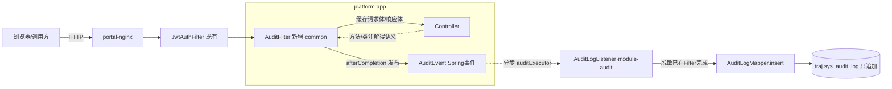

# MOD-AUDIT-001 操作审计日志模块设计

> 功能编号：F34（功能清单 §G 系统管理域）
> 文档版本：v1.1（2026-10-02）｜状态：**已实施并自测通过**
> 配套文档：[PRD-AUDIT-001 操作审计日志产品设计](../../html/PRD-AUDIT-001-操作审计日志模块产品设计.html)

---

## 1. 模块概述

### 1.1 定位

操作审计日志是平台的**合规与追溯基座**：自动、完整、防篡改地记录"谁在什么时间、从什么终端、对什么对象、做了什么操作、结果如何"，为安全事件追溯、操作纠纷定责、监管检查（北斗动态监控运营服务规范、网络安全等级保护）提供证据。

本期交付：**写操作与登录全量留痕 + 敏感查询按需留痕 + 日志检索页面 + 只追加防篡改**。

### 1.2 职责边界

| 在范围内（本期） | 不在范围内（后续） |
|---|---|
| 登录成功/失败、所有 POST/PUT/DELETE 自动留痕 | 细粒度按钮级权限控制（F33 IAM） |
| 注解式敏感查询留痕（导出、视频调阅等） | 日志投递到外部 SIEM / ELK |
| 管理端多条件检索、详情查看 | 按保留期自动归档/清理、分区表（F35/运维期） |
| 只追加存储 + 行内容指纹（防篡改检测基础） | 哈希链完整性校验工具、WORM 存储 |
| 操作人/IP/UA/耗时/结果/脱敏请求摘要 | 操作实时告警（如异常时段登录，F19） |

### 1.3 非目标与原则

- **审计绝不影响业务**：采集组件任何异常只输出 error 日志，不阻断请求；落库异步化。
- **零业务侵入优先**：默认规则自动覆盖全部 `/api/**`，业务代码仅在需要业务语义时加 `@AuditLog`。
- **最小化敏感数据**：密码/令牌/密钥类字段脱敏落库；请求体截断存储。

---

## 2. 现状与设计约束

1. 鉴权链路：`JwtAuthFilter`（order=1，拦截 `/api/*`）解析 JWT 写入 `UserContext`（ThreadLocal，含 username/role），`/api/auth/login` 跳过该过滤器；当前仅有演示账号 admin/ADMIN（F33 前）。
2. 统一响应：`Result<T>{code,message,data}`，业务约定 `code=0` 成功；业务失败返回 HTTP 200 + 非 0 code（如 40901）；仅鉴权失败为真实 HTTP 401。
3. MyBatis-Plus 已启用驼峰映射、分页插件（PG 方言）、`@MapperScan("com.mydbd.**.mapper")`；`BaseEntity` 带 create/update 自动填充。
4. 表全部位于 `traj` schema；init 脚本按序号执行（现有 01~04）。
5. Spring Boot 3.2 / Java 17，platform-common 为各业务模块共享，**不能反向依赖业务模块**。
6. 部署链路：浏览器 → portal-nginx(8090) → platform-app(8080)，真实客户端 IP 经 `X-Forwarded-For` 传递（需确认 nginx 已带该头，见 §13 待确认）。

---

## 3. 总体设计

### 3.1 采集架构



要点：

- **采集器在 common，落库实现在 module-audit**：common 只定义注解、事件、过滤器，通过 `ApplicationEventPublisher` 解耦；没有模块依赖倒置问题。未引入 module-audit 时事件无人监听，应用照常运行。
- **异步落库**：`@Async("auditExecutor")` 单线程顺序消费（保证单实例内时间有序，且避免并发争抢），队列容量 2000，拒绝策略 CALLER_RUNS（极端流量退化为同步，保证不丢审计）。
- **响应结果判定**：过滤器用 `ContentCachingResponseWrapper` 读取响应 JSON 的 `code` 字段；HTTP 状态与业务 code 双重判定成功/失败。
- **请求体读取**：用 `ContentCachingRequestWrapper`（下游读取不受影响，afterCompletion 时从缓存取 body）。

### 3.2 模块位置

```
platform-common（横切组件）
 └─ audit/AuditLog.java          注解（module/action/objectType/objectIdSpEL）
    audit/AuditAction.java       动作常量
    audit/AuditEvent.java        审计事件（不可变记录）
    audit/AuditFilter.java       采集过滤器 + 脱敏/语义解析
    audit/AuditProperties.java   开关与排除路径配置（audit.enabled 等）

module-audit（新模块）
 └─ entity/SysAuditLog
    mapper/SysAuditLogMapper
    service/AuditLogService     落库（指纹计算）、检索、统计
    listener/AuditLogListener   @Async 事件监听
    config/AuditAsyncConfig     线程池
    controller/AuditLogController
    vo/AuditLogVO / AuditStatsVO / dto/AuditLogQuery
```

platform-boot：`@EnableAsync`、父 pom 与 boot pom 注册 module-audit（方式同 module-mdm）。

### 3.3 默认采集规则

| 请求特征 | 是否记录 | 模块/动作来源 |
|---|---|---|
| `POST /api/auth/login` | 记录（成功→LOGIN，失败→LOGIN_FAIL；用户取请求体 username） | 内置规则 |
| POST / PUT / DELETE（业务） | 记录 | `@AuditLog` 注解优先；否则按路径与 HTTP 方法兜底映射 |
| GET | **默认不记录** | 仅方法标注 `@AuditLog(action=QUERY/EXPORT/VIDEO_VIEW...)` 时记录 |
| `/api/audit/**`、OPTIONS、actuator、静态资源 | 不记录 | 排除清单（可配置） |

兜底语义映射：module 取路径第 3 段（`/api/mdm/vehicles` → `MDM`，全大写），action 按方法 POST→CREATE、PUT→UPDATE、DELETE→DELETE；action_name 用字典缺省文案。

---

## 4. 数据模型设计

### 4.1 新增表：traj.sys_audit_log（审计日志，只追加）

| 列 | 类型 | 说明 |
|---|---|---|
| id | bigint PK | 应用雪花 ID（继承统一 ID 策略） |
| trace_id | varchar(48) | 一次请求一个，关联同请求产生的多条记录 |
| user_name | varchar(64) | 操作人；登录失败时取请求中的用户名；匿名（无 token）为 NULL |
| module | varchar(32) | 模块编码：AUTH/MDM/MONITOR/CEP/WORK_ORDER/VIDEO/AUDIT… |
| action | varchar(32) | 动作编码，见 §5.1 |
| action_name | varchar(64) | 动作中文名快照（如"车辆登记"），避免字典演进后历史不可读 |
| object_type | varchar(32) | 业务对象类型：VEHICLE/TERMINAL/DRIVER/DEPT/USER… |
| object_id | varchar(64) | 业务对象主键（SpEL 提取，字符串存储兼容未来复合键） |
| request_method | varchar(8) | GET/POST/PUT/DELETE |
| request_uri | varchar(256) | 不含 query 的路径 |
| query_string | varchar(512) | 截断保存（GET 记录时有用） |
| request_body | text | 脱敏 + 截断 2000 字符后的 JSON |
| status | smallint | 1=成功，0=失败（HTTP≥400 或业务 code≠0） |
| result_code | integer | 业务 code（如 0/40901/40101） |
| error_msg | varchar(500) | 失败时的 message（截断） |
| cost_ms | integer | 接口耗时毫秒 |
| client_ip | varchar(45) | X-Forwarded-For 首段，回落 remoteAddr；兼容 IPv6 |
| user_agent | varchar(256) | 截断 |
| content_hash | varchar(64) | 本行规范化内容 SHA-256（见 §5.3） |
| create_time | timestamp not null default now() | 操作时间（事件产生时刻，非落库时刻） |

索引：

```sql
CREATE INDEX idx_audit_time        ON traj.sys_audit_log (create_time DESC);
CREATE INDEX idx_audit_user_time   ON traj.sys_audit_log (user_name, create_time DESC);
CREATE INDEX idx_audit_module_act  ON traj.sys_audit_log (module, action, create_time DESC);
CREATE INDEX idx_audit_object      ON traj.sys_audit_log (object_type, object_id);
```

无 update/delete 列（不继承 BaseEntity 的 updater/update_date/valid_mark；无软删除）。应用层不提供修改/删除接口；数据库账号收回 UPDATE/DELETE 权限列入运维加固清单。

### 4.2 不建哈希链（本期）

`content_hash` 只做**行级指纹**用于离线篡改检测；不保存 `prev_hash`、不做串行哈希链——链式结构在异步并发与多实例部署下需要全局串行点，代价过高。表中不预留废列；未来需要时通过 `ALTER TABLE ADD COLUMN prev_hash` + 校验任务平滑升级（见 PRD §防篡改演进）。

---

## 5. 业务规则

### 5.1 动作字典（action_code）

| code | 名称 | 默认触发 |
|---|---|---|
| LOGIN | 登录成功 | POST /api/auth/login 且 code=0 |
| LOGIN_FAIL | 登录失败 | 同上且 code≠0/HTTP 401 |
| CREATE | 新增 | POST（注解可细化，如 VEHICLE_BIND） |
| UPDATE | 修改 | PUT |
| DELETE | 删除 | DELETE（业务为软删除也记 DELETE） |
| EXPORT | 数据导出 | 注解（后续波次） |
| VIDEO_VIEW | 视频调阅 | 注解（后续波次 F16/F25） |
| HANDLE | 业务处置（确认/派单/干预） | 注解（F17/F20/F21） |
| QUERY | 敏感查询 | 注解（普通查询不记录） |

模块编码随波次扩展：MDM、MONITOR、CEP、WORK_ORDER、AUDIT、IAM、CONFIG 等。

### 5.2 脱敏规则

对 request_body JSON 做键名匹配（大小写不敏感），命中后值替换为 `"***"`：
`password、oldPassword、newPassword、token、secret、serviceToken、jwt、idcard（身份证号）`；手机号（键名含 phone/mobile）保留前 3 后 4（138****8000）。无法解析为 JSON 的 body 不存原文。脱敏后长度截断 2000。

### 5.3 content_hash 计算

规范化字符串（字段以 `|` 连接，NULL 用空串）：
`traceId|userName|module|action|objectType|objectId|method|uri|status|resultCode|createTime(yyyy-MM-ddHH:mm:ss.SSS)`
→ SHA-256 HEX。用于：未来提供"按时间段重算指纹比对"的巡检任务，发现库表被直改的行。

### 5.4 登录事件特例

`/api/auth/login` 不经 JwtAuthFilter，AuditFilter 中对该路径：user_name 从请求体 JSON 的 `username` 字段提取；action 依据响应 code 区分 LOGIN/LOGIN_FAIL；失败同样落库（这是暴力破解审计的关键数据）。

### 5.5 性能与可靠性

- 过滤器内操作仅：缓存包装、计耗时、读小体积 body/响应头、发事件（耗时 < 1ms 量级）。
- 监听端异步 insert；审计 insert 失败 catch 后 error 日志，不重试（本期接受极低概率丢失，记录线程池监控指标到日志）。
- 排除高频 GET，预估写操作量级 < 10 万/日，单表可支撑数年；归档策略后续随 F35 补齐。

---

## 6. 接口设计

### 6.1 通用约定

前缀 `/api/audit/**`，JWT 鉴权，统一 `Result<T>` / `PageData<T>`；时间格式 `yyyy-MM-dd HH:mm:ss`。仅查询接口，无写入接口。

### 6.2 接口清单

| # | 方法路径 | 说明 | 查询参数/返回 |
|---|---|---|---|
| 1 | GET /api/audit/logs | 分页检索 | startTime,endTime,userName,module,action,status,keyword(模糊 uri/objectId/errorMsg),page,size → PageData&lt;SysAuditLog&gt;（列表不含 request_body 全文，返回 bodyPreview 前 200 字符） |
| 2 | GET /api/audit/logs/{id} | 详情 | 全字段（含 request_body） |
| 3 | GET /api/audit/stats | 区间概览（可选，本期实现） | startTime,endTime → {total, successRate, loginFailCount, actionDist:[{action,count}], topUsers:[{userName,count}]} |

检索强制时间范围：默认最近 7 天；单次跨度上限 90 天（超出 40001）；结束时间默认当前时刻。

### 6.3 主要错误场景

| 场景 | HTTP | code |
|---|---|---|
| 时间跨度 > 90 天 / 起始 > 结束 | 200 | 40001 |
| 日志不存在 | 200 | 40401 |
| 无 Token / 伪造 Token | 401 | 40101 |
| 权限不足（F33 上线后非管理员） | 200 | 40301 |

---

## 7. 后端工程结构

```
platform-common/src/main/java/com/mydbd/common/audit/
  AuditLog.java            @Retention(RUNTIME) @Target(METHOD)
  AuditAction.java         常量
  AuditEvent.java          record(...)
  AuditFilter.java         extends OncePerRequestFilter（注册 order=2）
  AuditRegistrar.java      @Configuration 注册 Filter（可由 audit.enabled 开关）

module-audit/
  pom.xml                  依赖 platform-common + mybatis-plus（同 module-mdm）
  config/AuditAsyncConfig.java   auditExecutor 线程池
  entity/SysAuditLog.java
  mapper/SysAuditLogMapper.java  extends BaseMapper + 2 个聚合 @Select
  service/AuditLogService.java   saveEvent / page / detail / stats
  listener/AuditLogListener.java @Async @EventListener
  controller/AuditLogController.java
  dto/AuditLogQuery.java
  vo/AuditLogVO.java、AuditStatsVO.java
```

过滤器在 common 中通过 `@ConditionalOnProperty(name="audit.enabled", havingValue="true", matchIfMissing=true)` 注册；module-audit 的 listener 缺省即存在。

语义解析：AuditFilter 在 afterCompletion 中通过 `request.getAttribute(HandlerMapping.BEST_MATCHING_HANDLER_ATTRIBUTE)` 取得 HandlerMethod（异步分发场景跳过 ERROR/ASYNC 分发类型），读取 `@AuditLog`；objectId 用 `SpelExpressionParser` + 方法参数名上下文（`#id`、`#req.vehicleId`）求值，求值异常降级为 NULL，不影响记录。

---

## 8. 前端设计

### 8.1 菜单与路由

新增一级分组"**系统管理**"（图标 Setting），下挂"操作审计"（路由 `/system/audit`，组件 `views/system/AuditLog.vue`，懒加载）。F33/F35 后续进入同一分组。菜单可见性本期不做角色控制（仅 admin 账号），路由 meta 预留 `perm: 'audit:view'`。

### 8.2 页面设计

- 顶部筛选卡片：时间范围（el-date-picker daterange，默认近 7 天）、用户名输入、模块下拉、动作下拉、结果下拉（成功/失败）、关键字输入；查询/重置。
- 表格列：时间、用户、模块（tag）、动作（tag，失败红色描边）、对象（objectType:objectId）、方法、URI、IP、耗时 ms、结果；详情按钮。
- 详情 el-drawer：全部字段分区展示（基本信息 / 请求信息 / 结果信息 / 终端信息），request_body 用 `<pre>` JSON 展示。
- 概览行（stats）：总操作数、成功率、登录失败次数、动作分布 top5（小型 el-progress 或数字卡）。
- 页面只读：无任何新增/编辑/删除按钮（产品上明确"日志不可人工干预"）。
- 新增 `src/api/audit.ts`、`src/constants/dict.ts` 增补 AUDIT_MODULES/AUDIT_ACTIONS。

---

## 9. 数据库变更脚本

新增 `infra/postgres/init/05-audit-tables.sql`：
- `CREATE TABLE IF NOT EXISTS traj.sys_audit_log`（§4.1）；
- 4 个索引；
- 表/列注释（中文）；
- 不灌种子。开发库直接对运行容器执行一次（与 04 脚本同样方式）。

---

## 10. 与其他模块的关系

- **F33 IAM**：审计先于 IAM 上线，user_name 来自 JWT subject；F33 后用户体系替换演示账号，审计表结构不变；详情可展示用户显示名（查询时 join，本期不做）。权限码 `audit:view` 随 F33 生效。
- **F17/F20/F21/F19**：处置、确认、派单、视频调阅等接口在对应波次加 `@AuditLog(action=HANDLE/VIDEO_VIEW, objectId=...)`，审计能力开箱即用。
- **F35 配置中心**：审计开关、排除路径、保留期未来迁移为系统参数；日志归档任务与 F35 字典/调度协同。
- **processing-service（Python）**：本期不审计其内部任务；其代平台调用的 service-token 请求由网关侧后续统一纳入。

---

## 11. 测试与验收标准

### 11.1 接口/集成用例

1. 登录成功产生 LOGIN=1 行；密码错误产生 LOGIN_FAIL 行且 user_name 为输入用户名；
2. MDM 新增车辆产生 CREATE 行，object_id 为新车辆 ID，request_body 中 password 类字段脱敏（以登录为例：body 中 password=***），手机号脱敏；
3. 修改/删除产生 UPDATE/DELETE 行；删除产生 40901 时 status=0、result_code=40901、error_msg 有值；
4. GET 列表默认**不**产生审计行；标注注解的 GET 产生 QUERY 行；
5. `/api/audit/logs` 自身不产生审计行；
6. 无 Token 访问审计接口返回真实 401；
7. 检索：时间范围、用户、模块+动作、失败筛选、关键字命中、分页 total 正确；跨度>90 天 40001；
8. 详情返回 request_body 全文；不存在 id 返回 40401；
9. 审计表不存在 update/delete 接口；
10. 故障注入：临时令 listener insert 抛异常，业务请求仍成功（响应与耗时不受实质影响）；
11. stats：总数/成功率/动作分布与明细一致；
12. 回归：既有 28 项 MDM 接口与监控/回放冒烟全部通过。

### 11.2 验收条件

- 12 组用例全过；浏览器完成"登录→制造若干操作→审计页检索→详情查看"完整闭环；
- 页面中文正常，失败行有明显视觉区分，时间均为本地时区；
- 代码中审计相关组件零业务侵入（除显式注解外，业务类不 import audit 包）。

---

## 12. 实施任务分解（批准后执行）

| 任务 | 内容 | 产物 |
|---|---|---|
| T1 | 05-audit-tables.sql 编写并对开发库执行 | 表+索引 |
| T2 | common：AuditLog 注解、AuditEvent、AuditFilter（缓存包装/脱敏/语义/SpEL/登录特例）、注册器与开关；platform-boot 加 @EnableAsync | common 5 类 |
| T3 | module-audit：pom 注册、实体/Mapper/Service/Listener/Controller/DTO/VO/线程池配置 | 后端模块 |
| T4 | 前端：api/audit.ts、字典、路由、系统管理菜单、AuditLog.vue（筛选/表格/抽屉/概览） | 1 页面 |
| T5 | 前后端构建、容器重建 | 可运行环境 |
| T6 | 接口自测 12 组 + 回归冒烟 | 测试记录 |
| T7 | 浏览器端到端验证 | 截图/结论 |

---

## 13. 待批准 / 待确认事项

1. **GET 默认不记、仅注解记录**的策略是否认可（避免查询日志爆炸；导出/调阅必须显式打注解）。
2. **异步落库 + 极端情况同步降级**的可靠级别是否满足本期合规要求。
3. 本期只做行级 content_hash、**不做哈希链**，是否认可。
4. 审计日志页面当前仅 admin 可见；正式权限随 F33 的 `audit:view` 生效。
5. 待确认 nginx 配置已透传 `X-Forwarded-For`（实施 T2 时核验 portal.conf，缺则补）。
6. 日志保留期与归档策略不在本期实现，预计随 F35/运维期补充。

---

## 14. 实施记录（v1.1，2026-10-02 落地）

T1~T7 全部完成，接口自测 12 组 + 浏览器端到端验证通过。相对 v1.0 设计的实现偏差（均已在代码落地）：

1. **AuditFilter 注册顺序由 order=2 改为 order=0**：必须包在 JwtAuthFilter（order=1）外层，才能在鉴权过滤器短路（无 Token/Token 失效直接返回 401）后仍记录匿名失败访问；同时 JwtAuthFilter 认证成功后把 UserInfo 写入 request 属性 `mydbd.audit.user`（其 finally 会清 ThreadLocal，过滤器返回后读不到）。
2. **common 实际落地 8 个类（非 5 个）**：新增 `AuditAspect`（@Around 切 `@AuditLog`，解析 objectId SpEL 入参）与 `AuditSemantic`（经 request attribute 传递给 Filter）；Filter 层拿不到 Controller 方法入参，SpEL 必须用 AOP 实现。
3. **objectId 兜底提取规则**：POST 优先取响应 `Result.data`（数字/含 id 对象）；PUT/DELETE 取路径末段数字；SpEL 结果优先于两者。修复过一次 POST 集合路径 objectType 兜底（末段即资源名）。
4. **雪花 ID 防 JS 精度丢失**：`SysAuditLog.id` 与 `AuditLogVO.id` 加 `@JsonSerialize(ToStringSerializer.class)`，前端 id 按 string 处理（19 位 ID 超 Number.MAX_SAFE_INTEGER，曾导致详情 40401）。
5. **统计接口路径**：`GET /api/audit/stats`（stats 内返回 total/successCount/successRate/loginFailCount/todayCount/actionDist/topUsers）。
6. **nginx 加固**：portal.conf 增加 `location = /index.html` 响应 `Cache-Control: no-cache, no-store, must-revalidate`，根除 SPA 发版后内嵌浏览器缓存旧 index.html/旧 chunk 问题（assets 文件名带 hash 仍可长缓存）。
7. **X-Forwarded-For 已核验**：portal.conf 各 location 均已透传，无需补充（§13.5 关闭）。当前本机经 Docker 端口映射访问时 client_ip 记录为网关 172.20.0.1，属部署形态正常现象。
8. **故障韧性验证方式**：以非 JSON POST（text/plain）注入，业务返回 500、审计仍落 status=0/result_code=50000 行，验证"审计不影响业务、异常内容不炸采集"。
9. 自测产生的审计行（含一次 hacker 登录失败、若干匿名 401）按只追加原则保留在 sys_audit_log；业务测试车辆已软删清理，种子基线恢复 5 车/5 终端/5 司机。
