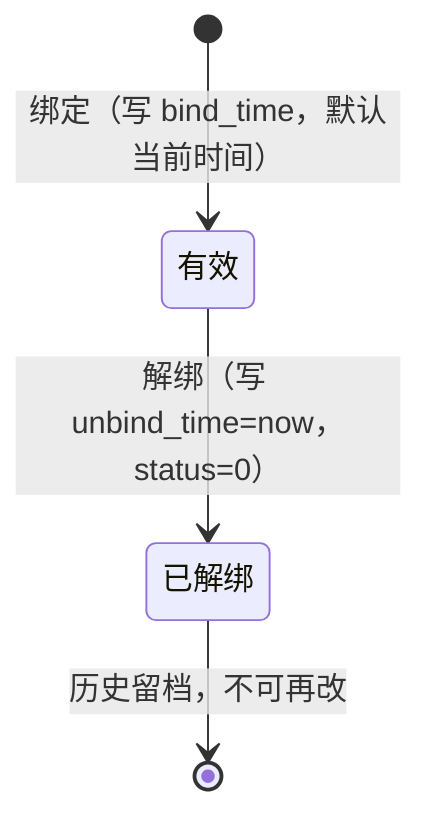

# MOD-MDM-001 主数据管理模块设计

> 版本：v1.1（上线回填）｜ 日期：2026-10-03
> 关联文档：[SYS-DBD-001 系统总体架构](../sys/SYS-DBD-001-系统总体架构.md)、[FUNC-DBD-001 功能清单](../../FUNC-DBD-001-功能清单.md)（F28~F32）、[DDL-TRAJ-001](../ddl/DDL-TRAJ-001-TRAJ-Schema数据库设计.md)
> 状态：**已上线**（F28~F32 全部落地，2026-10-03 核实回填，见 §14 实施记录）

---

## 1. 模块概述

### 1.1 定位

主数据管理（MDM，Master Data Management）模块负责平台"人、车、设备、组织"四类基础档案及其绑定关系的全生命周期维护，是实时监控、轨迹回放、风险预警、未来 808 接入（终端→车辆→车牌解析）与数据权限（按组织隔离）的共同数据底座。

对应功能清单：**F28 车辆档案、F29 终端档案、F30 驾驶员档案、F31 绑定关系、F32 企业与组织架构**。

### 1.2 职责边界

- ✅ 企业/车队组织树维护
- ✅ 车辆、终端、驾驶员档案的增删改查、启停用、分页筛选
- ✅ 车-终端、车-司机绑定/解绑与历史关系查询
- ✅ 主数据唯一性、绑定互斥等业务规则校验
- ✅ 为其他模块提供主数据下拉选项与详情数据
- ❌ 不做用户/账号/角色权限管理（属 F33 IAM，本模块仅预留权限码与数据权限字段）
- ❌ 不做数据字典管理后台（F35）；本期枚举值以前端常量 + 后端校验实现
- ❌ 不做 Excel 批量导入导出（本期仅单条维护；批量导入列入后续迭代）
- ❌ 不改轨迹点表结构、不做历史轨迹重算
- ❌ 不做多租户隔离逻辑（组织树先就位，租户字段与隔离随 IAM 一起落地）

---

## 2. 现状与设计约束

| 现状 | 影响 | 本设计对策 |
|---|---|---|
| `traj_vehicle / traj_terminal / traj_driver / traj_vehicle_terminal / traj_vehicle_driver` 五张主档表已存在且有种子数据 | 不新建重复表 | 直接复用，仅补全实体字段 |
| `traj_vehicle.dept_id` 存在但**无组织主表**（种子数据引用 1、2） | 组织筛选/数据权限无依据 | 新增 `traj.traj_dept` 组织表并回填 1、2 两个种子部门 |
| Java 侧仅有只读 `Vehicle` 实体（9 个字段，表有 19 个字段）、无 Terminal/Driver/绑定实体与任何写接口 | 管理功能从零开发 | 新增 `module-mdm` 业务模块 |
| 车-机、车-司解绑仅靠 `status/valid_mark`，车-终端表**缺少有效绑定唯一索引** | 并发绑定可能产生一车两机 | 补两个部分唯一索引（见 §5.2） |
| 公共字段 `creator/updater` 当前写入靠硬编码（种子为 system） | 新增审计字段无法自动留痕 | 增加 MyBatis-Plus `MetaObjectHandler` 自动填充（取 `UserContext`） |
| 统一响应 `Result/PageData`、全局异常、分页插件、JWT 过滤器均已就绪 | 直接复用 | 不重复建设 |
| processing-service 仅读写 `traj_gps_point/mon` 表 | MDM 改动对 Python 服务零影响 | 不改 Python 侧契约 |

**架构约束（来自 SYS-DBD-001）**：Java 业务模块之间零 Maven 依赖；模块间仅通过 HTTP/数据库表契约协作。故 MDM 为独立 Maven 模块，表物理上沿用 `traj` schema（表名为历史迁移资产，不改名）。

---

## 3. 总体设计

### 3.1 模块位置

```mermaid
flowchart TB
    subgraph FE["前端 frontend"]
        ORG["基础资料-组织架构"]
        VEH["基础资料-车辆档案"]
        TERM["基础资料-终端档案"]
        DRV["基础资料-驾驶员档案"]
        MONITOR["监控/回放/风险页（消费主数据）"]
    end

    subgraph JAVA["platform-app"]
        MDM["module-mdm（新增）<br/>组织/车/终端/司机/绑定"]
        TRAJ["module-trajectory（不变）"]
        MON["module-monitor（不变）"]
        COMMON["platform-common<br/>MetaObjectHandler（新增配置类）"]
    end

    subgraph PY["processing-app"]
        INGEST["ingest/simulator（契约不变）"]
    end

    subgraph DB[("PostgreSQL schema: traj")]
        T_DEPT["traj_dept（新增）"]
        T_VEH["traj_vehicle"]
        T_TERM["traj_terminal"]
        T_DRV["traj_driver"]
        T_VT["traj_vehicle_terminal"]
        T_VD["traj_vehicle_driver"]
    end

    FE -->|/api/mdm/**| MDM
    MONITOR -->|/api/mdm/*/options| MDM
    MDM --> COMMON
    MDM --> T_DEPT & T_VEH & T_TERM & T_DRV & T_VT & T_VD
    INGEST --> T_VEH
```

### 3.2 内部分层

```
controller   OrgController / VehicleController / TerminalController /
             DriverController / BindingController
   ↓
service      OrgService / VehicleService / TerminalService /
             DriverService / BindingService（事务边界、唯一校验、绑定互斥）
   ↓
mapper       DeptMapper / VehicleMapper / TerminalMapper / DriverMapper /
             VehicleTerminalMapper / VehicleDriverMapper（BaseMapper + 少量注解 SQL）
   ↓
entity       Dept / Vehicle（补全）/ Terminal / Driver / VehicleTerminal / VehicleDriver
dto/vo       *SaveRequest（入参校验）、*PageQuery、*VO（含关联展示字段）
```

---

## 4. 数据模型设计

### 4.1 新增表：traj_dept（企业/组织）

```sql
CREATE TABLE IF NOT EXISTS traj.traj_dept (
    id            bigserial    PRIMARY KEY,
    parent_id     bigint       NOT NULL DEFAULT 0,   -- 0=根节点
    dept_name     varchar(60)  NOT NULL,
    dept_code     varchar(40),                       -- 组织编码（可选，唯一）
    dept_type     smallint     NOT NULL DEFAULT 2,   -- 1=运输企业 2=车队/部门
    contact_person varchar(30),
    contact_phone varchar(30),
    province_code varchar(16),
    city_code     varchar(16),
    county_code   varchar(16),
    address       varchar(120),
    sort_no       integer      NOT NULL DEFAULT 0,
    valid_mark    smallint     NOT NULL DEFAULT 1,
    creator       varchar(40)  NOT NULL,
    create_date   timestamp    NOT NULL DEFAULT CURRENT_TIMESTAMP,
    updater       varchar(40),
    update_date   timestamp
);
COMMENT ON TABLE traj.traj_dept IS '企业与组织架构表';
CREATE UNIQUE INDEX IF NOT EXISTS uk_traj_dept_code
    ON traj.traj_dept (dept_code) WHERE valid_mark = 1;
CREATE INDEX IF NOT EXISTS idx_traj_dept_parent ON traj.traj_dept (parent_id);
```

种子数据（与现有车辆 dept_id 对齐）：id=1「北京物流公司」(企业)、id=2「北京配送中心」(企业)。

### 4.2 现有表补充索引

车-终端当前无任何有效绑定唯一约束，需补两个部分唯一索引（车-司机表已存在同类索引，无需变更）：

```sql
CREATE UNIQUE INDEX IF NOT EXISTS uk_traj_vt_vehicle_active
    ON traj.traj_vehicle_terminal (vehicle_id)  WHERE status = 1 AND valid_mark = 1;
CREATE UNIQUE INDEX IF NOT EXISTS uk_traj_vt_terminal_active
    ON traj.traj_vehicle_terminal (terminal_id) WHERE status = 1 AND valid_mark = 1;
```

车-司机增加一条"一车一个主班司机"约束（driver_type=1 主班）：

```sql
CREATE UNIQUE INDEX IF NOT EXISTS uk_traj_vd_vehicle_main
    ON traj.traj_vehicle_driver (vehicle_id)
    WHERE status = 1 AND valid_mark = 1 AND driver_type = 1;
```

> 司机同时只允许一条有效绑定的规则放在 Service 层校验（主/副班均受限），不建索引以便未来放开"副班可多车"策略。

### 4.3 字段字典（枚举约定）

| 字典 | 列 | 取值 |
|---|---|---|
| 组织类型 | dept.dept_type | 1 运输企业 / 2 车队·部门 |
| 车牌颜色 | vehicle.vehicle_plate_color | 蓝色 / 黄色 / 绿色 / 白色 / 黑色 |
| 运营类型 | vehicle.operation_type | 1 货运 / 2 客运 / 3 危化品 / 9 其他 |
| 终端协议 | terminal.protocol_type | JT808 / JT1078 / OTHER |
| 设备类型 | terminal.equipment_type | 沿用部标：1 一体机 / 2 分体机 / 4 视频智能终端（现有种子值为 4/2） |
| 终端状态 | terminal.status | 1 正常 / 2 维修停用 / 3 报废 |
| 司机性别 | driver.sex | 1 男 / 2 女 |
| 司机状态 | driver.status | 1 在岗 / 2 离岗 / 3 停用 |
| 绑定类型 | vehicle_terminal.bind_type | 1 正式安装 / 2 临时换装 |
| 司机类型 | vehicle_driver.driver_type | 1 主班 / 2 副班 |
| 绑定状态 | 两绑定表 status | 1 有效 / 0 已解绑 |
| 有效标记 | 全部表 valid_mark | 1 有效 / 0 失效（软删） |

字典在前后端各维护一份常量（后端做合法性校验，前端做下拉渲染），F35 字典中心上线后统一迁移到字典表。

### 4.4 公共字段与自动填充

所有主档表沿用 `creator/create_date/updater/update_date + valid_mark` 规范。新增配置类放于 **platform-common**（各业务模块通用）：

- 新增实体（含绑定记录）：`creator/updater` 自动取 `UserContext.username()`（当前登录名 admin），时间由 DB 默认值与填充器写入。
- 更新：自动写 `updater/update_date`。
- 存量 `BaseEntity` 已含四字段，填充器对其生效；不改变任何现有接口行为。

### 4.5 实体补全清单

| 实体 | 说明 |
|---|---|
| Dept | 对应 §4.1 全部字段 |
| Vehicle | 在现有 9 字段基础上补 vehicleIndustry、roadLicenseNo、省/市/县编码、车身颜色、车主电话、remark、validMark 等 |
| Terminal | 全字段：identityCode、tlMac、oemCode、tlModel、simAccount、protocolType、equipmentType、videoChannel、status、remark、validMark |
| Driver | 全字段：driverName、sex、idcard、contactPhone、licenseCode、licenceCategory、driverImg、status、remark、validMark |
| VehicleTerminal | 含安装人/安装时间、解绑时间等；关联 VO 追加车牌、终端号、型号 |
| VehicleDriver | 关联 VO 追加车牌、司机姓名、联系电话 |

---

## 5. 业务规则与状态

### 5.1 组织架构

1. 自关联树，根节点 `parent_id=0`；层级上限 **5 级**（企业→分公司→车队→班组）。
2. 同级 `dept_name` 不可重复；`dept_code` 启用后有效记录内唯一。
3. 删除/停用前置校验：存在有效子组织、有效车辆时拒绝（返回 40901 + 明确原因）。
4. 组织树接口一次返回全部有效节点，前端构建树（试点规模数据量小，不做懒加载）。

### 5.2 档案唯一性与生命周期

| 对象 | 唯一规则（有效记录） | 停用/删除规则 |
|---|---|---|
| 车辆 | 车牌号 + 车牌颜色唯一（现有索引保证） | 存在有效终端或有效司机绑定时禁止停用/删除，须先解绑 |
| 终端 | identity_code 唯一 | 已有效绑定车辆时禁止停用/删除 |
| 司机 | 驾驶证号 license_code 唯一 | 存在有效绑定时禁止停用/删除 |

- 删除统一为**软删除**（valid_mark=0），保留轨迹/事件历史可追溯；页面仅展示有效记录，删除接口只对管理员开放。
- 必填：车辆（车牌、车牌颜色）、终端（identity_code）、司机（姓名、驾驶证号）；VIN/驾驶证号做格式校验，手机号正则校验，不通过返回 40001 字段级错误信息。

### 5.3 绑定规则

| 关系 | 基数 | 规则 |
|---|---|---|
| 车 ↔ 终端 | 一对一 | 同一时刻一辆车仅一台有效终端、一台终端仅绑一辆车；记录安装人/安装时间/绑定类型 |
| 车 → 主班司机 | 一对一 | 一辆车仅一名有效主班司机 |
| 车 → 副班司机 | 一对多 | 可挂多名副班 |
| 司机 → 车辆 | 一对一 | 一名司机同一时刻仅允许一条有效绑定（主/副班均算），换人需先解绑 |

绑定/解绑要求双方 `valid_mark=1`；终端绑定额外要求 `status=1`、司机绑定要求 `status=1`。

### 5.4 绑定状态机



- 已解绑记录不可"复活"，重新绑定新增一条记录。
- "换绑"= 解绑旧关系 + 绑定新关系，在同一事务内完成（先拆后绑）。

### 5.5 并发与事务

- 绑定/解绑/换绑方法加 `@Transactional(rollbackFor = Exception.class)`。
- 互斥性以数据库部分唯一索引为最终防线：捕获 `DuplicateKeyException` 转换为 `CONFLICT(40901)`「该终端已绑定其他车辆」等业务提示。
- 档案创建与唯一性冲突同样转 40901，不向前端暴露堆栈。

---

## 6. 接口设计

### 6.1 通用约定

- 前缀 `/api/mdm/**`，JWT 鉴权（沿用 JwtAuthFilter），统一 `Result<T>` / `PageData<T>` 包装。
- 分页：`page`（默认1）、`size`（默认10、上限100）；时间/字符串字段沿用全局 `yyyy-MM-dd HH:mm:ss`。
- 入参用 Bean Validation 校验，错误走现有 `MethodArgumentNotValidException` 处理（40001）。
- 下拉选项统一 `/options` 轻量接口（仅 id + 展示名），供监控/回放/风险页及表单选用。

### 6.2 接口清单

| # | 方法 | 路径 | 说明 |
|---|---|---|---|
| 1 | GET | /api/mdm/depts/tree | 组织树（含车辆数统计） |
| 2 | GET | /api/mdm/depts/options | 组织下拉 |
| 3 | POST | /api/mdm/depts | 新增组织 |
| 4 | PUT | /api/mdm/depts/{id} | 修改组织 |
| 5 | DELETE | /api/mdm/depts/{id} | 软删组织（有子级/车辆时 40901） |
| 6 | GET | /api/mdm/vehicles | 车辆分页（关键字/组织/车牌颜色/运营类型筛选） |
| 7 | GET | /api/mdm/vehicles/options | 车辆下拉（id + 车牌） |
| 8 | GET | /api/mdm/vehicles/{id} | 车辆详情（含组织名、当前终端、当前司机） |
| 9 | POST | /api/mdm/vehicles | 新增车辆 |
| 10 | PUT | /api/mdm/vehicles/{id} | 修改车辆 |
| 11 | DELETE | /api/mdm/vehicles/{id} | 软删车辆（有有效绑定时 40901） |
| 12 | GET | /api/mdm/terminals | 终端分页（关键字/状态/协议/设备类型） |
| 13 | GET | /api/mdm/terminals/options | 终端下拉 |
| 14 | GET | /api/mdm/terminals/{id} | 终端详情（含绑定车辆） |
| 15 | POST | /api/mdm/terminals | 新增终端 |
| 16 | PUT | /api/mdm/terminals/{id} | 修改终端 |
| 17 | DELETE | /api/mdm/terminals/{id} | 软删终端 |
| 18 | GET | /api/mdm/drivers | 司机分页（姓名/手机/驾驶证号/状态） |
| 19 | GET | /api/mdm/drivers/options | 司机下拉 |
| 20 | GET | /api/mdm/drivers/{id} | 司机详情（含当前绑定车辆） |
| 21 | POST | /api/mdm/drivers | 新增司机 |
| 22 | PUT | /api/mdm/drivers/{id} | 修改司机 |
| 23 | DELETE | /api/mdm/drivers/{id} | 软删司机 |
| 24 | GET | /api/mdm/vehicles/{id}/bindings | 车辆绑定视图：当前终端 + 在班司机 + 历史记录 |
| 25 | POST | /api/mdm/vehicles/{id}/bind-terminal | 绑定终端（body: terminalId、bindType、installer、remark；已绑定时执行换绑） |
| 26 | POST | /api/mdm/vehicles/{id}/unbind-terminal | 解绑终端（body: remark） |
| 27 | POST | /api/mdm/vehicles/{id}/bind-driver | 绑定司机（body: driverId、driverType、remark） |
| 28 | POST | /api/mdm/vehicles/{id}/unbind-driver | 解绑司机（body: driverId、remark） |

### 6.3 典型报文

车辆分页响应（PageData 结构，records 内含关联展示字段）：

```json
{
  "code": 0, "message": "ok",
  "data": {
    "total": 5, "page": 1, "size": 10,
    "records": [{
      "id": 1, "deptId": 1, "deptName": "北京物流公司",
      "vehicleNo": "京A12345", "vehiclePlateColor": "蓝色",
      "vehicleType": "重型货车", "vehicleBrand": "解放",
      "operationType": 1, "ownerName": "北京物流公司",
      "validMark": 1,
      "boundTerminal": "TERM_001",
      "mainDriver": "张伟",
      "createDate": "2026-10-02 09:00:00"
    }]
  }
}
```

绑定终端请求：

```json
{ "terminalId": 3, "bindType": 1, "installer": "张三", "remark": "例行换装" }
```

### 6.4 主要错误场景

| 场景 | HTTP | code |
|---|---|---|
| 必填缺失 / 手机号·VIN·驾驶证号格式错误 | 200 | 40001 |
| 档案不存在 / 已删除 | 200 | 40401 |
| 车牌+颜色、终端号、驾驶证号重复 | 200 | 40901 |
| 有绑定关系时停用删除、组织存在下级/车辆时删除 | 200 | 40901 |
| 终端/司机已绑其他车、一辆车重复主班、绑定已停用对象 | 200 | 40901 |
| 无 Token / Token 失效 | 401 | 40101 |

---

## 7. 后端工程结构（实施清单，非代码）

```
backend-java/
├── pom.xml                         # modules 增加 module-mdm
├── module-mdm/                     # 新增 Maven 模块，仅依赖 platform-common
│   ├── pom.xml
│   └── src/main/java/com/mydbd/mdm/
│       ├── entity/    Dept / Vehicle(补全) / Terminal / Driver
│       │              / VehicleTerminal / VehicleDriver
│       ├── mapper/    六个 Mapper（BaseMapper；绑定历史用注解 SQL 关联查询）
│       ├── dto/       *SaveRequest、*PageQuery、BindTerminalRequest、BindDriverRequest
│       ├── vo/        DeptTreeVO、VehicleVO、TerminalVO、DriverVO、VehicleBindingVO
│       ├── service/   OrgService / VehicleService / TerminalService
│       │              / DriverService / BindingService
│       └── controller/ 五个 Controller，路径见 §6.2
├── platform-boot/pom.xml           # 增加 module-mdm 依赖（启动扫描已有根包覆盖）
└── platform-common/.../config/
    └── MybatisMetaObjectHandler.java   # 新增：公共字段自动填充
```

与现有代码的衔接：

- `module-trajectory` 的 `GET /api/traj/vehicles/registered` **本期保留不动**（避免影响已冒烟通过的链路）；车辆台账页面改用 `/api/mdm/vehicles`，旧接口在 F33 IAM 阶段统一清理。
- 监控/风险模块不改动；其页面如需展示组织/司机名，通过新增的 `/api/mdm/**/options` 或车辆详情接口取数，不引入模块间 Maven 依赖。
- processing-service、模拟器、样例导入逻辑**零改动**。

---

## 8. 前端设计

### 8.1 菜单与路由

MainLayout 侧边栏新增一级菜单组「**基础资料**」（简洁商务风，与现有菜单样式一致）：

| 菜单 | 路由 | 组件文件 |
|---|---|---|
| 组织架构 | /mdm/org | views/mdm/OrgTree.vue |
| 车辆档案 | /mdm/vehicles | views/mdm/VehicleList.vue |
| 终端档案 | /mdm/terminals | views/mdm/TerminalList.vue |
| 驾驶员档案 | /mdm/drivers | views/mdm/DriverList.vue |

新增 `src/api/mdm.ts` 承载 §6.2 全部接口；`src/constants/dict.ts` 存放 §4.3 枚举与标签/标签颜色映射。

### 8.2 页面设计

**① 组织架构 OrgTree.vue**

- 左侧 el-tree 组织树（顶部"新增根组织"按钮，节点 hover 显示新增下级/编辑/删除）；右侧选中组织的详情卡片 + 该组织下车辆简表。
- 表单弹窗字段：上级组织（树选）、名称、类型、编码、联系人/电话、省市区、地址、排序号。
- 删除被拒绝时展示后端返回的具体原因（如"该组织下还有 3 台有效车辆"）。

**② 车辆档案 VehicleList.vue**

- 顶部筛选：关键字（车牌/VIN）、组织（树选，含下级）、车牌颜色、运营类型 + 查询/重置。
- 表格列：车牌（含颜色标签）、所属组织、车型/品牌、运营类型、车主、当前终端、主班司机、状态、操作（编辑 / 绑定管理 / 删除）。
- 新增/编辑用 el-drawer 表单（字段分"基本信息 / 归属与证件"两组），前端做必填与格式校验。
- **绑定管理**弹层（核心交互）：三个区块——当前终端（显示终端号/型号/SIM，可换绑/解绑）、在班司机（主班+副班列表，可新增绑定/解绑）、历史记录（已解绑记录时间线，只读）。

**③ 终端档案 TerminalList.vue**

- 筛选：关键字（终端号/SIM）、协议、设备类型、状态。
- 表格列：终端号、品牌厂商、型号、SIM、协议、设备类型、视频通道数、状态、绑定车辆、操作。
- 表单弹窗维护全部档案字段；状态切换（正常/维修停用/报废）用下拉确认。

**④ 驾驶员档案 DriverList.vue**

- 筛选：姓名/手机号/驾驶证号关键字、状态。
- 表格列：姓名、性别、联系电话、驾驶证号、准驾车型、状态、当前绑定车辆、操作。
- 司机头像（driver_img）本期只保留字段与 URL 录入，不做上传组件（对象存储随 F35 建设）。

**通用交互**：所有列表分页用现有 `el-pagination` 风格；所有写操作成功后 ElMessage 提示并刷新当前页；删除用 ElMessageBox 二次确认；40901 冲突直接弹显后端消息。

### 8.3 权限预留

按钮/接口预留权限码，当前登录即 admin 全部可见，IAM 上线后接入指令式权限控制：

```
mdm:org:add/edit/delete
mdm:vehicle:list/add/edit/delete/bind
mdm:terminal:list/add/edit/delete/bind
mdm:driver:list/add/edit/delete/bind
```

数据权限预留：列表查询默认带 `deptId` 过滤能力（前端组织树选节点即按节点+子树过滤），IAM 的 ABAC「仅本企业车辆」规则后续在 Service 层追加，接口形态不变。

---

## 9. 数据库变更脚本

新增 `infra/postgres/init/04-mdm-tables.sql`（首启自动执行；幂等 `IF NOT EXISTS`）：

1. 创建 `traj.traj_dept` 及索引（§4.1）；
2. 回填种子部门 id=1/2（`ON CONFLICT DO NOTHING`）；
3. 补三条绑定部分唯一索引（§4.2）。

**已有环境升级方式**（供执行时参考，本设计阶段不执行）：对运行中的库手动执行同一脚本即可；不删改任何存量数据；现有 5 车/5 终端/5 司机种子数据与新部门天然对齐。

---

## 10. 与其他模块的关系

| 关联方 | 关系 |
|---|---|
| module-trajectory | 只读消费主数据（在途车辆、回放下拉）；本期新增 MDM options 接口供前端逐步替换，旧接口保留 |
| module-monitor | 风险事件展示车牌/司机信息时，以车辆/司机表为展示名称来源；后续通过内部 HTTP 或表关联读 |
| processing-service（Python） | 零改动。未来 808 网关上线后，报文 identity_code → 经 traj_vehicle_terminal → traj_vehicle 解析车牌，是本模块绑定关系的主要消费方 |
| F33 IAM（未建） | 消费 dept 树做数据权限；本模块预留权限码与 deptId 过滤 |
| F35 字典中心（未建） | 建成后 §4.3 枚举迁入字典表，前后端改数据源不改交互 |

---

## 11. 测试与验收标准

### 11.1 接口用例（实施后纳入冒烟脚本）

1. 组织：新增两级组织、重名拒绝、有车辆组织删除被拒、树结构正确；
2. 车辆：完整增改查、车牌+颜色重复 40901、有绑定时删除 40901、分页/关键字筛选命中；
3. 终端：增改查、终端号重复 40901、停用终端不可被绑定；
4. 司机：增改查、驾驶证号重复、手机号格式错误 40001；
5. 绑定：车绑终端成功→同一终端绑第二辆车 40901→换绑成功且旧记录有 unbind_time；主副班绑定、一辆车第二主班 40901、司机重复绑车 40901；解绑后双方可重新绑定；
6. 并发：对同一车辆并发两次绑终端，恰好一条成功（唯一索引验证）；
7. 鉴权：无 Token 全部 401；
8. 回归：现有监控/回放/样例导入/模拟器冒烟结果不受影响（28 项保持通过）。

### 11.2 验收条件

- [ ] 上述用例 100% 通过；
- [ ] 四个前端页面走通"查询→新增→编辑→绑定→解绑→删除"完整路径；
- [ ] 种子数据在新页面正确展示（5 车 5 终端 5 司机、初始绑定关系）；
- [ ] 无新增跨模块 Maven 依赖，`mvn clean package` 与 docker 构建通过；
- [ ] 公共字段自动填充生效（creator=admin，update 有 updater/update_date）。

---

## 12. 实施任务分解（批准后执行）

| 序号 | 任务 | 产出物 |
|---|---|---|
| T1 | 数据库脚本：traj_dept + 索引 + 种子部门 | 04-mdm-tables.sql |
| T2 | platform-common 公共字段自动填充 | MetaObjectHandler + 现有接口回归 |
| T3 | module-mdm 骨架：pom、6 实体、6 Mapper | 可编译模块，接入 boot |
| T4 | 组织架构后端（树/CRUD/校验） | 接口 1~5 |
| T5 | 车辆/终端/司机档案后端（分页/CRUD/启停用/options/详情聚合） | 接口 6~23 |
| T6 | 绑定关系后端（校验/状态机/换绑事务/历史） | 接口 24~28 |
| T7 | 前端 api/constants + 路由菜单 | mdm.ts、dict.ts、路由 |
| T8 | 四个管理页面 + 车辆绑定管理弹层 | views/mdm/* |
| T9 | 联调、冒烟脚本扩展、浏览器端到端回归 | 测试结果记录 |

---

## 13. 待批准事项

请评审以下决策点，确认后再进入编码：

1. **模块形态**：新建独立 Maven 模块 `module-mdm`（推荐，符合零依赖架构）；如倾向并入 module-trajectory 也可调整。
2. **组织表归属**：新表建在 `traj` schema（与现有主档表同库同 schema，改动最小）。
3. **绑定基数**：是否采纳"车-终端一对一、一车一主班可多副班、一司机同时仅一条有效绑定"。
4. **删除策略**：全部软删除（valid_mark=0），不提供物理删除入口。
5. **本期范围**：是否仅做单条维护、明确排除 Excel 批量导入导出与图片上传组件。

---

## 14. 实施记录（v1.1，2026-10-03 核实回填）

§13 五项决策点按推荐方案批准执行，F28~F32 已全部上线。交付物清单（2026-10-03 代码实证核实）：

| 层 | 交付物 |
|---|---|
| SQL | `infra/postgres/init/04-mdm-tables.sql`：traj_dept 新表 + 主档表扩展 + 菜单 100~104（主数据管理组/组织/车辆/终端/驾驶员）+ 按钮权限 201~204（edit）+ 角色授权 |
| 后端 | 新建 Maven 模块 `module-mdm`（零跨模块依赖）：5 Controller（`/api/mdm/vehicles`、`/api/mdm/terminals`、`/api/mdm/drivers`、`/api/mdm/depts`、`/api/mdm/vehicles/{vehicleId}` 绑定）+ 5 Service（Vehicle/Terminal/Driver/Org/Binding）+ Mapper/Entity/DTO/VO 全套 |
| 前端 | `views/mdm/VehicleList.vue`（含车-终端/车-司机绑定管理弹层，F31）、`TerminalList.vue`、`DriverList.vue`、`OrgTree.vue`；路由 4 条（meta.perm：mdm:org/vehicle/terminal/driver:view） |
| 架构决策 | 模块形态：独立 module-mdm（推荐项）；组织表：traj schema；绑定基数：车-终端一对一、一主班多副班、一司机单有效绑定；删除：全软删 valid_mark=0；范围：单条维护，无批量导入/图片上传 |

**核实结论**：后端 5 Controller、前端 4 页面+路由、数据库菜单 9 行+角色授权 20 条、线上接口路由已注册（未授权访问返回 401 而非 404），F28~F32 五项功能确认全部落地。本文档状态由"待批准"更正为"已上线"。
