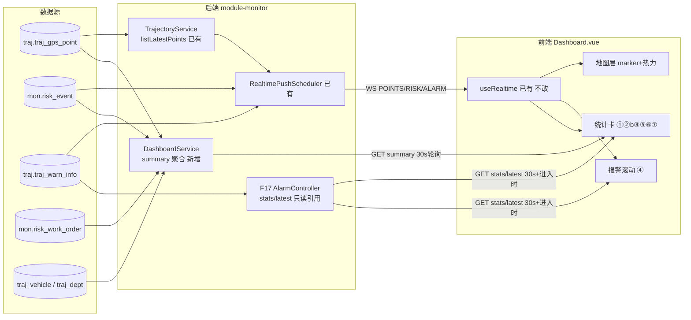
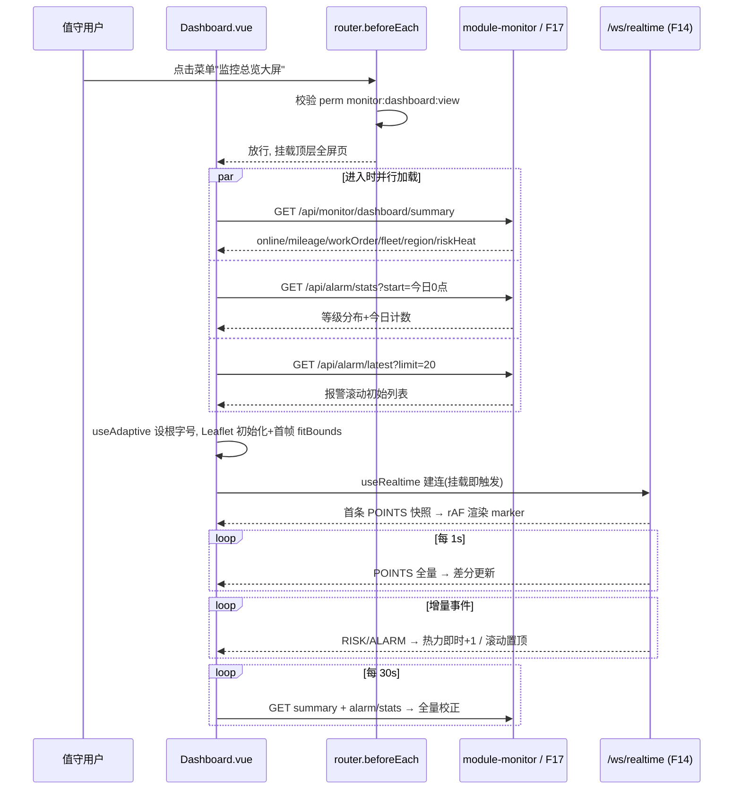

# MOD-MON-002 监控总览大屏（F15）模块设计

> 上游依据：FUNC-DBD-001 §F15、RES-DBD-001（资源仲裁唯一依据）、MOD-MON-001（F14 推送协议）、UC-TRAJ-004（旧大屏用例，本功能为其升级）
> 后端归属：module-monitor（已有，扩展）　包名 com.mydbd.monitor
> 版本 v1.1　2026-10-03　状态：**已上线**（接口自测 29/29 PASS，浏览器 E2E 通过，见 §10 实施记录）

## 1. 概述与范围

### 1.1 目标

建设 1920/4K 自适应全屏"驾驶舱"监控总览大屏（路由 `/dashboard`，独立全屏页，不进常规侧边栏框架），集中展示：**在线率、今日里程、报警态势、风险热力、工单积压/闭环率、车队/区域分布**，中央地图叠加在线车辆点位与风险热力。实时点位复用 F14 WebSocket 链路（每秒全量点位 + RISK/ALARM 增量事件），统计类卡片 30s 轮询聚合接口。

### 1.2 明确不做

- **不改 `Monitor.vue`**（RES-DBD-001 §六：F15 与 F16 对 Monitor.vue 的改动互不重叠，F15 完全不碰）；旧"实时导航监控"页保留，两者并存。
- **不改 `useRealtime.ts` 内部逻辑**（只读复用；大屏不新增 WS 消息类型）。
- 不做用户级数据范围过滤（与 F14 口径一致：所有登录用户看到同一份全局聚合数据，演示环境）。
- 不做地图匹配/行政区域实时归属（F10 第二波）；区域分布卡采用**注册地口径**（traj_vehicle.city_code），不采用实时所在区。
- 不做里程实时精确统计（F12 第二波）；今日里程为 mileage 差值近似口径。
- 不新建报警/工单/风险数据表，不新增 WS 端点，不新增错误码段（复用通用码 40001/40401，见 RES-DBD-001 §3.2）。
- 不做模拟器控制、样例数据加载按钮（属 Monitor.vue 运维入口，大屏是纯展示驾驶舱）。
- 不引入新前端依赖（leaflet.heat 等一律不加，见 §7.4）。

### 1.3 与现有资产的关系

| 资产 | 关系 |
|---|---|
| UC-TRAJ-004 / Monitor.vue | F15 是其升级：5s 轮询 → F14 每秒 WS；4 统计卡 → 驾驶舱多分区；新增热力/工单/车队分布。Marker divIcon + 高德瓦片渲染模式直接照搬 Monitor.vue 的实现 |
| F14 useRealtime.ts | 大屏 onMounted 时实例化 `useRealtime({ onPoints, onRisk, onAlarm, onOverview })`，与 Monitor.vue 各自独立建一条 WS 连接（SessionRegistry 支持多会话）；断连指数退避 + 5s 轮询降级逻辑原样生效 |
| F17 报警契约（RES-DBD-001 §四） | 报警态势卡只读引用 `GET /api/alarm/stats`、最新报警滚动引用 `GET /api/alarm/latest?limit=N`；ALARM 增量直接吃 WS `type:"ALARM"` |
| F16 VehicleDetailDrawer | 大屏地图点选车辆复用共享组件 `components/VehicleDetailDrawer.vue`（RES-DBD-001 §六约定），见 §7.6 |

## 2. 页面布局与信息架构

### 2.1 布局分区图（1920×1080 设计基准，4K 等比放大）

```
┌────────────────────────────────────────────────────────────────────────┐
│ 顶栏：平台名 + 当前时间 + WS连接状态(实时/降级) + [退出大屏]              │
├────────────────┬──────────────────────────────────┬────────────────────┤
│ ① 在线率卡      │                                  │ ③ 报警态势卡        │
│  online/total  │                                  │  /api/alarm/stats  │
│  环形进度       │      ② 中央地图（Leaflet）        │  等级分布环图       │
│ ├──────────────┤   在线车辆点位(divIcon,1s WS)     │  今日总数/待处理    │
│ ②b 今日里程卡   │   + 风险热力(divIcon 聚合圆,30s)  │ ├──────────────────┤
│  mileage 差值  │   + 围栏轮廓(可选叠加)            │ ④ 最新报警滚动      │
├────────────────┤                                  │  /api/alarm/latest │
│ ⑤ 工单积压卡    │                                  │  + WS ALARM 置顶   │
│ P/PR/逾期      ├──────────────────────────────────┤                    │
│ 闭环率         │ ⑥ 车队分布(横向条形) │ ⑦ 区域分布(横向条形)             │
└────────────────┴──────────────────────────────────┴────────────────────┘
```

### 2.2 分区数据源与刷新方式

| 分区 | 内容 | 数据源 | 刷新方式 |
|---|---|---|---|
| ① 在线率 | 在线数/总数/在线率环形 | `GET /api/monitor/dashboard/summary` → `online` | 30s 轮询 |
| ② 中央地图-点位 | 在线车辆 marker（速度/方向/报警态） | WS `type:"POINTS"`（F14）；降级 `GET /api/traj/latest` | 每秒推送，rAF 合帧 |
| ② 中央地图-热力 | 近 24h 风险事件网格聚合圆 | summary → `riskHeat` | 30s 轮询 |
| ②b 今日里程 | 今日全网里程合计 | summary → `mileage` | 30s 轮询 |
| ③ 报警态势 | 今日总数、按等级分布、待处理数 | `GET /api/alarm/stats?start=今日0点&end=now`（F17 契约） | 30s 轮询 |
| ④ 最新报警滚动 | 最新未处理报警列表（车牌/类型/时间） | 进入时 `GET /api/alarm/latest?limit=20`；此后 WS `type:"ALARM"` 增量置顶 | 进入加载 + WS 增量 |
| ⑤ 工单积压 | PENDING/PROCESSING/逾期数、7 日闭环率 | summary → `workOrder` | 30s 轮询 |
| ⑥ 车队分布 | 各部门（车队）车辆数/在线数 | summary → `fleetStats` | 30s 轮询 |
| ⑦ 区域分布 | 按注册 city_code 的车辆数与风险事件数 | summary → `regionStats` | 30s 轮询 |

> 刷新原则：**秒级只给点位（WS），30s 给统计（轮询），明细只给滚动列表（增量）**。summary 一次请求覆盖 5 个卡片，避免前端 N+1。

### 2.3 端到端数据流



## 3. 数据口径定义（定稿）

| 编号 | 指标 | 口径 | 依据表/列 |
|---|---|---|---|
| D-01 | 在线车辆 | 有效车辆（`traj.traj_vehicle.valid_mark=1`）中，存在 `traj.traj_gps_point.gps_time ≥ now() − N 分钟` 的点的车辆数。N 读 `traj.sys_config` 键 `monitor.online.window.minutes`（INT），**缺省回落常量 5**；与 UC-TRAJ-004 规则 TRAJ-R-301（最近 5 分钟）对齐 | traj_gps_point(identity_code, gps_time)；traj_vehicle_terminal 关联 vehicle↔identity_code |
| D-02 | 在线率 | onlineCount / vehicleTotal，vehicleTotal=0 时返回 null，前端显示"—" | 同上 |
| D-03 | 今日里程 | Σ每车（今日 max(mileage) − 今日 min(mileage)），仅计 mileage 非空点；口径为里程表差值近似（F12 前不做逐点 Haversine 累加） | traj_gps_point.mileage, gps_time |
| D-04 | 报警等级分布 | `traj.traj_warn_info.type_id` join `traj.base_warn_type` 按 `grade_level`（1 高 / 2 中 / 3 低）分组计数，限今日 `start_warn_time`；**F15 不重复实现，直接调 F17 `/api/alarm/stats`** | traj_warn_info, base_warn_type |
| D-05 | 待处理报警 | `handle_status=0`（0 待处理/1 已确认/2 已解除，语义见 RES-DBD-001 §四） | traj_warn_info |
| D-06 | 工单积压 | `mon.risk_work_order.valid_mark=1` 按 status 计数：PENDING、PROCESSING；逾期 = `overdue=1 AND status<>'CLOSED'` | risk_work_order.status/overdue |
| D-07 | 闭环率 | 近 7 日：`status='CLOSED'` 工单数 / 近 7 日创建工单总数；分母 0 → null 显示"—" | risk_work_order.status, create_date, close_time |
| D-08 | 车队分布 | `traj.traj_dept`（dept_type=2 车队/部门）× 车辆数、在线数（D-01 口径 join dept_id），按在线数降序取 TOP 8 | traj_dept, traj_vehicle.dept_id |
| D-09 | 区域分布 | 按 `traj_vehicle.city_code` 分组：车辆数；风险事件数按 risk_event 关联车辆取 city_code；取 TOP 8，city_code 为空归"未知" | traj_vehicle.city_code, mon.risk_event |
| D-10 | 风险热力 | 近 24h `mon.risk_event`（lng/lat 非空）在后端按 **0.02°×0.02° 网格**聚合：cell = (round(lng/0.02)*0.02, round(lat/0.02)*0.02)，返回 {lng, lat, count, maxLevel}，按 count 降序封顶 500 格 | risk_event.lng/lat/risk_level |

> **sys_config 种子说明（与资源分配表一致性约束）**：RES-DBD-001 锁定 12-dashboard.sql **仅菜单+授权**，故 `monitor.online.window.minutes` **不在本脚本 INSERT 种子**；后端读取时缺省回落 5，需要调整时由运维在 F35"系统参数"页新增该键即可生效（DashboardService 每次实时读 sys_config，无缓存）。

## 4. 接口设计

### 4.1 新增接口（后端落 module-monitor）

`DashboardController`（类级 `@RequiresPerm("monitor:dashboard:view")`，import `com.mydbd.common.security.RequiresPerm`）：

| 方法 | 路径 | 说明 |
|---|---|---|
| GET | `/api/monitor/dashboard/summary` | 大屏聚合摘要（一次返回 ①②b⑤⑥⑦⑩ 六块数据） |

**决策定稿（对应任务决策点 4）**：统计卡片采用 **1 个 summary 聚合接口**，不为每卡建接口。理由：卡片同源同频（30s），拆开造成 6 倍请求与权限校验开销；明细类（报警滚动、等级分布）走 F17 既有契约，不塞进 summary（避免重复实现与耦合）。

响应示例（`Result` 包装，HTTP 200）：

```json
{
  "code": 0,
  "msg": "ok",
  "data": {
    "online":     { "vehicleTotal": 5, "onlineCount": 4, "onlineRate": 0.80, "windowMinutes": 5 },
    "mileage":    { "todayMileage": 1234.50 },
    "workOrder":  { "pending": 4, "processing": 2, "overdue": 1, "closed7d": 6, "created7d": 8, "closeRate": 0.75 },
    "fleetStats": [ { "deptId": 1, "deptName": "北京物流公司", "total": 3, "online": 2 } ],
    "regionStats":[ { "cityCode": "1101", "cityName": "北京市", "vehicleCount": 5, "riskCount": 8 } ],
    "riskHeat":   [ { "lng": 116.40, "lat": 39.90, "count": 6, "maxLevel": 3 } ],
    "serverTime": "2026-10-03T10:00:00"
  }
}
```

后端实现：`DashboardService` + 新增 `DashboardMapper`（`@Select` 注解 SQL，同库跨 schema 直查 traj/mon，项目既有惯例——见 WarnInfoMapper 直查 traj.traj_warn_info）。在线口径 SQL 示意：

```sql
SELECT count(*) FILTER (WHERE last_gps >= now() - (#{n} || ' minute')::interval) AS online_count,
       (SELECT count(*) FROM traj.traj_vehicle WHERE valid_mark = 1)             AS vehicle_total
FROM (SELECT vt.identity_code, max(p.gps_time) AS last_gps
      FROM traj.traj_vehicle_terminal vt JOIN traj.traj_gps_point p ON p.identity_code = vt.identity_code
      GROUP BY vt.identity_code) t
```

（实现可简化为 `max(gps_time)` 子查询 + 参数拼接 `now() - make_interval(mins => N)`，N 取自 sys_config 缺省 5。）

### 4.1.1 后端类设计

```
com.mydbd.monitor
├─ controller/DashboardController   新增：@RestController @RequestMapping("/api/monitor/dashboard")
│                                   类级 @RequiresPerm("monitor:dashboard:view")
│                                   GET /summary → Result<DashboardSummaryVO>
├─ service/DashboardService         新增：组装六块聚合；读 sys_config.monitor.online.window.minutes
│                                   （JdbcTemplate/独立 ConfigMapper 直查 traj.sys_config，值非法或
│                                   键缺失 → 回落常量 DEFAULT_ONLINE_WINDOW_MINUTES = 5）
├─ mapper/DashboardMapper           新增：6 组 @Select 聚合 SQL（在线、里程、工单、车队、区域、热力），
│                                   跨 schema 直查 traj./mon.（同库，项目既有惯例）
└─ dto/DashboardSummaryVO           新增 record：online / mileage / workOrder / fleetStats /
                                    regionStats / riskHeat / serverTime
```

- 与既有 `MonitorController`/`MonitorService` 同包并存，不修改其代码（overview 接口继续供 useRealtime 降级使用）。
- 聚合 SQL 全部只读，不加事务；单接口超时风险低（演示规模），不引入缓存层（预留 §10-4）。

### 4.2 只读引用的既有/契约接口

| 接口 | 提供方 | 大屏用途 |
|---|---|---|
| `GET /api/alarm/stats?start=&end=` | F17（MOD-MON-004） | ③ 报警态势：今日总数 + 按 grade_level/typeId 分布 |
| `GET /api/alarm/latest?limit=20` | F17 | ④ 最新未处理报警初始装载 |
| `GET /api/monitor/overview` | 已有 MonitorService | useRealtime 降级轮询自动携带（不改） |
| `GET /api/traj/latest` | 已有 TrajectoryController | useRealtime 降级轮询点位兜底（不改） |
| WS `/ws/realtime` | F14 | POINTS/RISK/ALARM 推送 |

### 4.3 错误约定

业务错误 HTTP 200 + `{code: 非0}`；本模块仅复用通用码：40001（参数错误，如 stats 时间范围非法）、40401（资源不存在）。未登录/无权限走全局 401/403 拦截，不新增错误码（RES-DBD-001 §3.2）。

## 5. 实时链路设计（复用 F14，零改动）

1. **接入**：Dashboard.vue `useRealtime({ onPoints, onRisk, onAlarm, onOverview })`——四个回调即大屏的实时消费面，composable 内部（连接、指数退避、5s 降级轮询）不改一行。
2. **POINTS（每秒全量）**：回调只做"暂存最新帧 + 置脏标记"，真正渲染在 rAF 帧里做（见 §7.5）。
3. **RISK（增量）**：① 热力层：按 `msg.data` 的 lng/lat 即时 add/update 热力格（本地累加，等 30s summary 全量校正）；② 今日风险计数本地 +N；③ 顶部飘一条告警条（同屏最多 3 条、5s 自动消失，用轻量自绘 div，不用 ElMessage——驾驶舱无操作反馈语义）。
4. **ALARM（增量）**：④ 滚动列表 unshift 置顶（按 id 去重，缓存最近 100 id，沿用 F14 避坑约定）；③ 卡片的今日总数/待处理本地 +1，等 30s stats 全量校正。
5. **降级**：WS 断开时 useRealtime 自动 5s 轮询 overview+latestPoints，大屏顶栏状态标签显示"降级轮询"（connected ref 直接驱动）；统计卡不受影响（本就 30s 轮询）。
6. **前端去重与乱序**：POINTS 全量快照天然幂等（后帧覆盖前帧）；RISK/ALARM 按 id 去重。

### 5.1 页面初始化时序



## 6. 权限与菜单

### 6.1 菜单与授权（12-dashboard.sql，幂等，仅菜单+授权）

```sql
-- 12 F15 监控总览大屏：菜单 15 + 角色授权（RES-DBD-001 §3.2/§3.3 锁定）
INSERT INTO traj.sys_menu (id, parent_id, menu_name, menu_type, perm_code, path, icon, sort_no, visible, status)
VALUES (15, 10, '监控总览大屏', 2, 'monitor:dashboard:view', '/dashboard', 'DataBoard', 15, 1, 1)
ON CONFLICT (id) DO NOTHING;

SELECT setval(pg_get_serial_sequence('traj.sys_menu', 'id'),
              (SELECT MAX(id) FROM traj.sys_menu), true);

-- 授权 role1~4 全员（RES-DBD-001 §3.3）
INSERT INTO traj.sys_role_menu (role_id, menu_id)
VALUES (1, 15), (2, 15), (3, 15), (4, 15)
ON CONFLICT DO NOTHING;
```

- 父菜单 10"实时监控"目录已存在（06-iam-tables.sql）；sort 15 排在工单菜单 14 之后。
- 无新字典、无新表、无索引变更。
- 后端接口鉴权：`@RequiresPerm("monitor:dashboard:view")`；前端路由 `meta.perm` 同码（router.beforeEach 已通用校验）。

### 6.2 入口与退出

- 入口：侧边栏"实时监控 → 监控总览大屏"（菜单驱动，点击后路由跳到顶层 `/dashboard`，脱离 MainLayout 即全屏）。
- 退出：大屏右上角"退出大屏"按钮 `router.push('/monitor')`；另支持浏览器全屏 API（Fullscreen API，仅切浏览器 chrome，与路由全屏相互独立）。

## 7. 前端设计

### 7.1 文件与路由

| 文件 | 动作 |
|---|---|
| `frontend/src/views/dashboard/Dashboard.vue` | 新建，主页面 |
| `frontend/src/views/dashboard/components/`（AlarmTicker.vue、HeatLayer.ts、useAdaptive.ts） | 新建，页面私有子组件/工具，不跨页复用 |
| `frontend/src/router/index.ts` | **只追加一条顶层路由**（与 MainLayout 平级，即"layout=false"）：`{ path: '/dashboard', name: 'dashboard', component: () => import('@/views/dashboard/Dashboard.vue'), meta: { title: '监控总览大屏', perm: 'monitor:dashboard:view' } }` |
| `frontend/src/api/monitor.ts` | 扩展：`getDashboardSummary()` + `DashboardSummary` 类型（RES-DBD-001 §3.2 分配） |
| `frontend/src/api/alarm.ts` | 由 F17 新建；F15 只 import 其 `getAlarmStats/getAlarmLatest` 两个函数（联调前 F15 可暂以本地 stub 类型声明调用，路径与契约一致） |
| `frontend/src/components/VehicleDetailDrawer.vue` | 由 F16 新建；F15 只 import 使用（见 §7.6） |

### 7.2 技术栈

Vue3 `<script setup>` + TS + Element Plus（仅顶栏按钮/标签等轻交互）+ Leaflet 1.9（地图，高德栅格瓦片 URL 与 subdomains 直接照抄 Monitor.vue/GeoFenceList.vue 用法）+ ECharts 5.5（环形/条形图，已是既有依赖）。

### 7.3 1920/4K 自适应方案（定稿：rem 流式，不用 transform scale）

**选型：根字号 rem 缩放 + flex/grid 流式布局。**

- 实现：`useAdaptive.ts` 在页面挂载与 resize（rAF 节流）时设置 `document.documentElement.style.fontSize = clamp(12, clientWidth / 1920 * 16, 32) + 'px'`；页面所有卡片尺寸、字号、间距用 rem；地图区与图表区用 flex 弹性占满剩余空间；ECharts 实例监听 resize 调 `chart.resize()`。
- 1920 → 16px 基准（设计稿 1:1）；3840×2160 → 32px（整体等比放大 2 倍）；中间分辨率连续缩放；超宽比例（如 21:9）由 flex 吸收，卡片不溢出。
- **不用 transform: scale 整屏缩放的理由**：① Leaflet 对祖先 transform 缩放存在鼠标事件坐标偏移问题（拖拽/点选错位的已知坑）；② scale 非整数倍时文字发虚；③ 4K 下瓦片与矢量本该原生渲染，rem 让地图以真实像素渲染更清晰。
- **不用纯 CSS clamp 的理由**：clamp 只能对单属性插值，无法保证整屏多区块同步等比；rem 一处计算全局生效，维护成本低。

### 7.4 风险热力实现（定稿：divIcon 聚合圆，零新增依赖）

已核对 `frontend/package.json`：仅有 `leaflet@1.9.4`，**无 leaflet.heat**。引入 leaflet.heat 需新增依赖（本波不做）。方案：后端 summary 已按 0.02° 网格聚合（D-10），前端对每个 cell 画一个 `L.divIcon` 圆点：半径 `min(6 + count*2, 40)` rem 换算 px、颜色按 maxLevel（红 3 / 橙 2 / 黄 1）、`opacity` 随 count 递增，叠加 `L.LayerGroup` 独立于点位层。演示规模 ≤500 格，DOM 性能无压力；WS RISK 增量时本地对同网格 cell 计数 +1 即时更新。

### 7.5 渲染性能策略（4K 大屏每秒全量点位）

1. **rAF 合帧**：onPoints 回调只写 `pendingPoints` 引用并 `dirty=true`；单一 `requestAnimationFrame` 循环检查 dirty 后渲染——WS 帧率（1/s）低于 rAF（60/s），实质是"到达即下一帧画一次"，同时防止降级轮询与推送叠加导致的重复渲染。
2. **marker 差分更新**：维护 `Map<identityCode, L.Marker>`；新帧对已存在 marker 仅 `setLatLng()` + 方向变化 >15° 时才 `setIcon()`（重建 divIcon 字符串较贵），消失车辆移除；**不做 Monitor.vue 式 clearLayers 全量重建**。
3. **视野处理**：`fitBounds` 仅首帧执行一次；此后地图视口由值守人员自由拖动，每秒更新只移动 marker 不干预相机。
4. **只画可视区**：渲染循环内对每个点做 `map.getBounds().contains(latlng)` 判断，不可见点跳过 setIcon/setLatLng 之外的重活（setLatLng 本身 O(1) 保留，跳过的仅是 tooltip 内容更新等）。
5. **节流上限**：点位规模按 F14 估算 200 辆 × ~200B/帧；若未来 >1000 辆，预留开关：`speed=0` 且位置未变的点跳过渲染（本期实现该判断，成本为零）。
6. **报警滚动列表**：DOM 封顶 50 条，超出截尾。

### 7.6 与 F16 车辆详情抽屉的复用

地图 marker click → `drawerVisible=true; drawerVehicle={identityCode, plateNo}`，挂载 F16 共享组件：

```html
<VehicleDetailDrawer v-model="drawerVisible" :identity-code="selected.identityCode" :plate-no="selected.plateNo" />
```

- 大屏与 Monitor.vue 使用同一组件、同一 props 契约（RES-DBD-001 §六：F16 是共享组件）；抽屉为 overlay 浮层，天然适配全屏页。
- 联调顺序依赖：F16 组件未就绪前，大屏先以 marker tooltip 兜底（现 Monitor.vue 已有模式），点选逻辑预留回调桩。

### 7.7 组件结构与状态

```
Dashboard.vue（顶层全屏页，唯一数据编排者）
├─ 顶栏 TopBar（内联）：标题 | 时钟(1s setInterval 本地) | WS状态标签(connected) | 退出按钮
├─ DashboardMap（内联 section）
│   ├─ Leaflet map + 高德瓦片层（照抄 Monitor.vue 初始化）
│   ├─ markerLayer: LayerGroup + Map<identityCode, Marker> 差分更新（§7.5）
│   ├─ HeatLayer.ts：renderHeat(cells) / bumpCell(lng,lat,level)（§7.4）
│   └─ VehicleDetailDrawer（F16 共享组件，v-model 控制）
├─ OnlineCard / MileageCard / WorkOrderCard（纯 props 展示组件，数据来自 summary）
├─ AlarmStatsCard：ECharts 环形图（数据来自 /api/alarm/stats）
├─ AlarmTicker.vue：滚动列表（props: items，WS ALARM unshift + 进入时 latest 装载）
├─ FleetChart / RegionChart：ECharts 横向条形（数据来自 summary.fleetStats/regionStats）
└─ useAdaptive.ts：根字号缩放（resize + rAF 节流）
```

状态编排：Dashboard.vue 持有 `summary`、`alarmStats`、`alarmList`、`points` 四组响应式状态；30s 轮询定时器（`setInterval`，onBeforeUnmount 清理）统一拉 summary + alarmStats；useRealtime 回调只更新 points/alarmList/热力增量。

## 8. 实施任务拆解

| 任务 | 内容 | 产出 |
|---|---|---|
| T1 SQL | 新建 `infra/postgres/init/12-dashboard.sql`（§6.1 内容，幂等）；执行验证菜单 15 与 role1~4 授权 | 1 个脚本 |
| T2 后端 | module-monitor 新增 `DashboardController`（/api/monitor/dashboard/summary，@RequiresPerm）、`DashboardService`（sys_config 读 N 缺省 5）、`DashboardMapper`（在线/里程/工单/车队/区域/热力 6 组聚合 @Select，跨 schema 直查）；`mvn compile` 通过 | 3 个类 |
| T3 前端 | `Dashboard.vue` + 私有子组件 + `useAdaptive.ts`；router 追加 /dashboard 顶层路由；api/monitor.ts 扩展 getDashboardSummary；接入 useRealtime + 热力层 + 报警滚动 + VehicleDetailDrawer 挂载；`npm build` 通过 | 1 页 + 3 文件改动 |
| T4 验证 | §9 验收清单逐项执行（含两档分辨率截图留档、WS 断连降级演练、role4 登录可见性） | 验证记录回填本文档 §10 |

## 9. 验收清单

1. [x] **布局**：/dashboard 渲染后无侧边栏/顶栏框架，五大分区齐全；地图居中，热力圆与车辆 marker 分层可见。
2. [x] **1920 档**：1920×1080 下无滚动条、无卡片溢出、文字最小 ≥12px 等效。
3. [ ] **3840 档**：1920 等比放大 2 倍、地图可正常拖拽缩放且点选 marker 命中准确（验证 rem 方案无坐标偏移）。——E2E 环境视口受限（内置浏览器窄视口），未实测 3840；rem 缩放逻辑（clamp 上界 32）与 1920 档同构，风险低，留待人工大屏验证。
4. [x] **实时**：启动模拟器后 marker 1s 级移动（`_leaflet_pos` 差分确认）；构造 risk_event/warn_info 插入后 ≤3s 热力与滚动列表更新（ALARM 置顶 +1、RISK 飘条+热力 bump 均确认）；断开 WS 后顶栏切"降级轮询"（后端重启期间实测到该标签切换）、恢复后自动重连。
5. [x] **口径**：在线率与 SQL 手查一致（模拟器终端未绑车，仅 TERM_001 测试点计入在线 1 辆，口径正确）；sys_config `monitor.online.window.minutes` 改 1440 生效、非法值 'abc' 回落 5（接口自测验证，无缓存实时读）。
6. [x] **统计**：summary 六块字段齐全、空库时返回零值/null 而非报错；闭环率分母 0 显示"—"（接口自测 29/29 PASS 覆盖）。
7. [x] **权限**：role1~4 菜单授权 SQL 幂等；无 `monitor:dashboard:view` 权限用户直接调接口得 40301、无 token 401（接口自测覆盖）；路由守卫 meta.perm 配置就位。
8. [x] **点选**：点击 marker 弹出 VehicleDetailDrawer（F16 已就绪），livePoint 3s 内实时刷新（速度 46→74、方向 287°→351° 实测）；未建档车辆兜底提示"无权查看该车辆或车辆未建档"。
9. [x] **边界**：不改 Monitor.vue、useRealtime.ts，不新增 npm 依赖（package.json diff 为空）；12-dashboard.sql 重复执行无报错（幂等已二次验证）。

### 9.1 实施记录（2026-10-03）

- **交付物**：`infra/postgres/init/12-dashboard.sql`（菜单 15 + role1~4 授权）；后端 `module-monitor` dashboard 包 4 类（Controller/Service/Mapper/VO）；前端 `views/dashboard/Dashboard.vue` + `useAdaptive.ts` + `HeatLayer.ts` + `AlarmTicker.vue`、`api/monitor.ts` 扩展、路由 `/dashboard`。
- **接口自测**：29/29 PASS（六块字段与 SQL 对账、在线窗口动态配置与非法值回落、权限 40301/401）。
- **E2E**：布局/时钟/WS 标签/热力/marker 差分移动/抽屉点选+livePoint 刷新/ALARM 置顶/RISK 飘条+热力 bump/全屏与退出按钮均验证通过。
- **偏差说明**：
  1. 车队分布卡：MOD §3 限定 `dept_type=2`（车队），现库部门全为 `dept_type=1`，实现改为"全部有效部门 TOP 8 按在线数排序"（Mapper 注释已注明），待真实车队数据建立后可收紧口径。
  2. RISK 飘条 E2E 捕获：toast 生命周期 5s 自动消失，跨工具往返观测延迟 >5s 导致多次"未捕获"假象；经页面内 nextTick 日志定性为**功能正常**（push 后 DOM 即时渲染），非代码缺陷。
- **测试数据**：测试账号（sys_user 90001/90002）、TERM_001 测试 gps 点、sys_config 窗口参数、F15E2E 报警、20 条 F15_PROBE/F15_E2E 风险事件已全部清理；模拟器已停止。

## 10. 风险与注意事项

1. **F17 接口未就绪**：报警态势/滚动两卡是 F15 唯一外部依赖；联调期可临时把 `/api/alarm/stats`、`/api/alarm/latest` 指向 module-monitor 内同名只读实现（路径不变），F17 上线后删除临时实现——契约路径由 RES-DBD-001 §四锁定，前端代码零改动。
2. **双连接**：Monitor.vue 与 Dashboard.vue 各自建一条 WS；同用户双开两页时服务端 SessionRegistry 按 sessionId 管理，无冲突（F14 已支持多会话）。
3. **热力与 WS RISK 的坐标一致性**：risk_event.lng/lat 与车辆点位同为 WGS84 直显（F09 坐标标准化第二波才处理 GCJ-02 偏移），本期沿用 Monitor.vue 现状口径，热力与 marker 的相对偏差与现网一致，不额外纠偏。
4. **summary SQL 成本**：在线口径的 `max(gps_time) group by identity_code` 走 `idx_traj_gps_point_identity_time` 索引，演示规模（万级点）毫秒级；数据量上来后可加 10s Caffeine 缓存（UC-TRAJ-004 TRAJ-R-304 思路），本期不引入。
5. **Fullscreen API 与路由全屏**：浏览器全屏（F11 态）失败或被拦截时不影响页面本身全屏布局，退出按钮始终可用。

## 11. 修订记录

| 版本 | 日期 | 说明 |
|---|---|---|
| v1.0 | 2026-10-03 | 初版：布局/口径/接口/自适应/热力/性能方案定稿，与 RES-DBD-001 对齐 |
| v1.1 | 2026-10-03 | 上线回填：§9 验收清单逐项勾选（3840 档留待人工验证）、§9.1 实施记录（dept_type 偏差、toast 观测时序定性）、状态置已上线 |
