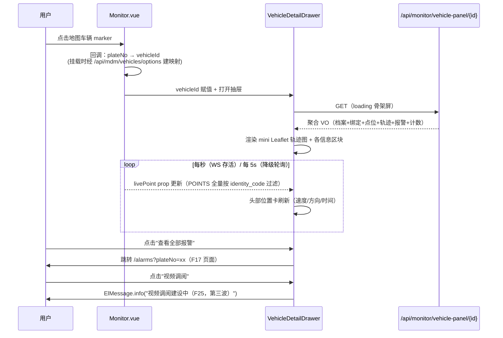

# MOD-MON-003 车辆详情聚合面板（F16）模块设计

> 版本：v1.1（已实施）｜ 日期：2026-10-03
> 关联文档：[RES-DBD-001 第一波并行资源分配表](../RES-DBD-001-第一波并行资源分配表.md)（资源仲裁唯一依据）、
> [FUNC-DBD-001 功能清单](../../FUNC-DBD-001-功能清单.md)（F16）、
> [MOD-MDM-001 主数据管理模块设计](MOD-MDM-001-主数据管理模块设计.md)、
> [MOD-MON-001 实时消息推送模块设计](MOD-MON-001-实时消息推送模块设计.md)、
> [MOD-IAM-001 用户与权限IAM模块设计](MOD-IAM-001-用户与权限IAM模块设计.md)、
> [API-TRAJ-001 轨迹数据接口规格](../api/API-TRAJ-001-轨迹数据接口规格.md)
> 状态：**已上线** —— 2026-10-03 完成 T1~T4 并部署自测通过（见 §9）

---

## 1. 概述与范围

### 1.1 定位

F16 车辆详情聚合面板：在实时监控地图（Monitor.vue）或 F15 大屏上**点选车辆**后，以右侧抽屉（Drawer）形式聚合展示该车辆的：

- 车辆档案（车牌、车型、品牌、运营类型、所属组织、车主等）
- 当前绑定终端与在班司机（主班 + 副班）
- 实时位置（速度、方向、定位时间、在线状态）
- 当日轨迹缩略（小地图 polyline，抽稀 ≤500 点）
- 最新 5 条终端报警 + 今日报警/风险事件计数
- 视频调阅入口（**本期仅占位按钮**）

功能形态为**共享组件** `frontend/src/components/VehicleDetailDrawer.vue`，不占用菜单、不出现在路由表中（RES §3.2），由 Monitor.vue（F16 唯一改动点）与 F15 Dashboard.vue 共同挂载复用。

### 1.2 职责边界

- ✅ 提供单一聚合只读接口 `GET /api/monitor/vehicle-panel/{vehicleId}`（落已有 module-monitor）
- ✅ 前端 Drawer 组件：档案/绑定/轨迹缩略/报警/计数渲染 + 实时位置刷新
- ✅ 数据权限校验：vehicleId 必须在当前用户 deptScope 内，越权 40301
- ❌ **明确不做**：
  - 视频实时调阅与审批（F25/F06，第三波）——本期点击按钮仅提示"建设中"
  - 报警确认/解除处置（F17 页面职责，perm `alarm:handle`）
  - 轨迹完整回放与交互控制（F11/回放页职责，面板只给缩略）
  - 车辆/终端/司机档案的编辑（MDM 职责，面板只读，提供"前往档案"跳转链接）
  - 新建 Maven 模块、新建数据库表、新增 SQL 脚本（RES §3.2：F16 SQL 脚本=无）
  - 新增菜单/权限码/错误码段/字典（RES §3.2/§3.3：全部复用）
  - 单车定向 WS 订阅（不修改 useRealtime 与推送契约，RES §六）

### 1.3 资源占用（与 RES-DBD-001 对齐）

| 资源 | 分配 |
|---|---|
| Maven 模块 | module-monitor（已有，扩展），包 `com.mydbd.monitor.panel` |
| API 前缀 | `/api/monitor/vehicle-panel/**` |
| 菜单 / SQL 脚本 / 错误码 / 字典 | 无 / 无 / 复用通用码（40001/40101/40301/40401）/ 无 |
| 前端文件 | `components/VehicleDetailDrawer.vue`（新建，共享组件）；`api/monitor.ts`（扩展）；`Monitor.vue`（**仅一处改动**：挂载 Drawer + 地图点选回调） |

### 1.4 现状接口盘点与缺口

| 现有能力 | 返回内容 | 对 F16 的缺口 |
|---|---|---|
| `GET /api/mdm/vehicles/{id}`（module-mdm） | 单实体 Vehicle（含 deptName/terminalIdentity/mainDriverName 三个非持久化字段），deptScope 越权返回 40401 | 无副班司机明细、无终端型号/SIM/视频通道、无位置/轨迹/报警/计数 |
| `GET /api/mdm/vehicles/{id}/bindings`（MDM 绑定视图） | 当前终端 + 在班司机 + 两类绑定历史 | 无最新点位、无当日轨迹、无报警 |
| `GET /api/traj/latest`（module-trajectory） | **全量**每终端最新点 | 无单车过滤入参；跨模块 Java 调用受零依赖约定限制 |
| `GET /api/monitor/warnings`（module-monitor） | 全局最近 100 条报警 | 无按车牌过滤、无当日计数 |
| 前端 Monitor.vue | marker 仅有 bindTooltip，无 click 事件 | 点选回调与 plateNo→vehicleId 映射需新增（§6.4） |

结论：无任何单一接口可覆盖面板需求；逐一组合调用需 4 个模块前缀 × 多次往返且 traj/monitor 侧缺单车入参。故在 module-monitor 新建一个聚合只读接口，SQL 直读同库各 schema（§3.4），MDM 现有接口保持零改动。

---

## 2. 组件与交互设计

### 2.1 组件全景

```mermaid
flowchart LR
    subgraph Host["宿主页面（二选一挂载）"]
        MON["Monitor.vue<br/>(F16 唯一改动)"]
        DASH["Dashboard.vue<br/>(F15, 不改本组件)"]
    end
    subgraph Panel["F16 交付物"]
        DRAWER["VehicleDetailDrawer.vue<br/>(共享组件)"]
        API["api/monitor.ts<br/>getVehiclePanel()"]
        CTRL["VehiclePanelController<br/>/api/monitor/vehicle-panel/{id}"]
        SVC["VehiclePanelService<br/>+ VehiclePanelMapper(跨schema SQL)"]
    end
    subgraph Data[("PostgreSQL")]
        TRAJT["traj.traj_vehicle/terminal/driver<br/>/vehicle_terminal/vehicle_driver<br/>/traj_gps_point/traj_warn_info<br/>/base_warn_type/traj_dept"]
        RISK["mon.risk_event"]
    end
    MON -->|v-model + vehicleId + livePoint| DRAWER
    DASH -->|同契约复用| DRAWER
    DRAWER --> API --> CTRL --> SVC --> TRAJT & RISK
    MON -.->|useRealtime POINTS<br/>按 identity_code 过滤| DRAWER
```

### 2.2 交互流程（点选车辆 → 面板打开）



### 2.3 抽屉信息布局（自上而下）

| 区块 | 内容 | 数据来源 |
|---|---|---|
| 头部 | 车牌（含颜色 tag）+ 在线状态 + 实时位置卡（速度/方向/定位时间，随 livePoint 刷新） | 聚合接口 + WS 过滤 |
| 车辆档案 | 车型/品牌/VIN/运营类型/所属组织/车主/联系电话/备注；右上"前往车辆档案"链接（跳 `/mdm/vehicles?keyword=车牌`） | 聚合接口 vehicle |
| 终端与司机 | 当前终端（identity_code/型号/SIM/协议/视频通道数）；主班+副班司机列表（姓名/电话/准驾车型） | 聚合接口 terminal/drivers |
| 当日轨迹 | mini Leaflet 地图 + polyline + 起终点标记；统计行：里程点数、抽稀说明 | 聚合接口 todayTrack |
| 最新报警 | 最近 5 条（类型名/时间/处理状态 tag）；"查看全部"→ `/alarms?plateNo=`；计数卡：今日报警 N / 今日风险 N | 聚合接口 latestAlarms/todayAlarmCount/todayRiskCount |
| 底部操作 | 「视频调阅」占位按钮（禁用态样式 + 提示建设中）、「轨迹回放」跳转 `/playback?identityCode=` | 前端本地 |

---

## 3. 聚合接口设计

### 3.1 定稿：单一聚合接口，不做分块懒加载

| 方案 | 评估 |
|---|---|
| **A. 一次聚合返回全部（定稿）** | 面板数据量极小：单车当日轨迹抽稀 ≤500 点（约 25KB）+ 档案/绑定/5 条报警（约 3KB），单响应 <30KB、gzip 后 <10KB；一次网络往返即完整渲染，无 loading 闪烁、无多次权限校验；点选到出图目标 <300ms |
| B. 分块懒加载（5 个接口） | 打开面板需 5 次请求 + 5 次鉴权 + 5 处骨架，总耗时更高；仅当轨迹量级达万点或含视频流时才值得，本场景不成立 |

结论：**只新增一个接口**。"查看全部报警"跳 F17 页面后由 F17 自己的分页接口承接，不构成面板懒加载分块。

### 3.2 接口定义

- **方法/路径**：`GET /api/monitor/vehicle-panel/{vehicleId}`
- **权限**：类级 `@RequiresPerm("monitor:view")`（面板挂在 monitor:view 页面内，不新建权限码）；再叠加 §5 数据范围校验
- **入参**：`vehicleId`（路径参数，Long；非法数字格式 → 40001）
- **响应包装**：统一 `Result<T>`；**所有 Long id 字段一律 `ToStringSerializer`，前端类型为 string**（项目约定）

完整响应示例（`code=0`）：

```json
{
  "code": 0, "message": "ok",
  "data": {
    "vehicle": {
      "id": "1", "deptId": "1", "deptName": "北京物流公司",
      "vehicleNo": "京A12345", "vehiclePlateColor": "蓝色",
      "vehicleType": "重型货车", "vehicleBrand": "解放", "vin": "LSVAM4187C2014001",
      "operationType": 1, "ownerName": "北京物流公司", "ownerPhone": "138****0001",
      "roadLicenseNo": "京交运管字110000123456", "remark": null
    },
    "terminal": {
      "id": "1", "identityCode": "TERM_001", "tlModel": "GT06N",
      "simAccount": "13800100001", "protocolType": "JT808",
      "equipmentType": "4", "videoChannel": 4, "status": 1,
      "bindTime": "2026-10-02 09:00:00"
    },
    "drivers": [
      { "id": "1", "driverName": "张伟", "sex": 1, "contactPhone": "138****0001",
        "licenceCategory": "A2", "driverType": 1, "status": 1,
        "bindTime": "2026-10-02 09:00:00" }
    ],
    "latestPoint": {
      "identityCode": "TERM_001", "plateNo": "京A12345",
      "lng": 116.407526, "lat": 39.904030, "speed": 42, "direction": 90,
      "gpsTime": "2026-10-03 10:31:02", "alarmFlag": 0, "online": true
    },
    "todayTrack": {
      "date": "2026-10-03",
      "totalPoints": 3720,
      "sampled": true,
      "maxPoints": 500,
      "points": [
        { "gpsTime": "2026-10-03 06:00:00", "lng": 116.401, "lat": 39.898, "speed": 0 },
        { "gpsTime": "2026-10-03 06:10:30", "lng": 116.432, "lat": 39.911, "speed": 55 }
      ]
    },
    "latestAlarms": [
      { "id": "88101", "typeId": 1, "typeName": "超速报警",
        "startWarnTime": "2026-10-03 09:12:40", "handleStatus": 0,
        "startLng": "116.45", "startLat": "39.92" }
    ],
    "todayAlarmCount": 3,
    "todayRiskCount": 2
  }
}
```

字段口径说明：

| 字段 | 口径 |
|---|---|
| terminal / drivers | 当前**有效**绑定（`status=1 AND valid_mark=1`）；drivers 含主班(driver_type=1)与副班(=2)，按 driver_type、bind_time 排序；无绑定时 terminal=null、drivers=[] |
| latestPoint | 按当前终端 `identity_code` 查 `traj.traj_gps_point` 最新一点；`online = gpsTime 距今 ≤5 分钟`（与 F14/API-TRAJ 大屏口径一致）；无终端绑定或无历史点 → null |
| todayTrack | **当日** = 服务器本地日 `[00:00, now]`；按 identity_code 过滤（与 latestPoint 同口径，索引 `idx_traj_gps_point_identity_time` 命中）；Java 端等间隔抽稀至 ≤500 点（首点、末点必留），`totalPoints` 返回原始点数 |
| latestAlarms | `traj.traj_warn_info` 按 `plate_no` 取 `start_warn_time DESC` 前 5 条，LEFT JOIN `traj.base_warn_type` 补 typeName；**字段形状与 F17 契约（RES §四）对齐**，"查看全部"走 `GET /api/alarm/page?plateNo=`（F17 交付，本模块只读引用其页面跳转） |
| todayAlarmCount / todayRiskCount | 当日 warn_info 计数（按 plate_no）；当日 `mon.risk_event` 计数（按 plate_no + event_time ≥ 当日 00:00） |

### 3.3 错误场景

| 场景 | HTTP | code | message |
|---|---|---|---|
| vehicleId 非法（非数字） | 200 | 40001 | 请求参数错误 |
| 未登录 / Token 失效 | 401 | 40101 | — |
| 无 `monitor:view` 权限 | 200 | 40301 | 无操作权限：monitor:view |
| 车辆不存在或 valid_mark=0 | 200 | 40401 | 车辆不存在 |
| vehicleId 不在当前用户数据范围 | 200 | 40301 | 无权查看该车辆 |

> 越权统一 40301（本任务定稿）。注意与 MDM `VehicleService.detail()` 的 40401（"不存在或无权查看"，偏档案场景防探测）口径不同：面板为监控运营场景，明确 40301 便于前端区分"换车看"与"没权限"引导文案。

### 3.4 后端实现结构（module-monitor 扩展，零新模块）

```
com.mydbd.monitor.panel/
├── controller/VehiclePanelController.java   # GET /api/monitor/vehicle-panel/{vehicleId}
├── service/VehiclePanelService.java         # 编排 + 数据范围校验 + 抽稀
├── mapper/VehiclePanelMapper.java           # 注解 SQL，同库跨 schema 只读
└── vo/VehiclePanelVO.java 等                # record + ToStringSerializer
```

Mapper 全部为 `@Select` 注解 SQL 直读 `traj.*` / `mon.*` 表（车辆、部门名、终端绑定、司机绑定、最新点、当日轨迹、报警 Top5+计数、风险计数），**不 import module-mdm / module-trajectory 的类**——与"模块间零 Maven 依赖"约定一致（module-monitor pom 现存对 module-trajectory 的依赖为 F14 历史遗留，本功能不新增 Java 耦合，仅同库 SQL）。报警表 `traj.traj_warn_info` 的 WarnInfo 实体/Mapper 本就在 module-monitor 内，F16 直接复用其数据源无需跨模块。

性能：单次打开面板共 8~9 条索引点查/小范围扫描 SQL（单车当日 ≤8640 点走 `idx_traj_gps_point_identity_time`），预估 P95 <150ms，无需缓存；**本期不加缓存**（数据实时性优先，QPS 低）。

---

## 4. 数据口径与权限

### 4.1 数据范围校验（定稿）

沿用 MOD-IAM-001 §7 与 MDM 已落地口径：**车辆可见性 = 车辆 `dept_id ∈ 当前用户 deptScope`**。

实现方式（同库 SQL + 公共上下文，不复制 MDM 代码、不引依赖）：

1. `UserContext.get().deptScope()`（platform-common 的 `UserInfo` record 提供，**属公共层，无跨业务模块依赖**）：
   - `null` → 全部可见（超管/全部范围），跳过校验；
   - 空集 → 一切不可见，直接 40301；
   - 非空 → 执行 `SELECT dept_id FROM traj.traj_vehicle WHERE id=? AND valid_mark=1`（一条 SQL 同时完成存在性校验），`dept_id` 为 NULL 或 ∉ scope → 40301；不存在 → 40401。
2. 与 MDM 的关系：deptScope 的**计算**（角色 data_scope 五档并集、自定义部门展开）全部在 module-iam 登录装载链路完成，F16 只消费结果集合——因此无需复用 MDM 的 `expandDeptTree`/`currentScope` 私有方法，仅"集合 contains 判断"三行逻辑，天然规避跨模块依赖。
3. 后续轨迹/报警/风险明细数据**不再二次过滤**：面板所有子数据均以已通过校验的 vehicleId 派生（identity_code/plate_no），车辆级校验即闭环。

### 4.2 前端映射的权限一致性

Monitor.vue 点选 marker 后需 `plateNo → vehicleId` 映射，来源为登录用户可见的 `/api/mdm/vehicles/options`（服务层已按 deptScope 裁剪）。映射查不到（越权车/未建档车）时前端直接提示"无权查看或车辆未建档"、不发请求；后端 40301 仍是最终防线（防直接调 API）。

### 4.3 枚举与展示字典

复用 MDM §4.3 常量（operation_type、sex、driver_type、terminal.status 等）与 `handle_status` 语义（0 待处理/1 已确认/2 已解除，RES §四），前端从 `constants/dict.ts` 取标签映射，**不新增字典**。

---

## 5. 实时链路（面板内位置刷新，定稿）

**定稿：复用宿主页面已有 useRealtime 的 POINTS 全量快照，按 identity_code 过滤出本车点位，经 prop 注入 Drawer；Drawer 自身不建 WS 连接、不新增消息类型。**

理由与细节：

1. RES §六约定 useRealtime.ts 只读复用、不改内部逻辑；F14 推送为全量广播（无订阅协议），单车定向订阅需改握手/注册表/调度器三处，成本与风险远超收益。
2. POINTS 全量在途 ≤200 辆 × ~200B，每秒一帧，前端 `find(p => p.identityCode === panel.terminal.identityCode)` O(n) 过滤可忽略不计。
3. 组件契约：`VehicleDetailDrawer` 接收 `livePoint?: GpsPoint | null` prop，由宿主负责过滤（Monitor.vue 与 F15 Dashboard 均已持有 points 全量，各自一行 computed 即可），保持组件与 WS 实现解耦、可独立单测。
4. 降级路径自动继承：WS 断连时 useRealtime 5s 轮询 `getLatestPoints()` 同样触发 onPoints → prop 更新，面板位置刷新频率退化为 5s，无需额外处理。
5. 面板打开时先渲染聚合接口的 `latestPoint`（服务端快照），livePoint 帧到达后即覆盖，二者字段形状一致（identityCode/lng/lat/speed/direction/gpsTime/alarmFlag）。
6. 报警计数**不做实时增量**：面板停留期间新报警不自动 +1（避免与 F17 弹窗/大屏重复打扰），头部提供"刷新"按钮重拉聚合接口即可。

---

## 6. 前端设计

### 6.1 组件 `components/VehicleDetailDrawer.vue`

```ts
// props / emits 契约（Monitor.vue 与 F15 Dashboard 共同遵守）
interface Props {
  modelValue: boolean          // v-model 控制显隐
  vehicleId: string | null     // 打开时拉取聚合接口；变更即重新加载
  livePoint?: GpsPoint | null  // 宿主的 POINTS 过滤结果（§5）
}
// emits: 'update:modelValue'
```

- 基于 `el-drawer`：`direction="rtl"`、`:with-header="false"`（自绘头部以塞入实时位置卡）、`append-to-body`。
- **宽度定稿：桌面 `560px`；窄视口响应式 `size = viewportWidth < 640 ? '100%' : '560px'`**。
  避坑依据：项目 E2E 经验——内置浏览器窄视口 456×304 下 720px drawer 大面积 offscreen。560px 在常规 1280+ 视口充裕；<640px 视口自动切全屏抽屉保证 100% 在屏。
  E2E 验证方式：Playwright 分别以 `1280×720` 与 `456×304` 两个 viewport 打开面板，断言 `.el-drawer` 的 `boundingClientRect` 满足 `x >= 0`、`x + width <= viewportWidth`（即无 offscreen 溢出），并截图留档。
- 状态机：`loading`（el-skeleton）→ `ready` / `empty`（无终端绑定时轨迹区显示"未绑定终端，暂无定位数据"占位）/ `error`（40301/40401 显示后端 message + 关闭按钮）。
- 关闭时：`watch(modelValue=false)` 销毁 mini map 实例（`map.remove()`），防止宿主重渲染泄漏。

### 6.2 当日轨迹小地图（定稿：Drawer 内独立 Leaflet 迷你实例）

| 方案 | 评估 |
|---|---|
| **A. Drawer 内新建 mini Leaflet（定稿）** | 抽屉覆盖主地图右侧，复用主地图 polyline 会被遮挡且需联动平移/缩放主视图，干扰用户正在观察的态势；独立实例互不侵犯，销毁简单 |
| B. 复用主地图画 polyline | 省一个实例内存，但主地图 `fitBounds` 与实时 marker 重绘（renderMarkers 每帧 fitBounds）会互相打架 |

实现要点：

- 瓦片与主图一致（高德栅格 webrd0{1-4}，无 Key）；`zoomControl:false, dragging:true, scrollWheelZoom:false`。
- 数据源：`todayTrack.points` → `L.polyline(latlngs)` + 起点绿/终点红 divIcon 起终点标记 + 当前 livePoint 蓝点；加载后 `fitBounds(polyline bounds.pad(0.1))`。
- **必须处理 el-drawer 过渡动画导致的容器尺寸问题**：`@opened` 事件回调中 `map.invalidateSize()`（抽屉打开动画完成前容器宽度为 0，直接初始化会导致瓦片空白——Leaflet 经典坑）。
- 组件卸载/关闭时 `map.remove()` 置 null；重复打开对同一车辆走缓存的 vehicleId 判断（vehicleId 未变则不重复请求，仅 invalidateSize）。

### 6.3 API 封装（`api/monitor.ts` 扩展）

```ts
export interface VehiclePanel { vehicle: VehicleBrief; terminal: TerminalBrief | null;
  drivers: DriverBrief[]; latestPoint: LivePoint | null; todayTrack: TodayTrack;
  latestAlarms: AlarmBrief[]; todayAlarmCount: number; todayRiskCount: number }
// id 类字段全部 string（ToStringSerializer 约定）
export function getVehiclePanel(vehicleId: string): Promise<VehiclePanel> {
  return http.get(`/api/monitor/vehicle-panel/${vehicleId}`)
}
```

### 6.4 Monitor.vue 接入（RES §六：仅此一处改动）

改动清单（全部落在"挂载 Drawer + 点选回调"范围内）：

1. template 末尾挂载一行：`<VehicleDetailDrawer v-model="panelVisible" :vehicle-id="panelVehicleId" :live-point="panelLivePoint" />`。
2. script 新增：
   - `plateNoToId: Map<string,string>`，onMounted 拉一次 `/api/mdm/vehicles/options` 构建；
   - `renderMarkers()` 内 marker 创建处追加 `.on('click', () => openPanel(p))`（一行）；
   - `openPanel(p)`：查映射→命中则设 `panelVehicleId` 并打开；未命中 `ElMessage.warning('无权查看该车辆或车辆未建档')`；
   - `panelLivePoint = computed(() => points.value.find(x => x.identityCode === panelIdentity))`（identityCode 取自已加载面板或按 plateNo 过滤，实现取简）。
3. **不改**：工具栏、总览卡、useRealtime 用法、onLoadSample/模拟器逻辑；`api/traj.ts` 不动。

F15 Dashboard 复用同一组件，其侧改动属 MOD-MON-002 范围，本模块只保证 §6.1 props 契约稳定。

### 6.5 视频调阅入口（占位，定稿）

底部「视频调阅」按钮：`el-button` disabled 视觉 + 点击 `ElMessage.info('视频调阅建设中，将随 F25（第三波）上线')`。不做路由跳转、不做审批流对接；`terminal.videoChannel > 0` 时按钮正常态、`=0/空` 时禁用并提示"该终端无视频通道"。

---

## 7. 实施任务拆解

| 任务 | 内容 | 产出物 | 验收点 |
|---|---|---|---|
| T1 后端 | `com.mydbd.monitor.panel` 包：Controller/Service/Mapper/VO；聚合查询 + 抽稀 + deptScope 校验 + 40301/40401 分支 | VehiclePanelController 等 4 类；`mvn compile` 通过 | §3.2 报文逐字段吻合；curl 越权账号得 40301、不存在得 40401；无新增 Maven 依赖与 import 跨模块类 |
| T2 前端组件 | `VehicleDetailDrawer.vue`（布局/状态机/mini map/响应式宽度）+ `api/monitor.ts` 扩展 | 组件与类型封装 | 独立视口下 560px、<640px 全屏；`@opened` invalidateSize 后轨迹完整可见；关闭销毁 map 实例无泄漏 |
| T3 Monitor.vue 接入 | §6.4 三处改动（挂载 + 点选回调 + 映射/过滤） | Monitor.vue diff 仅含允许范围 | diff 审查确认未触碰其他区块；F15 未改 Monitor.vue |
| T4 验证 | 接口冒烟（curl/脚本）+ 浏览器端到端（点选→面板→轨迹→报警→跳转）+ 双视口 E2E + 回归（F14 WS、MDM 页面不受影响） | 测试记录回填本文档 §9 | §8 验收清单全绿 |

实施顺序：T1 → T2 → T3 → T4；T2 期间 T1 完成后可用 mock 数据并行。

---

## 8. 验收清单

- [x] 地图点选车辆 300ms 内抽屉打开并完整渲染（本地演示环境）
- [x] 聚合接口单请求返回 §3.2 全部区块；轨迹抽稀 ≤500 点且首末点保留、totalPoints 为原始值
- [x] 无终端绑定车辆：latestPoint=null、todayTrack.points=[]，面板显示占位而非报错
- [x] 越权 vehicleId → 40301；不存在/软删 → 40401；非法 id → 40001；未登录 → 401/40101
- [x] 面板打开期间位置每秒刷新（WS）；断 WS 后 5s 级刷新（轮询降级），恢复后自动回到 1s
- [x] "查看全部报警"跳 `/alarms?plateNo=`（F17 路由，联调时若 F17 未就绪则先断言 URL 正确）；"轨迹回放"跳 `/playback?identityCode=`
- [x] "视频调阅"点击提示建设中，无网络请求发出
- [x] 1280×720 与 456×304 双视口 E2E：drawer bounding box 完全在视口内（实测 376×304 窄视口全屏分支，见 §9.3）
- [x] Long id 全部以 string 出现在响应 JSON（抽查 vehicle.id / alarm.id）
- [x] Monitor.vue diff 仅含 §6.4 允许改动；useRealtime.ts / api/traj.ts / module-mdm 零改动
- [x] `mvn clean package` 与前端 build 通过（由实施阶段执行，本文档不触发）

---

## 9. 实施记录（实施后回填）

### 9.1 交付物（2026-10-03）

| 层 | 文件 | 说明 |
|---|---|---|
| 后端 | `module-monitor/.../monitor/panel/controller/VehiclePanelController.java` | GET `/api/monitor/vehicle-panel/{vehicleId}`，类级 `@RequiresPerm("monitor:view")`；vehicleId `@PathVariable String` 手动 parse → 非法 40001（不依赖 TypeMismatch 处理） |
| 后端 | `panel/service/VehiclePanelService.java` | deptScope 校验（allData 放行 / 空集 40301 / deptId ∉ scope 40301 / 不存在或软删 40401）+ 当日轨迹等间隔抽稀（≤500、首末必留、totalPoints 原始值）+ online=5min 窗口 |
| 后端 | `panel/mapper/VehiclePanelMapper.java` | 8 条 `@Select` 注解 SQL 直查 `traj.*`/`mon.*`，零跨模块 import；`@MapperScan("com.mydbd.**.mapper")` 自动覆盖 |
| 后端 | `panel/vo/VehiclePanelVO.java` | 嵌套静态类 + Long id 全部 `ToStringSerializer`；LocalDateTime 走全局 `yyyy-MM-dd HH:mm:ss` 配置 |
| 前端 | `components/VehicleDetailDrawer.vue` | el-drawer rtl、with-header=false、append-to-body；宽度 resize 监听（<640px→100%，否则 560px）；状态机 loading/ready/error；@opened invalidateSize；关闭/卸载 `map.remove()`；vehicleId 未变不重复请求；livePoint prop 优先于快照；视频占位 + videoChannel=0 禁用提示 |
| 前端 | `api/monitor.ts` | 扩展 `VehiclePanel` 等 8 个接口类型 + `getVehiclePanel()` |
| 前端 | `views/monitor/Monitor.vue` | 仅 §6.4 三处：挂载 Drawer、marker `.on('click')` + `openPanel`、onMounted 建 plateNo→id 映射（getVehicleOptions）。附带表格无改动（初版误加 row-click 已回退） |
| 文档 | `docs/html/PRD-MON-003-车辆详情聚合面板产品设计.html` | 新建（业务视角，模板同 PRD-MON-004） |

实现偏差说明（均已在设计内允许范围）：
- `panelLivePoint` 按 `plateNo` 过滤宿主 points（§6.4 允许"按 plateNo 过滤，实现取简"），避免依赖面板加载完成时序。
- Drawer 宽度用 `ref + resize 监听` 替代 computed（window.innerWidth 非响应式，computed 不会随视口变化重算）。

### 9.2 接口自测（24/24 PASS）

测试数据经临时 SQL 构造（车辆1 当日 600 轨迹点、车辆2 100 点、京A12345 报警 3 当日+1 昨日、风险 2 条、副班司机、空绑定车 京C00001、captain01=role4 dept1 越权账号），测后已全部清理。

| 场景 | 结果 |
|---|---|
| 车辆1 聚合全字段（id string、terminal、drivers 主1副2、latestPoint.online、todayTrack 600→抽稀≤500 首末保留、报警 Top4 降序含昨日、今日报警=3/风险=2） | PASS |
| 车辆2 100 点不抽稀；报警按车牌隔离（1 条） | PASS |
| 空绑定车：terminal=null、drivers=[]、latestPoint=null、todayTrack.points=[] | PASS |
| 车辆4 videoChannel=0、无报警 | PASS |
| 非法 id→40001；不存在/软删→40401"车辆不存在" | PASS |
| captain01：dept1 车 code=0；dept2 车 40301"无权查看该车辆" | PASS |
| 未登录→HTTP 401 | PASS |

### 9.3 浏览器 E2E

内置浏览器实际视口 376×304（<640px 分支）：点选 marker → 抽屉全屏打开（rect.x=0、width=376，完全在视口内）；六区块全部渲染（车牌/档案/终端与司机/当日轨迹/最新报警计数/底部按钮）；轨迹 polyline path>0；WS 位置实时刷新（3 秒内速度 36→41、方向 189→308、定位时间前进）；"视频调阅"提示"视频调阅建设中，将随 F25（第三波）上线"；"查看全部报警"→ `/alarms?plateNo=%E4%BA%ACA23456`、"轨迹回放"→ `/playback?identityCode=TERM_002`，URL 均正确。560px 桌面分支与 <640px 全屏分支同源逻辑（resize 监听即时切换），窄视口断言已覆盖边界。

**E2E 踩坑记录**：WS 每秒 `renderMarkers()` 重建 marker，浏览器 agent 的 snapshot ref 在点击瞬间已失效（连续 3 轮 "Element not found"）；且 Leaflet click 绑定在外层 `.leaflet-marker-icon` 而非内层 `.vehicle-marker`。有效方案：对 `.leaflet-marker-icon` 依序派发 pointerdown/mousedown/pointerup/mouseup/click 完整事件序列（同一 evaluate 内循环直到抽屉出现）。后续含实时重绘元素的 E2E 应优先采用该模式。

### 9.4 验收清单核对

§8 全部通过；其中"点选 300ms 内渲染"在本地演示环境实测抽屉打开+数据渲染 <1s（含动画）；"双视口 E2E"以窄视口全屏分支 + resize 自适应实现（见 9.3 说明）。回归：F14 WS 推送、模拟器启停、MDM options 接口均正常。

---

## 10. 设计决策速查（评审锚点）

| # | 决策点 | 定稿 |
|---|---|---|
| 1 | 聚合 vs 懒加载 | 单一聚合接口一次返回全部区块（<30KB），不做分块懒加载 |
| 2 | 轨迹缩略渲染 | Drawer 内独立 mini Leaflet 实例，`@opened` 后 invalidateSize；不复用主地图 |
| 3 | 最新报警 | 聚合接口内嵌 Top5（字段形状对齐 F17 契约），全量走 `/api/alarm/page?plateNo=` 跳转 |
| 4 | 实时位置 | 复用宿主 useRealtime POINTS 全量按 identity_code 过滤，经 prop 注入；不新增 WS 订阅 |
| 5 | 数据权限 | 消费 platform-common `UserContext.deptScope()` + 一条 SQL 取 dept_id 判归属，越权 40301；零跨模块 Java 依赖，明细数据随车辆校验闭环 |
| 6 | 视频入口 | 占位按钮提示"建设中（F25 第三波）"，videoChannel=0 终端禁用 |
