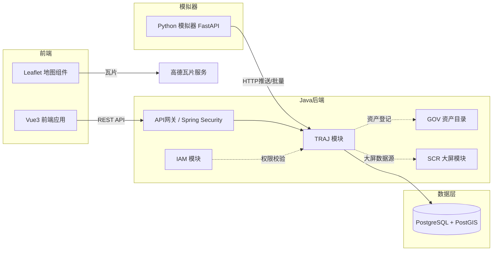
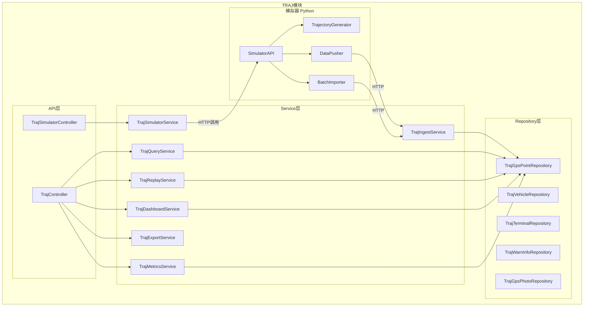
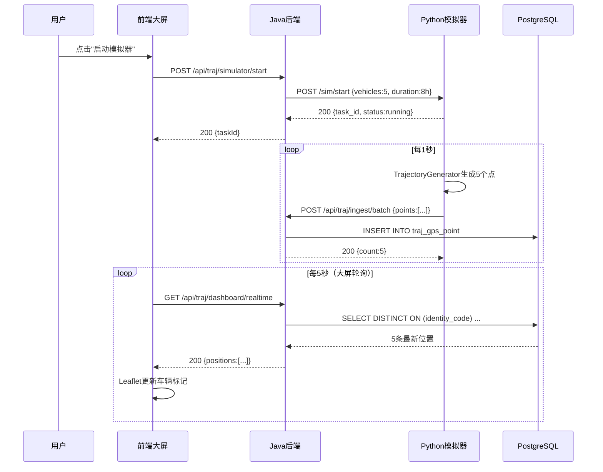
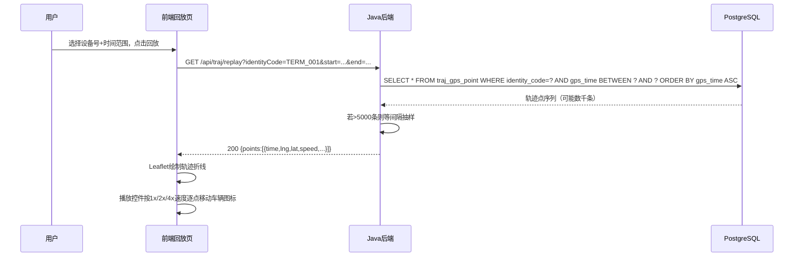

# MOD-TRAJ-001 轨迹数据模拟与可视化模块设计

> 版本：v1.0 ｜ 日期：2026-09-30
> 关联文档：SYS-001, SYS-005, DDL-TRAJ-001, UC-TRAJ-001~004, API-TRAJ-001~002

---

## 1. 模块概述

### 1.1 模块定位与职责边界

TRAJ 模块是系统第 7 个业务模块，负责北斗导航轨迹数据的模拟接入、存储、可视化与查询分析。该模块作为 MVP 阶段的演示增强功能，补足系统在时空数据领域的展示能力。

**职责边界**：
- ✅ 模拟北斗终端轨迹数据生成（Python 模拟器）
- ✅ 轨迹数据接入（批量导入 + 实时推送两种模式）
- ✅ 轨迹数据存储（PostgreSQL + PostGIS）
- ✅ 轨迹可视化展示（地图渲染、回放、查询、大屏）
- ✅ 轨迹指标计算（速度、距离、停留点）
- ✅ 报警事件与抓拍图片元数据管理
- ❌ 不负责真实北斗终端协议解析（演示阶段用模拟器）
- ❌ 不负责实时流处理（Kafka/Flink 等留待生产阶段）
- ❌ 不负责视频流传输（仅管理图片元数据）

### 1.2 技术栈

| 层 | 技术 | 版本 | 用途 |
|---|---|---|---|
| 模拟器 | Python + FastAPI | 3.11 / 0.110 | 轨迹数据生成与推送 |
| 后端 | Java + Spring Boot | 17 / 3.2 | 业务逻辑、查询服务 |
| 持久化 | PostgreSQL + PostGIS | 16 / 3.4 | 轨迹点空间存储与查询 |
| 前端地图 | Leaflet + 高德瓦片 | 1.9 / 栅格瓦片 | 地图渲染（免费无需 Key） |
| 前端图表 | ECharts | 5.x | 大屏图表 |
| 容器 | Docker Compose | — | postgis/postgis:16-3.4 镜像 |

### 1.3 模块在系统中的位置



---

## 2. 模块架构

### 2.1 内部分层结构



### 2.2 对外发布的接口（api 子包清单）

TRAJ 模块对外接口定义在 `com.mydatama.traj.api` 包中：

| 接口名 | 方法 | 说明 |
|---|---|---|
| `TrajQueryFacade` | `queryPoints`, `queryLatestPositions`, `queryByBoundingBox` | 轨迹查询服务 |
| `TrajReplayFacade` | `getReplayTrack`, `getReplaySpeed` | 轨迹回放服务 |
| `TrajDashboardFacade` | `getOverview`, `getRealtimePositions`, `getAlarmStats` | 大屏聚合数据 |
| `TrajMetricsFacade` | `calculateDistance`, `calculateSpeed`, `detectStops` | 指标计算 |
| `TrajSimulatorFacade` | `start`, `stop`, `getStatus`, `batchImport` | 模拟器控制 |

### 2.3 依赖的其他模块接口

| 模块 | 依赖接口 | 用途 |
|---|---|---|
| IAM | `AuthService.getCurrentUser()` | 获取当前用户、权限校验 |
| IAM | `AuditService.record()` | 操作审计 |
| GOV | `AssetCatalogService.registerAsset()` | 轨迹数据集登记为资产 |
| SCR | `DashboardAggregator.registerSource()` | 注册大屏数据源 |
| COM | `StorageService` | 抓拍图片文件存储 |

### 2.4 模块依赖规则（ArchUnit 约束）

```java
@ArchTest
static final ArchRule traj_should_not_depend_on_other_implementation =
    noClasses().that().resideInAPackage("..traj..")
        .should().dependOnClassesThat().resideInAPackage("..iam.impl..")
        .orShould().dependOnClassesThat().resideInAPackage("..proc.impl..");

@ArchTest
static final ArchRule traj_api_should_only_be_accessed_via_facade =
    classes().that().resideInAPackage("..traj.api..")
        .should().onlyBeAccessed().byClassesThat().resideInAPackage("..traj..")
        .orShould().beAnnotatedWith(RestController.class);
```

---

## 3. 核心类与组件设计

### 3.1 TrajectoryGenerator（模拟器·轨迹生成器）

- **职责**：根据预设路线与时间参数，生成符合北斗数据格式的轨迹点序列
- **语言**：Python（独立 FastAPI 进程）
- **接口定义**：

```python
class TrajectoryGenerator:
    def generate_route(
        self,
        vehicle_id: int,
        route_points: list[tuple[float, float]],  # [(lng, lat), ...] 路线关键点
        start_time: datetime,
        duration_hours: int,
        frequency_hz: float = 1.0,
        avg_speed_kmh: float = 40.0
    ) -> Iterator[GpsPoint]:
        """
        沿路线关键点插值生成轨迹点序列。

        Args:
            vehicle_id: 车辆ID
            route_points: 路线关键点经纬度列表
            start_time: 起始时间
            duration_hours: 持续时长（小时）
            frequency_hz: 采样频率（Hz），默认 1Hz
            avg_speed_kmh: 平均速度（km/h）

        Yields:
            GpsPoint: 轨迹点数据结构
        """
```

- **实现策略**：
  - 使用线性插值在路线关键点间生成中间点
  - 速度随机波动（±20% 围绕平均速度）
  - 模拟红绿灯停车（每 5-10 分钟停留 30-60 秒）
  - 方向角根据相邻点计算
  - 海拔使用固定值加小幅随机扰动
- **依赖**：无外部依赖（纯算法）
- **被依赖**：`DataPusher`、`BatchImporter`

### 3.2 DataPusher（模拟器·实时推送器）

- **职责**：按指定频率将生成的轨迹点通过 HTTP 推送到 Java 后端
- **接口定义**：

```python
class DataPusher:
    async def start_pushing(
        self,
        generator: TrajectoryGenerator,
        target_url: str,
        api_key: str,
        push_interval_ms: int = 1000
    ) -> None:
        """启动异步推送循环。"""

    async def stop_pushing(self) -> None:
        """停止推送。"""
```

- **实现策略**：`asyncio` 异步循环，`aiohttp` 发送 HTTP POST
- **依赖**：`TrajectoryGenerator`、Java 后端 `/api/traj/ingest` 接口
- **被依赖**：`SimulatorAPI`

### 3.3 TrajIngestService（数据接入服务）

- **职责**：接收模拟器推送/批量导入的轨迹点，校验并写入数据库
- **接口定义**：

```java
public interface TrajIngestService {
    /**
     * 接收单个轨迹点（实时推送模式）。
     * @param point 轨迹点DTO
     * @return 入库后的ID
     */
    Long ingestPoint(TrajGpsPointDTO point);

    /**
     * 批量接收轨迹点（批量导入模式）。
     * @param points 轨迹点列表
     * @return 入库数量
     */
    int ingestBatch(List<TrajGpsPointDTO> points);
}
```

- **实现类**：`TrajIngestServiceImpl`
- **实现策略**：
  - 单点接入：JPA save，PostGIS 几何字段用 `ST_SetSRID(ST_MakePoint(lng, lat), 4326)` 设置
  - 批量接入：`JdbcTemplate.batchUpdate` 提升性能，每批 500 条
  - 数据校验：经纬度范围（lng: 73-136, lat: 3-54），时间不超前于当前
- **依赖**：`TrajGpsPointRepository`
- **被依赖**：`TrajController`、`TrajSimulatorService`

### 3.4 TrajQueryService（轨迹查询服务）

- **职责**：按多维度条件查询轨迹点，支持分页、时间范围、设备/车牌筛选
- **接口定义**：

```java
public interface TrajQueryService {
    /**
     * 分页查询轨迹点。
     */
    Page<TrajGpsPointVO> queryPoints(TrajQueryRequest req, Pageable pageable);

    /**
     * 查询所有车辆最新位置（大屏实时展示）。
     */
    List<TrajLatestPositionVO> queryLatestPositions();

    /**
     * 按地图视野范围查询车辆。
     */
    List<TrajGpsPointVO> queryByBoundingBox(double minLng, double minLat,
                                            double maxLng, double maxLat);
}
```

- **实现策略**：
  - 时间范围查询走 `idx_traj_gps_point_identity_time` 索引
  - 最新位置查询：`SELECT DISTINCT ON (identity_code) ... ORDER BY identity_code, gps_time DESC`
  - 视野范围查询：PostGIS `ST_Within(location, ST_MakeEnvelope(...))` 走 GIST 索引
- **依赖**：`TrajGpsPointRepository`
- **被依赖**：`TrajController`

### 3.5 TrajReplayService（轨迹回放服务）

- **职责**：提取指定车辆/终端在时间范围内的完整轨迹序列，供前端按时间播放
- **接口定义**：

```java
public interface TrajReplayService {
    /**
     * 获取回放轨迹数据。
     * @param identityCode 设备号
     * @param startTime 起始时间
     * @param endTime 结束时间
     * @return 轨迹点序列（按时间升序）
     */
    List<TrajReplayPointVO> getReplayTrack(String identityCode,
                                           LocalDateTime startTime,
                                           LocalDateTime endTime);
}
```

- **实现策略**：
  - 一次查询全部轨迹点（时间范围内），按 `gps_time ASC` 排序
  - 返回精简字段：`gps_time, lng, lat, speed, direction, alarm_flag`
  - 若点数超过 5000，按等间隔抽样降至 5000（避免前端渲染压力）
- **依赖**：`TrajGpsPointRepository`
- **被依赖**：`TrajController`

### 3.6 TrajDashboardService（大屏聚合服务）

- **职责**：为轨迹总览大屏提供聚合数据
- **接口定义**：

```java
public interface TrajDashboardService {
    /** 总览统计：车辆总数、在线数、今日轨迹点数、报警数 */
    TrajOverviewVO getOverview();

    /** 实时车辆位置列表 */
    List<TrajLatestPositionVO> getRealtimePositions();

    /** 报警类型分布 */
    List<NameValueVO> getAlarmTypeDistribution();

    /** 时段轨迹点分布（24小时） */
    List<HourlyCountVO> getHourlyDistribution();
}
```

- **实现策略**：聚合查询，结果缓存 10 秒（Caffeine）
- **依赖**：`TrajGpsPointRepository`、`TrajVehicleRepository`、`TrajWarnInfoRepository`
- **被依赖**：`TrajController`、SCR 大屏模块（跨模块调用）

### 3.7 TrajMetricsService（指标计算服务）

- **职责**：基于轨迹点序列计算行驶速度、距离、停留点等关键指标
- **接口定义**：

```java
public interface TrajMetricsService {
    /**
     * 计算轨迹指标。
     */
    TrajMetricsVO calculate(String identityCode,
                            LocalDateTime startTime,
                            LocalDateTime endTime);
}
```

- **实现策略**：
  - 总距离：相邻点用 PostGIS `ST_DistanceSphere(prev, curr)` 累加
  - 平均速度：距离 / 总时长
  - 最高速度：`MAX(speed)`
  - 停留点检测：连续 3 分钟速度 < 5 km/h 的位置聚类
- **依赖**：`TrajGpsPointRepository`
- **被依赖**：`TrajController`

### 3.8 TrajSimulatorService（模拟器控制服务）

- **职责**：通过 HTTP 控制 Python 模拟器的启动/停止/状态查询
- **接口定义**：

```java
public interface TrajSimulatorService {
    /** 启动模拟器 */
    void start(SimulatorConfigDTO config);

    /** 停止模拟器 */
    void stop();

    /** 查询模拟器状态 */
    SimulatorStatusVO getStatus();

    /** 触发批量导入 */
    BatchImportResultVO batchImport(BatchImportDTO dto);
}
```

- **实现策略**：`RestTemplate` 调用 Python 模拟器 FastAPI 的控制接口
- **依赖**：Python 模拟器 API
- **被依赖**：`TrajSimulatorController`

---

## 4. 数据模型

### 4.1 涉及的表

详见 [DDL-TRAJ-001](../ddl/DDL-TRAJ-001-TRAJ-Schema数据库设计.md)。

| 表名 | 用途 | 读/写 |
|---|---|---|
| traj_gps_point | 轨迹点核心表 | 写：IngestService；读：Query/Replay/Dashboard/Metrics |
| traj_vehicle | 车辆台账 | 写：管理操作；读：Dashboard |
| traj_terminal | 终端台账 | 写：管理操作；读：Dashboard |
| traj_driver | 驾驶员档案 | 写：管理操作；读：关联查询 |
| traj_vehicle_driver | 车辆-司机绑定 | 写：管理操作；读：关联查询 |
| traj_vehicle_terminal | 车辆-终端绑定 | 写：管理操作；读：关联查询 |
| traj_warn_info | 报警信息 | 写：IngestService；读：Dashboard |
| traj_gps_photo | 抓拍图片元数据 | 写：IngestService；读：查询 |

### 4.2 实体关系（ER 片图）

详见 [DDL-TRAJ-001 §5 ER 片图](../ddl/DDL-TRAJ-001-TRAJ-Schema数据库设计.md#5-er-片图)。

### 4.3 读写规则与并发控制

- **写入**：轨迹点纯追加，无更新冲突。批量写入用 `JdbcTemplate.batchUpdate`
- **读取**：时间范围 + 设备号走复合索引；空间范围走 GIST 索引
- **并发控制**：轨迹点表无锁需求；台账表用乐观锁（`update_date` 比对）
- **缓存**：大屏聚合数据 Caffeine 缓存 10 秒；车辆/终端台账缓存 5 分钟

---

## 5. 业务流程

### 5.1 模拟数据生成与接入流程

- **触发条件**：用户在大屏点击"启动模拟器"或调用 API
- **前置条件**：种子数据已初始化（5辆车+5个终端）
- **正常流程**：



- **异常流程**：模拟器不可达 → 返回 503，前端提示"模拟器未启动"
- **后置条件**：traj_gps_point 表持续追加轨迹点
- **关联用例**：UC-TRAJ-001

### 5.2 轨迹回放流程

- **触发条件**：用户在查询页选择车辆与时间范围，点击"回放"
- **前置条件**：该时间范围内已有轨迹数据
- **正常流程**：



- **异常流程**：无数据 → 返回空列表，前端提示"该时间范围无轨迹数据"
- **关联用例**：UC-TRAJ-002

### 5.3 轨迹查询流程

- **触发条件**：用户在查询页输入筛选条件并搜索
- **前置条件**：已有轨迹数据
- **正常流程**：前端提交筛选条件 → 后端走复合索引分页查询 → 返回点列表 + 地图标记
- **关联用例**：UC-TRAJ-003

### 5.4 大屏实时展示流程

- **触发条件**：用户打开轨迹总览大屏页面
- **前置条件**：模拟器运行中或已有历史数据
- **正常流程**：前端每 5 秒轮询 `/api/traj/dashboard/realtime` → 后端返回最新位置 → Leaflet 更新标记
- **关联用例**：UC-TRAJ-004

---

## 6. 接口清单

| 方法 | 路径 | 说明 | 权限 | 详细文档 |
|---|---|---|---|---|
| POST | /api/traj/ingest | 单点接入 | traj:ingest | API-TRAJ-002 |
| POST | /api/traj/ingest/batch | 批量接入 | traj:ingest | API-TRAJ-002 |
| GET | /api/traj/query | 分页查询轨迹点 | traj:query | API-TRAJ-001 |
| GET | /api/traj/replay | 获取回放轨迹 | traj:query | API-TRAJ-001 |
| GET | /api/traj/metrics | 获取轨迹指标 | traj:query | API-TRAJ-001 |
| GET | /api/traj/export | 导出轨迹数据 | traj:export | API-TRAJ-001 |
| GET | /api/traj/dashboard/overview | 大屏总览 | traj:view | API-TRAJ-001 |
| GET | /api/traj/dashboard/realtime | 大屏实时位置 | traj:view | API-TRAJ-001 |
| GET | /api/traj/dashboard/alarms | 大屏报警统计 | traj:view | API-TRAJ-001 |
| POST | /api/traj/simulator/start | 启动模拟器 | traj:admin | API-TRAJ-002 |
| POST | /api/traj/simulator/stop | 停止模拟器 | traj:admin | API-TRAJ-002 |
| GET | /api/traj/simulator/status | 模拟器状态 | traj:view | API-TRAJ-002 |
| POST | /api/traj/simulator/batch-import | 批量导入 | traj:admin | API-TRAJ-002 |

---

## 7. 异常处理

### 7.1 模块特有异常

| 异常码 | 异常消息 | 触发条件 | 处理策略 |
|---|---|---|---|
| TRAJ_001 | 设备号不存在: {identityCode} | 接入的设备号未在 traj_terminal 登记 | 拒绝写入，返回 400 |
| TRAJ_002 | 经纬度超出中国范围: lng={lng}, lat={lat} | 接入数据坐标越界 | 拒绝写入，返回 400 |
| TRAJ_003 | GPS时间超前于当前时间 | 接入数据时间戳在未来 | 拒绝写入，返回 400 |
| TRAJ_004 | 模拟器未启动 | 调用 stop/status 时模拟器未运行 | 返回 409 |
| TRAJ_005 | 模拟器已运行 | 重复调用 start | 返回 409 |
| TRAJ_006 | 查询时间范围超过30天 | 查询跨度过大 | 返回 400，提示缩小范围 |
| TRAJ_007 | 回放数据量过大(>{limit}) | 单次回放超 10 万点 | 服务端抽样至 5000 点 |
| TRAJ_008 | 模拟器不可达 | Python 模拟器进程未启动 | 返回 503 |

### 7.2 降级策略

| 场景 | 降级策略 |
|---|---|
| PostGIS 空间查询超时 | 降级为 lng/lat 范围比较（B树索引） |
| 模拟器不可达 | 大屏展示历史最新位置，不刷新 |
| 回放数据量过大 | 服务端抽样 + 前端分段时间轴加载 |
| 批量导入部分失败 | 返回成功/失败计数，失败记录记录到日志 |

---

## 8. 安全设计

### 8.1 权限控制点

| 接口 | 权限码 | 角色 |
|---|---|---|
| /api/traj/ingest/* | traj:ingest | system（模拟器专用 API Key） |
| /api/traj/query | traj:query | viewer, operator, admin |
| /api/traj/replay | traj:query | viewer, operator, admin |
| /api/traj/export | traj:export | operator, admin |
| /api/traj/dashboard/* | traj:view | viewer, operator, admin |
| /api/traj/simulator/* | traj:admin | admin |

### 8.2 数据脱敏点

| 字段 | 脱敏规则 | 位置 |
|---|---|---|
| traj_driver.idcard | 中间 8 位星号替换 | 写入前（PROC 脱敏引擎） |
| traj_driver.contact_phone | 中间 4 位星号替换 | 写入前（PROC 脱敏引擎） |
| 导出数据中的驾驶员信息 | 整字段脱敏 | 导出时 |

### 8.3 审计点

| 操作 | 审计动作 | 审计字段 |
|---|---|---|
| 启动/停止模拟器 | SIMULATOR_START / SIMULATOR_STOP | userId, config, timestamp |
| 批量导入数据 | TRAJ_BATCH_IMPORT | userId, count, source |
| 导出轨迹数据 | TRAJ_EXPORT | userId, identityCode, timeRange, rowCount |

---

## 9. 配置项

| 配置键 | 类型 | 默认值 | 说明 |
|---|---|---|---|
| traj.simulator.enabled | boolean | true | 是否启用模拟器模块 |
| traj.simulator.python-url | string | http://traj-simulator:8088 | Python 模拟器地址 |
| traj.simulator.default-vehicles | int | 5 | 默认模拟车辆数 |
| traj.simulator.default-duration-hours | int | 8 | 默认模拟时长 |
| traj.simulator.default-frequency-hz | float | 1.0 | 默认采样频率 |
| traj.ingest.batch-size | int | 500 | 批量接入每批大小 |
| traj.ingest.max-lng | double | 136.0 | 经度上限（中国） |
| traj.ingest.min-lng | double | 73.0 | 经度下限 |
| traj.ingest.max-lat | double | 54.0 | 纬度上限 |
| traj.ingest.min-lat | double | 3.0 | 纬度下限 |
| traj.query.max-days | int | 30 | 查询最大时间跨度（天） |
| traj.replay.max-points | int | 5000 | 回放最大返回点数 |
| traj.replay.sample-threshold | int | 5000 | 触发抽样的点数阈值 |
| traj.dashboard.cache-ttl-seconds | int | 10 | 大屏聚合缓存时长 |
| traj.dashboard.polling-interval-ms | int | 5000 | 前端轮询间隔 |

---

## 10. 扩展点

### 10.1 轨迹数据源扩展

- **接口**：`TrajDataSource`（抽象接口）
- **现有实现**：`SimulatorTrajDataSource`（模拟器数据源）
- **如何新增实现**：
  1. 实现 `TrajDataSource` 接口（如 `JT808TcpDataSource` 接收真实北斗终端 TCP 推送）
  2. 在 `application.yml` 配置 `traj.source.type=jt808`
  3. 通过 `@ConditionalOnProperty` 自动激活新实现

### 10.2 地图引擎扩展

- **接口**：`MapEngine`（前端抽象，TypeScript interface）
- **现有实现**：`LeafletMapEngine`（Leaflet + 高德瓦片）
- **如何新增实现**：实现 `MapEngine` 接口（如 `AMapMapEngine` 使用高德 JS API），替换组件注入

### 10.3 存储层扩展

- **接口**：`TrajStorageService`（抽象接口）
- **现有实现**：`PostgisTrajStorageService`
- **如何新增实现**：未来可扩展 `ElasticsearchTrajStorageService`（海量轨迹场景）或 `S3TrajStorageService`（冷数据归档）

---

## 11. 验收标准

- [ ] Python 模拟器可独立启动，生成 5 辆车 × 8 小时 × 1Hz 的轨迹数据
- [ ] 模拟器通过 HTTP 推送轨迹点到 Java 后端，数据成功写入 `traj_gps_point`
- [ ] 前端地图可展示所有车辆最新位置，每 5 秒刷新
- [ ] 轨迹回放页可按时间范围播放轨迹，支持 1x/2x/4x 倍速
- [ ] 轨迹查询页支持按设备号/车牌/时间范围筛选，结果在地图标记
- [ ] 大屏展示 4 个统计卡片 + 2 个图表 + 实时位置地图
- [ ] 轨迹指标计算正确：总距离、平均速度、最高速度、停留点
- [ ] PostGIS 空间查询可命中 GIST 索引（EXPLAIN 验证）
- [ ] 权限控制生效：viewer 不能启停模拟器，不能导出数据
- [ ] 审计日志记录模拟器启停、批量导入、数据导出操作
- [ ] 模拟器不可达时大屏降级展示历史最新位置
- [ ] 容器内存增量 ≤ 80MB（PostGIS 50MB + 模拟器 30MB）

---

## 12. 修订记录

| 版本 | 日期 | 修订人 | 修订内容 |
|---|---|---|---|
| v1.0 | 2026-09-30 | system | 初版：完整模块设计，含 8 个核心组件、4 条业务流程、13 个接口、8 类异常 |
