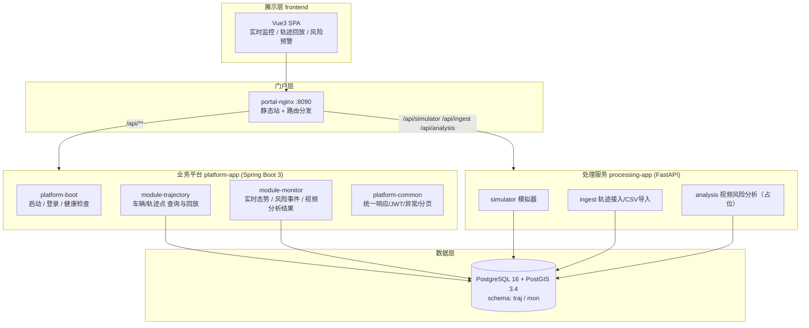

# SYS-DBD-001 系统总体架构

> 版本：v0.2.0 ｜ 日期：2026-10-05
> 关联文档：MOD-TRAJ-001、DDL-TRAJ-001、API-TRAJ-001/002、UC-TRAJ-001~004、MOD-IAM-001、research/03
> v0.2.0 变更：新增 §8 数据权限强制规则（总体规则），后续全部功能开发（含查询、分析、报表、导出、推送）必须遵守

## 1. 项目定位

mydbd 是专注于**北斗导航数据核心业务**的独立项目，能力范围：

1. 北斗轨迹数据的接入与解析（批量导入 + 实时推送；后续接入 JT/T 808 协议网关）
2. 轨迹地图可视化（Leaflet + 高德瓦片）
3. 历史轨迹路线回放（时间轴 + 速度控制）
4. 实时导航数据监控（在途车辆、最新位置、报警态势）
5. 风险预警与分析：基于 ADAS/DSM 事件与驾驶员监控视频，风险分级、处置与统计

业务蓝图与行业背景见《[03-导航系统数据采集与应用平台设计](../../research/03-导航系统数据采集与应用平台设计.md)》。

## 2. 总体架构



## 3. 模块划分（低耦合高内聚）

| 模块 | 类型 | 职责 | 依赖 |
|---|---|---|---|
| platform-common | Java | 统一 Result/分页、错误码、BizException/全局异常、JWT 工具与过滤器、MyBatis-Plus 分页/CORS | 无业务依赖 |
| module-trajectory | Java | 轨迹域：车辆台账、轨迹点查询、最新位置、历史轨迹 | platform-common |
| module-monitor | Java | 监控域：总览指标、风险事件分页与处置、类型分布、终端报警、视频分析任务 | platform-common |
| platform-boot | Java | 启动入口、演示账号登录、健康检查、actuator | 全部业务模块 |
| processing-service | Python | 轨迹模拟器、终端接入（服务令牌）、样例 CSV 导入、视频分析占位引擎 | 仅依赖数据库契约 |
| frontend | Vue3 | 实时监控页、回放页、风险预警页 | 仅依赖 HTTP 接口契约 |

耦合规则：

- Java 业务模块之间 **零 Maven 依赖**；监控域需要轨迹统计时直接读取 `traj` schema（见 WarnInfoMapper 注释），后续演进为内部 API。
- Java 与 Python 之间仅通过 HTTP + 数据库表契约协作，当前骨架不共享代码。
- 前端只认 HTTP 接口；接口走统一前缀 `/api/**` 与 `{code, message, data}` 响应结构。

## 4. 数据模型

| schema | 核心表 |
|---|---|
| traj | traj_gps_point（轨迹点 + PostGIS geometry/GIST 索引）、traj_vehicle、traj_terminal、traj_driver、traj_vehicle_driver、traj_vehicle_terminal、traj_warn_info、traj_gps_photo、base_warn_type |
| mon | risk_event（风险预警事件）、video_analysis（视频分析任务） |

traj 域结构与迁移的 DDL-TRAJ-001 完全一致；mon 域为本项目新增，定义见 `infra/postgres/init/03-mon-tables.sql`。

## 5. 接口总览

| 方法 | 路径 | 说明 |
|---|---|---|
| POST | /api/auth/login | 登录（演示账号 admin/admin123） |
| GET | /api/traj/vehicles | 在途车辆（轨迹点去重） |
| GET | /api/traj/vehicles/registered | 车辆台账 |
| GET | /api/traj/latest | 各终端最新轨迹点 |
| GET | /api/traj/track | 历史轨迹查询（identityCode/plateNo + 时间范围） |
| GET | /api/monitor/overview | 监控总览指标 |
| GET | /api/monitor/risks | 风险事件分页 |
| POST | /api/monitor/risks/{id}/handle | 风险事件处置 |
| GET | /api/monitor/risks/type-stats | 事件类型分布 |
| GET | /api/monitor/warnings | 终端报警列表 |
| GET | /api/monitor/video-analyses | 视频分析任务列表 |
| POST | /api/simulator/start · /stop · GET /status | 模拟器控制 |
| POST | /api/ingest/traj | 终端实时推送（X-Service-Token） |
| POST | /api/ingest/load-sample | 样例 CSV/事件导入 |
| POST | /api/analysis/video | 视频分析（X-Service-Token，当前为占位引擎） |

迁移的 API-TRAJ-001/002 描述了同一批轨迹/模拟器接口的详细字段语义。

## 6. 部署

四个容器：`postgres`（postgis/postgis:16-3.4）、`platform-app`、`processing-app`、`portal-nginx`。

```bash
cp .env.example .env
docker compose up -d
# http://localhost:8090  账号 admin / admin123
```

processing-app 只读挂载 `samples/` 到 `/data/samples`；PostgreSQL 初始化脚本首次启动自动执行。

## 7. 迭代路线

| 阶段 | 内容 |
|---|---|
| v0.1（当前） | 模块化骨架；文档迁移；样例导入；地图监控；轨迹回放；风险事件处置与统计；视频分析占位 |
| v0.2 | JT/T 808-2019 终端接入（注册/鉴权/心跳/定位/报警报文解析）；电子围栏；风险规则引擎下推 SQL |
| v0.3 | JT/T 1078 视频通道：实时视频调阅、事件片段上传；接入真实 DSM/ADAS 视觉模型 |
| v1.0 | IAM 权限体系、审计日志、大屏、面向多车队/多租户的运营能力（对齐 research/03 蓝图） |

## 8. 数据权限强制规则（总体规则）

> 本节为**总体规则**，效力覆盖全部模块与后续全部功能开发（查询、分析、报表、导出、实时推送、异步任务均适用）。
> 任何功能设计文档必须写明数据范围口径；任何代码评审必须核对数据权限是否落实。例外须在设计文档显式说明并经审批。

### 8.1 默认强制，无一例外

1. 全部业务数据访问默认受登录用户 `UserInfo.deptScope` 约束：
   - `null` = 全部数据（超级管理员或角色数据范围=全部），不加部门条件；
   - **空集合 = 不可见任何数据**（返回空列表、空页或计数 0）；
   - 非空集合 = 按部门/车牌集合过滤。
2. 只有超级管理员与数据范围=全部的角色不受限；不存在"某个接口特殊、先不过滤"的默认许可。
3. **fail-closed**：无法确定用户或归属缺失时按"不可见"处理，而非放行。

### 8.2 归属锚点与口径

1. 车辆类数据（轨迹、位置、里程、行驶/停车/怠速、油耗、报警、风险、统计、服务费等）以 `traj_vehicle.dept_id` 为**唯一归属锚点**；明细数据经车牌 `JOIN / EXISTS` 车辆表过滤。
2. 司机类数据：司机表无 `dept_id`，统一经车-司机绑定关系映射车辆归属，不新增司机归属字段。
3. 企业/组织聚合类数据：**先按范围裁剪组织行，再在裁剪后的集合上聚合**；禁止"全量聚合后过滤"导致总指标越权。
4. 越权访问详情统一表现为"不存在/没有数据"（404 或空结果），不提示"无权查看"，不泄露资源是否存在。
5. **可见性一律以车辆归属组织为准，禁止按车牌省份/简称过滤**：账号不与车牌的省份属性绑定。某公司（部门）名下可挂任意外省车牌的车辆，只要车辆 `dept_id` 在用户数据范围内，其全部数据（轨迹、报警、风险、统计、推送等）即对该用户可见；反之，同省车牌但归属其他组织的车辆不可见。`province_code`、车牌首字仅为档案/展示信息，不得作为权限条件。
6. 车辆过户（`dept_id` 变更）后，其历史数据随新归属可见；如需"历史按发生时归属隔离"须另行设计时点归属表，并在设计文档显式说明。

### 8.3 实时推送与异步任务

1. WebSocket / SSE 等实时通道必须**按会话所属用户的范围过滤后推送**；握手或建连时确定用户身份，新连接首帧同样受限。禁止对所有会话无差别广播业务数据。
2. 异步导出 / 异步计算：任务创建时固化执行人及其数据范围快照；任务与结果文件按人隔离；范围事后变更不回溯历史任务。
3. 对外/内部服务令牌调用（ingest 等）只允许写入其被授权的数据，不借服务令牌绕过读取范围。

### 8.4 一致性与准入

1. 同一数据在"屏幕显示、HTTP 接口、导出文件、实时推送"中的范围必须一致。
2. 新功能准入清单：
   - 设计文档：列出功能涉及的数据实体、归属锚点、过滤口径与越权表现；
   - 开发：接入本规则，不新增绕过路径；
   - 评审/测试：以受限角色（如每省测试账号）实际验证"本范围可见、范围外不可见"。
3. 字段级脱敏、跨部门写校验等更细粒度要求，随功能迭代另行补充，但其设计同样不得放宽本规则。
