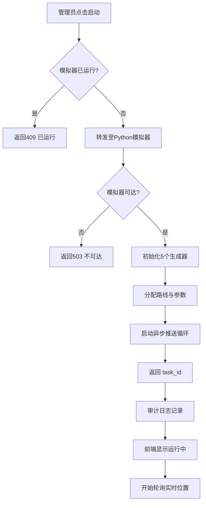
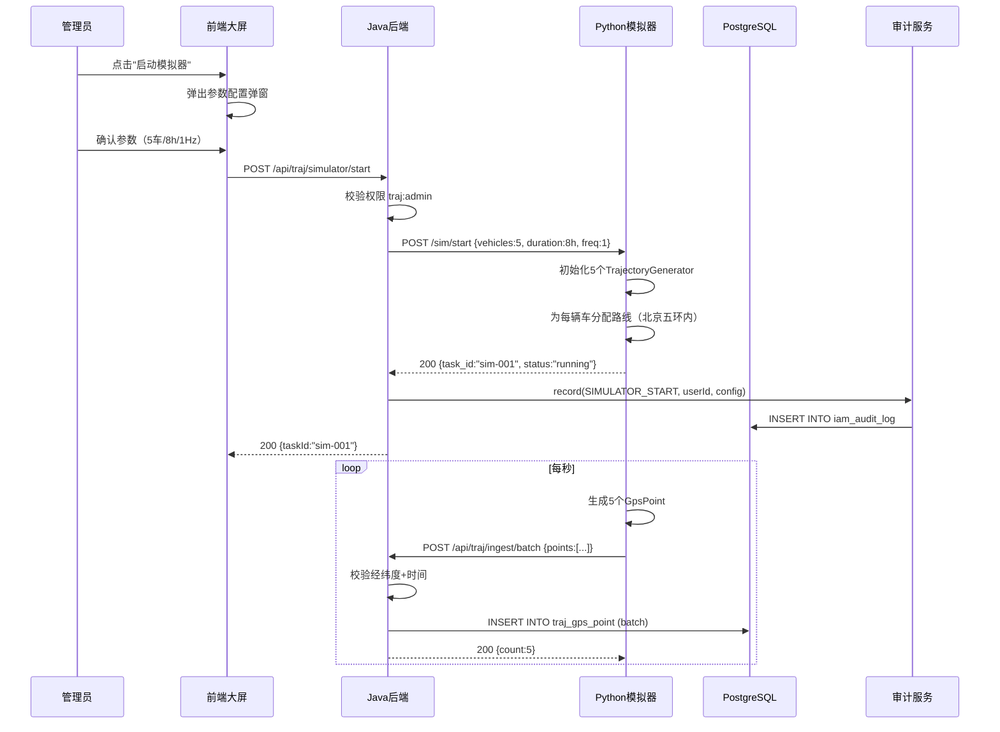

# UC-TRAJ-001 模拟数据生成与启动

> 版本：v1.0 ｜ 日期：2026-09-30
> 所属模块：TRAJ
> 关联文档：MOD-TRAJ-001, API-TRAJ-002, DDL-TRAJ-001

---

## 1. 用例概述

### 1.1 用例名称

模拟数据生成与启动

### 1.2 参与者（角色）

| 角色 | 说明 |
|---|---|
| 系统管理员（admin） | 启动/停止模拟器、配置模拟参数 |
| Python 模拟器（system） | 自动生成轨迹数据并推送至后端 |

### 1.3 前置条件

1. 用户已登录系统并具备 `traj:admin` 权限
2. Python 模拟器容器已启动且网络可达
3. 种子数据已初始化（5 辆车 + 5 个终端 + 5 名驾驶员，见 DDL-TRAJ-001 §4.1）
4. PostgreSQL + PostGIS 扩展已启用

### 1.4 后置条件（成功）

- Python 模拟器开始按 1Hz 频率生成 5 辆车的轨迹点
- 轨迹点实时写入 `traj_gps_point` 表
- 模拟器状态变为 `running`
- 审计日志记录 `SIMULATOR_START` 事件

### 1.5 后置条件（失败）

- 模拟器未启动，无数据写入
- 前端显示错误提示
- 审计日志记录启动失败

---

## 2. 主流程

### 2.1 流程步骤

| 步骤 | 执行者 | 动作 | 系统响应 | 数据变更 |
|---|---|---|---|---|
| 1 | 管理员 | 在大屏控制面板点击"启动模拟器"按钮 | 弹出参数配置弹窗 | — |
| 2 | 管理员 | 确认默认参数（5车/8小时/1Hz），点击确认 | 前端发送 POST /api/traj/simulator/start | — |
| 3 | Java后端 | 校验权限 + 模拟器当前状态 | 若已运行返回 409 | — |
| 4 | Java后端 | 转发请求至 Python 模拟器 /sim/start | — | — |
| 5 | Python模拟器 | 初始化 5 个 TrajectoryGenerator 实例 | 为每辆车分配路线 | — |
| 6 | Python模拟器 | 返回 {task_id, status:running} | — | — |
| 7 | Java后端 | 记录审计日志，返回 200 | — | iam_audit_log 新增一条 |
| 8 | 前端 | 显示"模拟器运行中"状态指示 | 开始轮询实时位置 | — |
| 9 | Python模拟器 | 每秒生成 5 个轨迹点 | POST /api/traj/ingest/batch | traj_gps_point +5 行/秒 |
| 10 | Java后端 | 校验并批量写入数据库 | 返回 200 {count:5} | — |

### 2.2 流程图



### 2.3 时序图



---

## 3. 备选流程

### 3.1 自定义模拟参数

- **触发条件**：管理员在参数弹窗中修改默认值
- **处理步骤**：
  1. 修改车辆数（1-20）、时长（1-24小时）、频率（0.5-5Hz）、平均速度（20-80 km/h）
  2. 提交后模拟器按新参数运行
  3. 车辆数超过种子数据时，自动生成额外虚拟车辆

### 3.2 批量导入历史数据

- **触发条件**：管理员选择"批量导入"而非"实时推送"
- **处理步骤**：
  1. 模拟器一次性生成完整时段轨迹数据（如 8 小时 × 5 车 = 14.4 万点）
  2. 分批推送至后端（每批 500 条）
  3. 全部写入后返回汇总结果
  4. 大屏可立即查询回放，无需等待实时生成

---

## 4. 异常流程

### 4.1 模拟器容器未启动

| 触发条件 | 系统行为 | 用户可见结果 | 错误码 | 数据回滚 |
|---|---|---|---|---|
| Python 模拟器网络不可达 | Java 后端捕获 ConnectException | "模拟器服务不可达，请检查容器状态" | TRAJ_008 / 503 | 无数据写入 |

### 4.2 模拟器已运行

| 触发条件 | 系统行为 | 用户可见结果 | 错误码 | 数据回滚 |
|---|---|---|---|---|
| 重复调用 start | 后端检查状态返回 409 | "模拟器已运行，请先停止" | TRAJ_005 / 409 | 无影响 |

### 4.3 轨迹点坐标越界

| 触发条件 | 系统行为 | 用户可见结果 | 错误码 | 数据回滚 |
|---|---|---|---|---|
| 生成的 lng/lat 超出中国范围 | IngestService 拒绝该点 | 模拟器日志记录跳过 | TRAJ_002 / 400 | 该点不写入 |

### 4.4 数据库写入失败

| 触发条件 | 系统行为 | 用户可见结果 | 错误码 | 数据回滚 |
|---|---|---|---|---|
| PostgreSQL 连接异常 | 批量写入抛出异常 | 模拟器重试 3 次后记录失败 | 500 | 事务回滚，该批数据不入库 |

---

## 5. 业务规则

| 规则编号 | 规则描述 | 约束值/公式 |
|---|---|---|
| TRAJ-R-001 | 模拟车辆数上限 | 20 辆（避免演示资源过载） |
| TRAJ-R-002 | 模拟时长上限 | 24 小时 |
| TRAJ-R-003 | 采样频率上限 | 5 Hz（每秒 5 点） |
| TRAJ-R-004 | 经度范围 | 73.0 ≤ lng ≤ 136.0 |
| TRAJ-R-005 | 纬度范围 | 3.0 ≤ lat ≤ 54.0 |
| TRAJ-R-006 | GPS 时间不得超前当前时间 | gps_time ≤ now() |
| TRAJ-R-007 | 速度随机波动范围 | avgSpeed × (0.8 ~ 1.2) |
| TRAJ-R-008 | 模拟停车间隔 | 每 5-10 分钟停留 30-60 秒 |
| TRAJ-R-009 | 批量写入每批大小 | 500 条 |

---

## 6. 界面设计

### 6.1 页面布局描述

启动入口位于"轨迹总览大屏"右上角控制面板：

```
┌─────────────────────────────────────────┐
│  轨迹总览大屏          [模拟器: 已停止▼] │
├─────────────────────────────────────────┤
│                                         │
│         [Leaflet 地图区域]               │
│                                         │
├─────────────────────────────────────────┤
│  统计卡片1 | 统计卡片2 | 统计卡片3       │
└─────────────────────────────────────────┘
```

点击"模拟器"下拉按钮弹出配置弹窗：

```
┌───────────────────────────────┐
│  启动轨迹模拟器               │
├───────────────────────────────┤
│  模拟车辆数:  [5    ] 辆      │
│  模拟时长:    [8    ] 小时    │
│  采样频率:    [1.0  ] Hz      │
│  平均速度:    [40   ] km/h    │
│  推送模式:    (●)实时推送     │
│              ( )批量导入      │
├───────────────────────────────┤
│           [取消]  [启动]      │
└───────────────────────────────┘
```

### 6.2 交互说明

- 模拟器运行中时，下拉按钮显示"模拟器: 运行中"（绿色），点击可弹出"停止"操作
- 启动成功后自动关闭弹窗，大屏开始轮询实时位置
- 启动失败时弹窗不关闭，顶部显示红色错误提示

### 6.3 权限要求

- 启动/停止操作：`traj:admin`（仅 admin 角色）
- 查看运行状态：`traj:view`（所有角色）

---

## 7. 接口调用

| 步骤 | 接口 | 方法 | 请求摘要 | 响应摘要 |
|---|---|---|---|---|
| 2 | /api/traj/simulator/start | POST | {vehicles:5, durationHours:8, frequencyHz:1.0, avgSpeedKmh:40, mode:"realtime"} | {taskId, status:"running"} |
| 9 | /api/traj/ingest/batch | POST | {points:[{identityCode, plateNo, gpsTime, lng, lat, speed, direction, altitude}]} | {count:5} |
| 8 | /api/traj/simulator/status | GET | — | {status:"running", vehicles:5, pointsGenerated:120, uptime:"00:02:00"} |

---

## 8. 数据变更

| 表 | 操作 | 字段变更说明 |
|---|---|---|
| traj_gps_point | INSERT | 每秒新增 5 行（5 辆车各一个轨迹点） |
| iam_audit_log | INSERT | 启动时记录 SIMULATOR_START 事件 |

---

## 9. 测试要点

| 测试场景 | 预期结果 | 测试数据 |
|---|---|---|
| 启动模拟器（默认参数） | 状态变 running，1 秒后 traj_gps_point 有 5 条新数据 | 默认配置 |
| 重复启动 | 返回 409，原模拟器不受影响 | 已运行的模拟器 |
| 模拟器容器停止后启动 | 返回 503 | 停止 Python 容器 |
| 坐标越界数据 | 该点被拒绝，其他点正常写入 | lng=200 |
| GPS 时间超前 | 该点被拒绝 | gps_time=明天 |
| 批量导入模式 | 8 小时数据在 30 秒内全部入库 | 14.4 万点 |
| 停止模拟器 | 状态变 stopped，不再有新数据写入 | 运行中状态 |
| 权限不足的 viewer 启动 | 返回 403 | viewer 角色 |

---

## 10. 修订记录

| 版本 | 日期 | 修订人 | 修订内容 |
|---|---|---|---|
| v1.0 | 2026-09-30 | system | 初版 |
