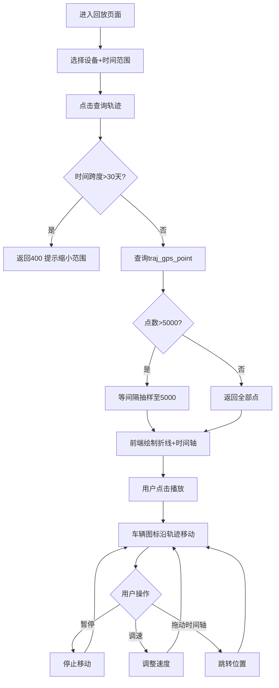
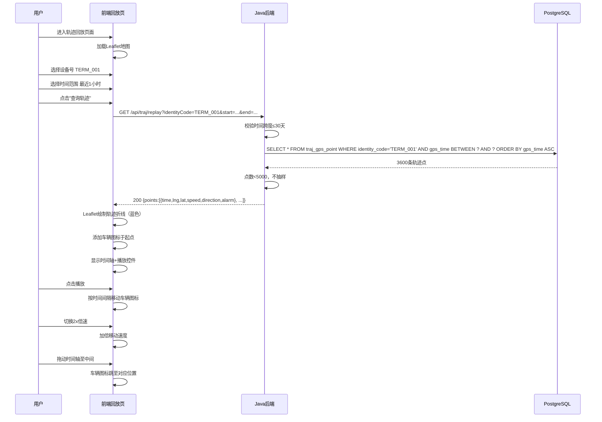

# UC-TRAJ-002 轨迹回放

> 版本：v1.0 ｜ 日期：2026-09-30
> 所属模块：TRAJ
> 关联文档：MOD-TRAJ-001, API-TRAJ-001, DDL-TRAJ-001

---

## 1. 用例概述

### 1.1 用例名称

轨迹回放

### 1.2 参与者（角色）

| 角色 | 说明 |
|---|---|
| 查看者（viewer） | 选择车辆与时间范围，播放轨迹回放 |
| 操作员（operator） | 同上，额外可导出回放数据 |
| 系统管理员（admin） | 同上 |

### 1.3 前置条件

1. 用户已登录并具备 `traj:query` 权限
2. 目标设备/车辆在指定时间范围内已有轨迹数据
3. 前端已加载 Leaflet 地图组件

### 1.4 后置条件（成功）

- 地图上绘制完整轨迹折线
- 车辆图标按时间顺序沿轨迹移动
- 可暂停/继续/调速回放
- 时间轴显示当前回放进度

### 1.5 后置条件（失败）

- 地图不绘制轨迹
- 显示错误提示（无数据/查询失败）

---

## 2. 主流程

### 2.1 流程步骤

| 步骤 | 执行者 | 动作 | 系统响应 | 数据变更 |
|---|---|---|---|---|
| 1 | 用户 | 进入"轨迹回放"页面 | 加载 Leaflet 地图 + 查询表单 | — |
| 2 | 用户 | 选择设备号（下拉或输入） | 下拉列表来自 traj_terminal | — |
| 3 | 用户 | 选择时间范围（起始/结束） | 默认最近 1 小时 | — |
| 4 | 用户 | 点击"查询轨迹"按钮 | 前端发送 GET /api/traj/replay | — |
| 5 | Java后端 | 校验时间跨度 ≤ 30 天 | 超限返回 400 | — |
| 6 | Java后端 | 查询 traj_gps_point | 按 identity_code + 时间范围升序 | — |
| 7 | Java后端 | 若点数 > 5000 则等间隔抽样 | 降至 5000 点 | — |
| 8 | 前端 | 接收轨迹点列表 | 在地图绘制轨迹折线 | — |
| 9 | 前端 | 显示播放控件 + 时间轴 | 车辆图标置于起点 | — |
| 10 | 用户 | 点击播放按钮 | 车辆图标沿轨迹移动 | — |
| 11 | 用户 | 可拖动时间轴跳转 | 车辆图标跳至对应位置 | — |
| 12 | 用户 | 可切换 1x/2x/4x 倍速 | 调整移动速度 | — |

### 2.2 流程图



### 2.3 时序图



---

## 3. 备选流程

### 3.1 回放中查看某点详情

- **触发条件**：用户点击轨迹上的某个点或车辆图标
- **处理步骤**：
  1. 弹出信息卡片显示该点详情：时间、经纬度、速度、方向、报警标志
  2. 关闭卡片后继续回放

### 3.2 多车对比回放

- **触发条件**：用户选择多个设备号
- **处理步骤**：
  1. 同时查询多设备轨迹
  2. 地图上用不同颜色折线绘制
  3. 多个车辆图标同步播放

### 3.3 报警点高亮

- **触发条件**：轨迹中存在 `alarm_flag=1` 的点
- **处理步骤**：
  1. 报警点用红色圆点标记
  2. 回放至报警点时弹出报警提示

---

## 4. 异常流程

### 4.1 时间范围内无数据

| 触发条件 | 系统行为 | 用户可见结果 | 错误码 | 数据回滚 |
|---|---|---|---|---|
| 查询结果为空 | 返回空列表 | 地图无折线，提示"该时间范围无轨迹数据" | — | 无 |

### 4.2 查询跨度超限

| 触发条件 | 系统行为 | 用户可见结果 | 错误码 | 数据回滚 |
|---|---|---|---|---|
| 时间跨度 > 30 天 | 返回 400 | "查询时间范围不能超过30天，请缩小范围" | TRAJ_006 / 400 | 无 |

### 4.3 数据量过大触发抽样

| 触发条件 | 系统行为 | 用户可见结果 | 错误码 | 数据回滚 |
|---|---|---|---|---|
| 原始点数 > 5000 | 服务端抽样至 5000 | 时间轴标注"已抽样"，轨迹略有简化 | TRAJ_007 / 200 | 无 |

### 4.4 查询超时

| 触发条件 | 系统行为 | 用户可见结果 | 错误码 | 数据回滚 |
|---|---|---|---|---|
| 数据库查询超过 10 秒 | 返回 500 | "查询超时，请缩小时间范围" | 500 | 无 |

---

## 5. 业务规则

| 规则编号 | 规则描述 | 约束值/公式 |
|---|---|---|
| TRAJ-R-101 | 回放时间跨度上限 | 30 天 |
| TRAJ-R-102 | 回放最大返回点数 | 5000（超出则等间隔抽样） |
| TRAJ-R-103 | 抽样策略 | 等间隔抽样，保留首尾点 |
| TRAJ-R-104 | 回放倍速选项 | 1x, 2x, 4x, 8x |
| TRAJ-R-105 | 轨迹折线颜色 | 正常段蓝色 #1890ff，报警段红色 #ff4d4f |
| TRAJ-R-106 | 车辆图标方向 | 根据 direction 字段旋转图标 |

---

## 6. 界面设计

### 6.1 页面布局描述

```
┌─────────────────────────────────────────────────────┐
│  轨迹回放                                            │
├─────────────────────────────────────────────────────┤
│ 设备号: [TERM_001 ▼]  起始: [2026-09-30 08:00]      │
│ 结束:   [2026-09-30 09:00]  [查询轨迹]  [导出]      │
├─────────────────────────────────────────────────────┤
│                                                     │
│                                                     │
│              [Leaflet 地图区域]                      │
│            （轨迹折线 + 车辆图标）                    │
│                                                     │
│                                                     │
├─────────────────────────────────────────────────────┤
│ ◀  [▶播放] [⏸暂停]  1x [▼]   08:00:00 ▬▬▬●▬▬ 09:00 │
└─────────────────────────────────────────────────────┘
```

### 6.2 交互说明

- 查询表单固定在顶部，地图占据主要区域
- 播放控件固定在底部，时间轴可拖动
- 点击地图上的轨迹点弹出详情卡片
- 鼠标滚轮缩放地图，拖拽平移
- 报警点用红色脉冲动画标记

### 6.3 权限要求

- 查询与回放：`traj:query`（viewer/ operator/ admin）
- 导出按钮：`traj:export`（operator/admin）

---

## 7. 接口调用

| 步骤 | 接口 | 方法 | 请求摘要 | 响应摘要 |
|---|---|---|---|---|
| 4 | /api/traj/replay | GET | ?identityCode=TERM_001&start=2026-09-30T08:00&end=2026-09-30T09:00 | {points:[{time,lng,lat,speed,direction,alarmFlag}], total:3600, sampled:false} |
| 导出 | /api/traj/export | GET | ?identityCode=TERM_001&start=...&end=...&format=csv | 文件下载（CSV） |

---

## 8. 数据变更

本用例为纯查询，无数据变更。

---

## 9. 测试要点

| 测试场景 | 预期结果 | 测试数据 |
|---|---|---|
| 查询1小时轨迹 | 返回3600点，地图绘制折线 | TERM_001 最近1小时 |
| 查询无数据时段 | 返回空列表，提示无数据 | 未来时间范围 |
| 查询跨度>30天 | 返回400，提示缩小范围 | 起始=30天前，结束=今天 |
| 查询跨度30天整 | 正常返回 | 起始=30天前，结束=今天 |
| 超过5000点抽样 | 返回5000点，sampled=true | 2小时数据（7200点） |
| 播放轨迹 | 车辆图标从起点沿折线移动 | 3600点轨迹 |
| 切换2x倍速 | 移动速度加倍 | 播放中 |
| 拖动时间轴 | 图标跳至对应位置 | 拖至中间 |
| 报警点高亮 | 红色标记，播放时弹出提示 | 含 alarm_flag=1 的轨迹 |
| viewer导出 | 返回403 | viewer角色点击导出 |

---

## 10. 修订记录

| 版本 | 日期 | 修订人 | 修订内容 |
|---|---|---|---|
| v1.0 | 2026-09-30 | system | 初版 |
