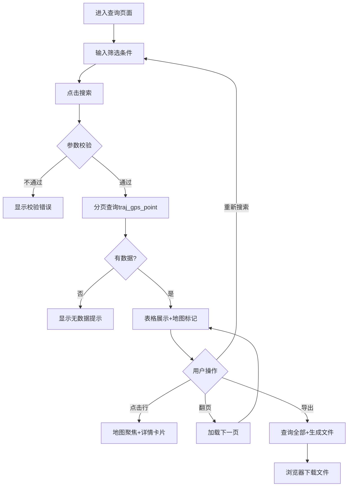
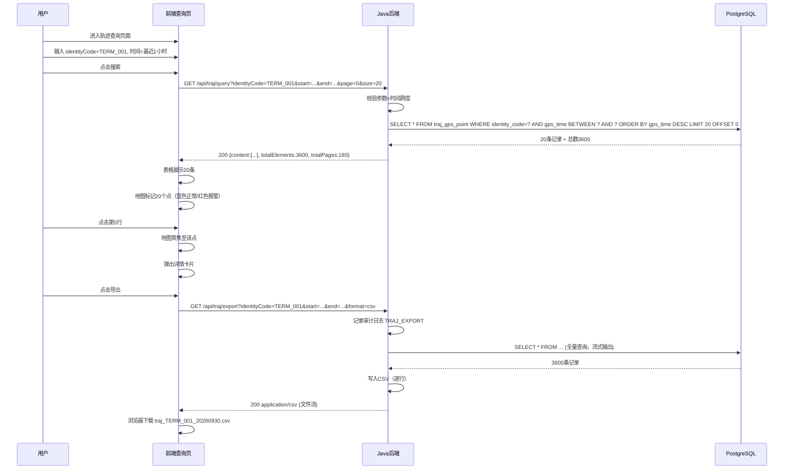

# UC-TRAJ-003 轨迹查询

> 版本：v1.0 ｜ 日期：2026-09-30
> 所属模块：TRAJ
> 关联文档：MOD-TRAJ-001, API-TRAJ-001, DDL-TRAJ-001

---

## 1. 用例概述

### 1.1 用例名称

轨迹查询

### 1.2 参与者（角色）

| 角色 | 说明 |
|---|---|
| 查看者（viewer） | 按条件筛选并查看轨迹点列表 |
| 操作员（operator） | 同上，可导出查询结果 |
| 系统管理员（admin） | 同上 |

### 1.3 前置条件

1. 用户已登录并具备 `traj:query` 权限
2. 已有轨迹数据入库
3. 前端已加载 Leaflet 地图组件

### 1.4 后置条件（成功）

- 地图上展示符合条件的轨迹点标记
- 下方表格分页展示轨迹点详情
- 可导出查询结果为 CSV/Excel

### 1.5 后置条件（失败）

- 显示错误提示，无结果展示

---

## 2. 主流程

### 2.1 流程步骤

| 步骤 | 执行者 | 动作 | 系统响应 | 数据变更 |
|---|---|---|---|---|
| 1 | 用户 | 进入"轨迹查询"页面 | 加载地图 + 查询表单 + 结果表格 | — |
| 2 | 用户 | 输入筛选条件 | 支持设备号/车牌/时间范围/报警标志 | — |
| 3 | 用户 | 点击"搜索"按钮 | 前端发送 GET /api/traj/query | — |
| 4 | Java后端 | 校验查询参数 | 时间跨度≤30天 | — |
| 5 | Java后端 | 执行分页查询 | 走复合索引 identity_code+gps_time | — |
| 6 | 前端 | 接收分页结果 | 表格展示当前页数据 | — |
| 7 | 前端 | 地图上标记当前页轨迹点 | 不同颜色区分报警/正常 | — |
| 8 | 用户 | 可点击表格行查看详情 | 地图聚焦至该点，弹出信息卡片 | — |
| 9 | 用户 | 可点击"导出"按钮 | 触发导出请求 | — |
| 10 | Java后端 | 查询全部符合条件的记录 | 分批写入 CSV/Excel | — |
| 11 | 前端 | 下载文件 | 浏览器触发文件下载 | — |

### 2.2 流程图



### 2.3 时序图



---

## 3. 备选流程

### 3.1 按地图视野筛选

- **触发条件**：用户在地图上框选区域
- **处理步骤**：
  1. 前端获取视野边界 `bounds = [[minLng, minLat], [maxLng, maxLat]]`
  2. 调用 `GET /api/traj/query?bbox=minLng,minLat,maxLng,maxLat`
  3. 后端用 PostGIS `ST_Within(location, ST_MakeEnvelope(...))` 查询
  4. 返回视野内所有轨迹点

### 3.2 仅查询报警点

- **触发条件**：用户勾选"仅报警"复选框
- **处理步骤**：查询条件追加 `alarm_flag=1`，地图仅显示红色标记

### 3.3 多设备同时查询

- **触发条件**：用户选择多个设备号
- **处理步骤**：后端用 `IN (...)` 查询，地图用不同颜色区分设备

---

## 4. 异常流程

### 4.1 查询跨度超限

| 触发条件 | 系统行为 | 用户可见结果 | 错误码 | 数据回滚 |
|---|---|---|---|---|
| 时间跨度 > 30 天 | 返回 400 | "查询范围不能超过30天" | TRAJ_006 / 400 | 无 |

### 4.2 导出数据量过大

| 触发条件 | 系统行为 | 用户可见结果 | 错误码 | 数据回滚 |
|---|---|---|---|---|
| 导出记录 > 10 万行 | 返回 400 | "导出数据量过大(>10万行)，请缩小查询范围" | — / 400 | 无 |

### 4.3 查询超时

| 触发条件 | 系统行为 | 用户可见结果 | 错误码 | 数据回滚 |
|---|---|---|---|---|
| 查询超过 10 秒 | 返回 500 | "查询超时" | 500 | 无 |

---

## 5. 业务规则

| 规则编号 | 规则描述 | 约束值/公式 |
|---|---|---|
| TRAJ-R-201 | 查询时间跨度上限 | 30 天 |
| TRAJ-R-202 | 分页默认每页 | 20 条 |
| TRAJ-R-203 | 分页最大每页 | 100 条 |
| TRAJ-R-204 | 导出格式 | CSV, Excel（xlsx） |
| TRAJ-R-205 | 导出最大行数 | 100,000 行 |
| TRAJ-R-206 | 地图标记上限 | 当前页数据（≤100 个标记） |
| TRAJ-R-207 | 报警点标记颜色 | 红色 #ff4d4f |
| TRAJ-R-208 | 正常点标记颜色 | 蓝色 #1890ff |
| TRAJ-R-209 | 导出文件名规则 | traj_{identityCode}_{yyyyMMdd}.csv |

---

## 6. 界面设计

### 6.1 页面布局描述

```
┌─────────────────────────────────────────────────────┐
│  轨迹查询                                            │
├─────────────────────────────────────────────────────┤
│ 设备号: [TERM_001▼] 车牌: [京A12345]                 │
│ 起始:   [2026-09-30 08:00] 结束: [2026-09-30 09:00] │
│ 报警: [✓仅报警]  [搜索]  [导出CSV] [导出Excel]       │
├──────────────────────────────┬──────────────────────┤
│                              │                      │
│    [Leaflet 地图区域]         │   结果表格           │
│    （轨迹点标记）              │  ┌────────────────┐ │
│                              │  │时间|经纬度|速度│ │
│                              │  │08:00|116.4,40|42│ │
│                              │  │08:01|116.4,40|45│ │
│                              │  │...             │ │
│                              │  │  < 1 2 3 >     │ │
│                              │  └────────────────┘ │
└──────────────────────────────┴──────────────────────┘
```

### 6.2 交互说明

- 左侧地图与右侧表格并排，比例约 6:4
- 表格行高亮联动地图标记（hover 同步）
- 翻页时地图标记同步更新
- 导出时显示进度条

### 6.3 权限要求

- 查询：`traj:query`（viewer/ operator/ admin）
- 导出：`traj:export`（operator/admin）

---

## 7. 接口调用

| 步骤 | 接口 | 方法 | 请求摘要 | 响应摘要 |
|---|---|---|---|---|
| 3 | /api/traj/query | GET | ?identityCode=TERM_001&start=...&end=...&alarmOnly=false&page=0&size=20 | {content:[{id,time,lng,lat,speed,direction,alarmFlag}], totalElements, totalPages} |
| 10 | /api/traj/export | GET | ?identityCode=TERM_001&start=...&end=...&format=csv | 文件流（CSV） |

---

## 8. 数据变更

本用例为纯查询，无数据变更。导出操作记录审计日志。

| 表 | 操作 | 字段变更说明 |
|---|---|---|
| iam_audit_log | INSERT | 导出时记录 TRAJ_EXPORT 事件（userId, identityCode, timeRange, rowCount） |

---

## 9. 测试要点

| 测试场景 | 预期结果 | 测试数据 |
|---|---|---|
| 按设备号查询 | 返回该设备所有轨迹点 | TERM_001 |
| 按车牌查询 | 返回该车牌所有轨迹点 | 京A12345 |
| 按时间范围查询 | 仅返回时间范围内的点 | 08:00-09:00 |
| 仅报警查询 | 仅返回 alarm_flag=1 的点 | 勾选仅报警 |
| 分页查询 | 每页20条，可翻页 | 3600条数据 |
| 框选地图区域查询 | 返回视野内的点 | 框选北京五环 |
| 导出CSV | 下载CSV文件，行数=查询总数 | 3600条 |
| 导出Excel | 下载xlsx文件 | 3600条 |
| 导出超10万行 | 返回400提示 | 10万+数据 |
| 查询跨度>30天 | 返回400 | 31天跨度 |
| 表格行联动地图 | hover行高亮对应地图标记 | — |
| viewer导出 | 返回403 | viewer角色 |

---

## 10. 修订记录

| 版本 | 日期 | 修订人 | 修订内容 |
|---|---|---|---|
| v1.0 | 2026-09-30 | system | 初版 |
