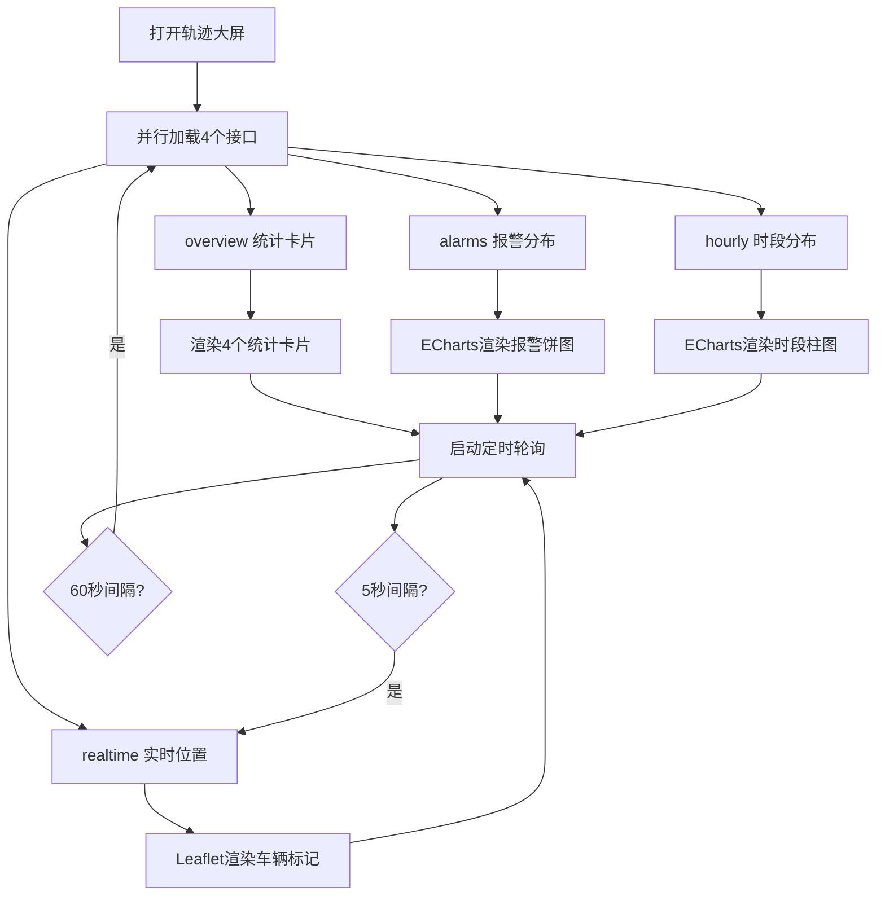
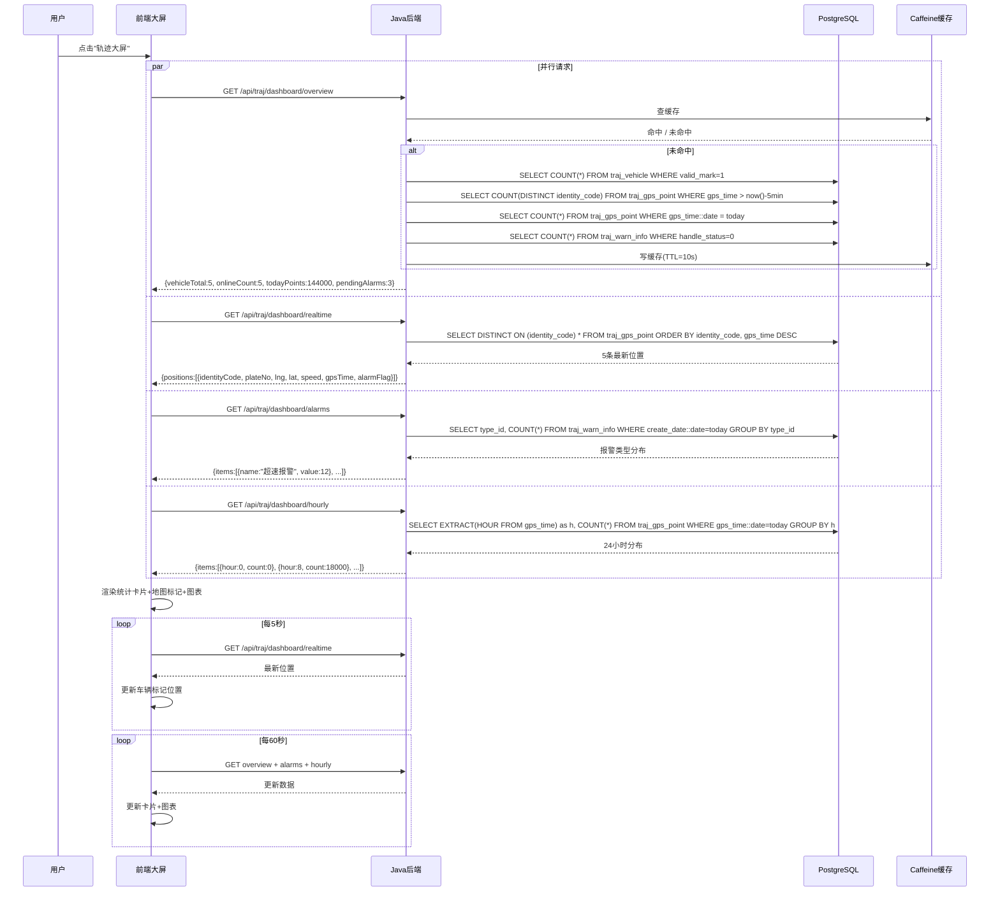

# UC-TRAJ-004 轨迹总览大屏

> 版本：v1.0 ｜ 日期：2026-09-30
> 所属模块：TRAJ
> 关联文档：MOD-TRAJ-001, API-TRAJ-001, DDL-TRAJ-001

---

## 1. 用例概述

### 1.1 用例名称

轨迹总览大屏

### 1.2 参与者（角色）

| 角色 | 说明 |
|---|---|
| 查看者（viewer） | 查看实时轨迹总览大屏 |
| 操作员（operator） | 同上 |
| 系统管理员（admin） | 同上，额外可启停模拟器 |

### 1.3 前置条件

1. 用户已登录并具备 `traj:view` 权限
2. 模拟器运行中或已有历史轨迹数据
3. 前端已加载 Leaflet + ECharts

### 1.4 后置条件（成功）

- 大屏展示：4 个统计卡片 + 实时位置地图 + 2 个统计图表
- 每 5 秒自动刷新实时位置
- 模拟器状态指示正确

### 1.5 后置条件（失败）

- 大屏显示降级提示或错误信息

---

## 2. 主流程

### 2.1 流程步骤

| 步骤 | 执行者 | 动作 | 系统响应 | 数据变更 |
|---|---|---|---|---|
| 1 | 用户 | 点击导航栏"轨迹大屏" | 加载大屏页面 | — |
| 2 | 前端 | 首次加载调用 overview 接口 | 获取统计卡片数据 | — |
| 3 | 前端 | 调用 realtime 接口 | 获取所有车辆最新位置 | — |
| 4 | 前端 | 调用 alarms 接口 | 获取报警类型分布 | — |
| 5 | 前端 | 调用 hourly 接口 | 获取 24 小时点数分布 | — |
| 6 | 前端 | Leaflet 渲染车辆标记 | 每车一个图标，按方向旋转 | — |
| 7 | 前端 | ECharts 渲染图表 | 报警分布饼图 + 时段分布柱图 | — |
| 8 | 前端 | 启动 5 秒轮询定时器 | 每 5 秒刷新 realtime 接口 | — |
| 9 | 前端 | 启动 60 秒轮询定时器 | 每 60 秒刷新 overview + alarms + hourly | — |
| 10 | 用户 | 查看大屏 | 数据实时更新 | — |

### 2.2 流程图



### 2.3 时序图



---

## 3. 备选流程

### 3.1 点击车辆图标查看详情

- **触发条件**：用户点击地图上的车辆标记
- **处理步骤**：
  1. 弹出信息卡片：车牌、设备号、当前速度、GPS时间、报警状态
  2. 提供"查看轨迹"链接，跳转至 UC-TRAJ-002 轨迹回放页

### 3.2 模拟器未运行

- **触发条件**：模拟器未启动，但历史数据存在
- **处理步骤**：
  1. 统计卡片正常展示（车辆总数、今日轨迹点数）
  2. 在线车辆数显示为 0（最近 5 分钟无新数据）
  3. 实时位置展示每个设备最后一条轨迹点
  4. 顶部显示"模拟器未运行"提示横幅

### 3.3 大屏全屏模式

- **触发条件**：用户点击"全屏"按钮
- **处理步骤**：调用浏览器 Fullscreen API，隐藏导航栏

---

## 4. 异常流程

### 4.1 模拟器不可达

| 触发条件 | 系统行为 | 用户可见结果 | 错误码 | 数据回滚 |
|---|---|---|---|---|
| 启动模拟器时 Python 进程不可达 | 返回 503 | 控制面板提示"模拟器不可达" | TRAJ_008 / 503 | 无 |

### 4.2 实时位置查询失败

| 触发条件 | 系统行为 | 用户可见结果 | 错误码 | 数据回滚 |
|---|---|---|---|---|
| realtime 接口超时 | 前端保留上次数据 | 地图标记不更新，无报错 | — | 无 |

### 4.3 无任何轨迹数据

| 触发条件 | 系统行为 | 用户可见结果 | 错误码 | 数据回滚 |
|---|---|---|---|---|
| traj_gps_point 表为空 | 各接口返回零值 | 统计卡片显示0，地图空白，提示"请先启动模拟器" | — | 无 |

---

## 5. 业务规则

| 规则编号 | 规则描述 | 约束值/公式 |
|---|---|---|
| TRAJ-R-301 | 在线车辆判定 | 最近 5 分钟内有轨迹点的设备数 |
| TRAJ-R-302 | 实时位置刷新间隔 | 5 秒 |
| TRAJ-R-303 | 统计卡片刷新间隔 | 60 秒 |
| TRAJ-R-304 | 大屏聚合缓存时长 | 10 秒（Caffeine） |
| TRAJ-R-305 | 车辆图标旋转 | 根据 direction 字段旋转图标角度 |
| TRAJ-R-306 | 报警车辆标记 | 红色脉冲动画 |
| TRAJ-R-307 | 正常车辆标记 | 蓝色图标 |
| TRAJ-R-308 | 离线车辆标记 | 灰色图标 |

---

## 6. 界面设计

### 6.1 页面布局描述

```
┌─────────────────────────────────────────────────────────────┐
│  轨迹总览大屏                              [模拟器: 运行中▼] │
├──────────┬──────────┬──────────┬───────────────────────────┤
│ 车辆总数  │ 在线车辆  │ 今日轨迹点│ 待处理报警               │
│    5     │    5     │ 144,000  │     3                    │
├──────────┴──────────┴──────────┴───────────────────────────┤
│                                                             │
│                                                             │
│                  [Leaflet 地图区域]                          │
│            （5个车辆标记，实时移动）                          │
│                                                             │
│                                                             │
├─────────────────────────────┬───────────────────────────────┤
│   报警类型分布（饼图）        │   24小时轨迹点分布（柱图）     │
│   ┌────────────────┐        │   ┌────────────────┐          │
│   │   超速 40%      │        │   │  █             │          │
│   │   疲劳 30%      │        │   │  ██   ████     │          │
│   │   围栏 20%      │        │   │  ███████████   │          │
│   │   其他 10%      │        │   │  ██████████████│          │
│   └────────────────┘        │   └────────────────┘          │
│                             │   0  4  8  12  16  20  24     │
└─────────────────────────────┴───────────────────────────────┘
```

### 6.2 交互说明

- 4 个统计卡片顶部一排，等宽分布
- 地图占据主要区域（约 60% 高度）
- 两个图表底部并排（约 25% 高度）
- 模拟器控制按钮在右上角
- 车辆标记可点击，弹出详情卡片

### 6.3 权限要求

- 查看大屏：`traj:view`（所有角色）
- 启停模拟器：`traj:admin`（仅 admin）

---

## 7. 接口调用

| 步骤 | 接口 | 方法 | 请求摘要 | 响应摘要 |
|---|---|---|---|---|
| 2 | /api/traj/dashboard/overview | GET | — | {vehicleTotal, onlineCount, todayPoints, pendingAlarms} |
| 3 | /api/traj/dashboard/realtime | GET | — | {positions:[{identityCode, plateNo, lng, lat, speed, direction, gpsTime, alarmFlag}]} |
| 4 | /api/traj/dashboard/alarms | GET | — | {items:[{name, value}]} |
| 5 | /api/traj/dashboard/hourly | GET | — | {items:[{hour, count}]} |
| 启动 | /api/traj/simulator/start | POST | {vehicles, durationHours, frequencyHz, mode} | {taskId, status} |

---

## 8. 数据变更

本用例为纯查询，无数据变更。启停模拟器记录审计日志。

---

## 9. 测试要点

| 测试场景 | 预期结果 | 测试数据 |
|---|---|---|
| 打开大屏（模拟器运行中） | 4卡片+地图5标记+2图表正常展示 | 模拟器运行5分钟 |
| 实时位置刷新 | 每5秒车辆标记位置更新 | 模拟器运行中 |
| 统计卡片刷新 | 每60秒卡片数值更新 | 模拟器运行中 |
| 点击车辆标记 | 弹出详情卡片 | 点击任一标记 |
| 模拟器未运行 | 显示提示横幅，展示历史最新位置 | 停止模拟器 |
| 无任何数据 | 卡片显示0，地图空白，提示启动模拟器 | 空库 |
| 报警车辆标记 | 红色脉冲动画 | alarm_flag=1 的车辆 |
| 离线车辆标记 | 灰色图标 | 5分钟无数据的车辆 |
| 全屏模式 | 隐藏导航栏，大屏铺满 | 点击全屏按钮 |
| viewer查看大屏 | 正常展示 | viewer角色 |
| viewer启动模拟器 | 返回403 | viewer角色点击启动 |
| overview缓存生效 | 10秒内多次请求只查一次DB | 连续请求overview |

---

## 10. 修订记录

| 版本 | 日期 | 修订人 | 修订内容 |
|---|---|---|---|
| v1.0 | 2026-09-30 | system | 初版 |
